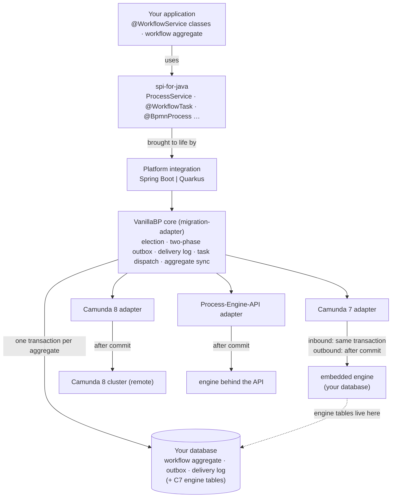

# Diagrams

One VanillaBP picture is a drawing, and it lives here. All the others are Mermaid blocks sitting
inside the document which explains their subject, because Mermaid renders on GitHub without an
export step and a reviewer can read what changed in a diff.

## The architecture overview

`overview.excalidraw` is the source, `overview.png` the export. The wiki's Home page embeds the PNG
and links back to the source from there, so re-export the PNG whenever you touch the drawing.
Otherwise the wiki keeps showing yesterday's picture while the source says something else.

Why this one is not Mermaid: the placement of its boxes is the content. Layers run top down, each
engine sits under its adapter, and the database stands beside everything which writes to it.
Mermaid's automatic layout put the database wherever it liked, which is no help to a reader trying
to see who writes where.

Here is the same overview as Mermaid, for a page which cannot host an image:

## Where the other pictures are

Every one of them is in `migration-adapter/README.md`, in the section which already describes what
it shows. Change a picture where you change the prose around it. There is no second copy of the
diagram source anywhere, and that is deliberate: two copies drift apart, and the reader has no way
of telling which one is current.

|                                              Picture                                              |                                              Section of `migration-adapter/README.md`                                               |
|---------------------------------------------------------------------------------------------------|-------------------------------------------------------------------------------------------------------------------------------------|
| Moving a workflow module from one BPMS to the next                                                | [BPMS election by prioritized adapters](../migration-adapter/README.md#bpms-election-by-prioritized-adapters)                       |
| The walk which asks each adapter whether it holds a workflow, and the second walk at the dispatch | [Awareness contract](../migration-adapter/README.md#awareness-contract-workflowawareness)                                           |
| Correlating a message, and what each adapter checks before the commit                             | [Waiting for a workflow to become visible](../migration-adapter/README.md#waiting-for-a-workflow-to-become-visible)                 |
| The order the core calls an adapter in while a workflow module deploys                            | [Deployment pipeline](../migration-adapter/README.md#deployment-pipeline)                                                           |
| One task delivered, and the same task delivered twice                                             | [Workflow-task processing](../migration-adapter/README.md#workflow-task-processing)                                                 |
| The contexts an adapter builds and hands to the core                                              | [Workflow-task processing](../migration-adapter/README.md#workflow-task-processing)                                                 |
| Camunda 7 on an engine datasource of its own, where the two commits are separate                  | [Deliveries VanillaBP already processed](../migration-adapter/README.md#deliveries-vanillabp-already-processed-taskdeliverylog-spi) |
| `startWorkflow` from the application, across the commit into phase two                            | [Two-phase workflow start](../migration-adapter/README.md#two-phase-workflow-start-phasetwooutbox-spi)                              |
| The same start on a time line which crosses a crash                                               | [Two-phase workflow start](../migration-adapter/README.md#two-phase-workflow-start-phasetwooutbox-spi)                              |
| What is left on `MigratableProcessService` once the handlers carry the operations                 | [An operation is defined once](../migration-adapter/README.md#an-operation-is-defined-once)                                         |
| Which points write the aggregate's shared values, and what reads them                             | [Pushing a changed aggregate](../migration-adapter/README.md#pushing-a-changed-aggregate-aggregatechanged)                          |
| A timer, signal or conditional start event firing in the BPMS                                     | [Workflows the BPMS starts itself](../migration-adapter/README.md#workflows-the-bpms-starts-itself-bpmsinitiatedstartinvoker)       |
| What an adapter registers per platform, and what it never implements                              | [What the platform hands an adapter](../migration-adapter/README.md#what-the-platform-hands-an-adapter-adaptercollaborators)        |
| The three transaction boundaries and which work belongs to which                                  | [The transaction the work runs in](../migration-adapter/README.md#the-transaction-the-work-runs-in)                                 |

## Two traps worth knowing before you edit one

A semicolon separates statements in Mermaid. One inside a message, inside a note or inside a
`participant … as …` alias therefore ends the statement early, and the diagram does not parse at
all: no picture in IntelliJ and none on GitHub, just an error message. Six of the pictures above were
unreadable for that reason until it was found. Write a comma, a `·` or a second sentence instead.

Angle brackets and round brackets are safe. Mermaid escapes `<` and `>` itself, so
`AdapterDeploymentService<BPMN,PC>` renders as written, and a `participant P as Platform (Spring /
Quarkus)` needs no quoting. The one place a semicolon belongs is at the end of a `classDef` or
`class` statement, where it terminates rather than interrupts.

Before you commit a changed diagram, render it once. `npx -p @mermaid-js/mermaid-cli mmdc -i
picture.mmd -o picture.svg` uses the same renderer GitHub and the IntelliJ plugin do, and it fails
loudly on anything they would fail on quietly.
