# Migration adapter

The migration adapter is the implementation of VanillaBP's adapter mechanism
used under the hood. Platform integrations are sole responsible for loading configuration
and analyzing business code in a way specific to the respective platform. Connecting
to adapters of supported BPMSs is done by this module which is used by platform
integrations  as a dependency. This ensures the same behavior of VanillaBP on
different platforms.

This file explains the core to whoever changes it. If you are BUILDING an adapter rather than
changing the core, read [`ADAPTER-AUTHORS.md`](./ADAPTER-AUTHORS.md) instead: it collects the
duties spread across the sections below into one document a team without access to this workspace
can read from top to bottom. If you are building an EXTENSION instead, the same document for that
side is [`EXTENSION-AUTHORS.md`](./EXTENSION-AUTHORS.md).

## Two kinds of plug-ins: adapters and extensions

Everything that takes part in deploying a workflow module implements
`ExtensionWiringService<BPMN, PC>`. There are two kinds of implementations, and telling
them apart is the first thing to understand about this module:

|                     |                                                                                 **BPMS adapter**                                                                                 |                                                                                      **Extension**                                                                                      |
|---------------------|----------------------------------------------------------------------------------------------------------------------------------------------------------------------------------|-----------------------------------------------------------------------------------------------------------------------------------------------------------------------------------------|
| Interface           | `AdapterDeploymentService<BPMN, PC>` — which *extends* `ExtensionWiringService`                                                                                                  | `ExtensionWiringService<BPMN, PC>`                                                                                                                                                      |
| What it is for      | connecting VanillaBP to ONE business process management system: it owns the BPMN model type, reads and deploys the models and executes every workflow operation against its BPMS | integrating something ADDITIONAL into the deployment: it sees the models the adapter sees and wires its own concerns against them, but it never talks to the BPMS on VanillaBP's behalf |
| Owns the model?     | yes — it reads, prepares and deploys it                                                                                                                                          | no — it only inspects (and may enrich) what the adapter read                                                                                                                            |
| How many per module | one per configured adapter id (several BPMS side by side = the migration scenario)                                                                                               | any number                                                                                                                                                                              |
| Examples            | `camunda7`, `camunda8`, `process-engine-api`                                                                                                                                     | the [VanillaBP Business Cockpit](https://github.com/vanillabp/business-cockpit)                                                                                                         |

An adapter is therefore "the wiring service that owns the model", which is why the
sections below describe the pipeline once and note where extensions join it.

## Features

The migration adapter is "an adapter aware of other adapters": it is the single point
where BPMS adapters plug in, and it decides on a per-workflow basis which BPMS is used.
This enables migration scenarios without touching business code:

1. Migrating within the same BPMS (on-premises to SaaS, or between versions).
2. Migrating from one BPMS to another (e.g. Camunda 7 to Camunda 8).

### BPMS election by prioritized adapters

Which BPMS is used is configured as a *prioritized list of adapters*
(`vanillabp.prioritized-adapters`). The list can be overridden per workflow module
(`vanillabp.workflow-modules.<id>.prioritized-adapters`) and per workflow
(`...workflows.<bpmnProcessId>.prioritized-adapters`) — the most specific non-empty
value wins (see `MigrationAdapterProperties`).

- **New workflows** are always started using the first (highest-priority) adapter.
- **Existing workflows** may still live in a previously used BPMS. For operations on
  existing workflows (message correlation, completing tasks) the adapters are asked in
  priority order whether they own the instance (`MigratableProcessService.awarenessOfTask`
  and `awarenessOfWorkflow`, returning a `WorkflowAwareness`). This is why eventual
  consistency has to be handled *here* and not in individual adapters: a remote BPMS
  (like Camunda 8) may not know an instance *yet*, and only the migration adapter can
  decide to fall back to the next adapter in the list.

A migration is three states of one configured list, and the picture below walks them: the old
BPMS on its own, both of them side by side while the workflows already running finish where they
are, and the new one alone once the old one holds nothing any more.

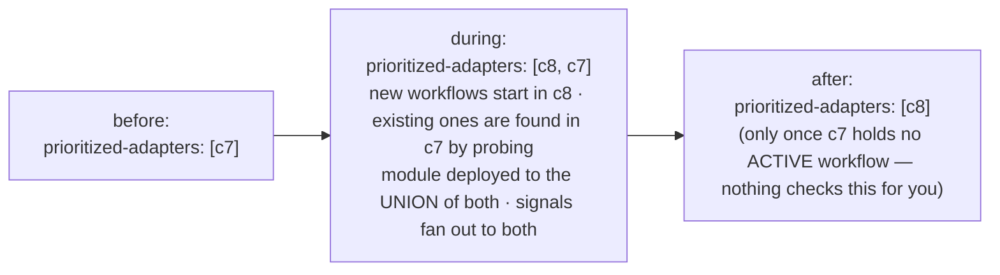

### Awareness contract (`WorkflowAwareness`)

Asking a BPMS whether it knows a workflow or task has four possible answers
(`MigratableProcessService.awarenessOfTask(workflowAggregateId, taskId)` /
`awarenessOfWorkflow(aggregatePersistence, workflowAggregateId)`):

|       Value        |                            Meaning                            |        Migration adapter's reaction         |
|--------------------|---------------------------------------------------------------|---------------------------------------------|
| `ACTIVE`           | The BPMS knows the workflow/task and it is active             | Use this adapter                            |
| `COMPLETED`        | The BPMS knows the workflow/task but it was already completed | Use this adapter (operation comes too late) |
| `UNKNOWN_TO_BPMS`  | The BPMS definitely does not know the workflow/task           | Fall back to the next adapter of the list   |
| `BPMS_UNAVAILABLE` | The BPMS could not be asked (unreachable, timeout)            | Do **not** fall back — retry later          |

The distinction between `UNKNOWN_TO_BPMS` and `BPMS_UNAVAILABLE` is crucial: only a
definite "not known" permits falling back to the next adapter — a temporary failure
must not silently elect the wrong BPMS. There is an instance-level method
(`awarenessOfWorkflow`) in addition to the task-level one because message correlation
has no task ID and task IDs are not unique across BPMSs. `WorkflowLocatorTest` walks the
four answers one at a time (`activeStopsTheWalk`, `unknownFallsThrough`,
`completedIsReported`, `unavailableNeverFallsBack`), so a fall-back sneaked into the
unavailable branch turns the build red.

The election runtime lives in `WorkflowLocator` (one instance per process service):
every operation on an EXISTING workflow (complete/cancel task, user task, message
correlation — in phase one and again at phase-two dispatch) walks the prioritized
adapters with an operation-specific probe (`awarenessOfTask`,
`awarenessOfUserTask`, `awarenessOfWorkflow`). `ACTIVE` executes there, `UNKNOWN_TO_BPMS`
falls through to the next adapter, `COMPLETED` is a warned no-op, and
`BPMS_UNAVAILABLE` fails naming the adapter — it NEVER falls back. New workflows always
start in the first-priority adapter (no probing).

The walk itself is drawn below. A cached hint is probed first and the remaining adapters follow in
list order, and each of the four answers ends the walk in its own way.

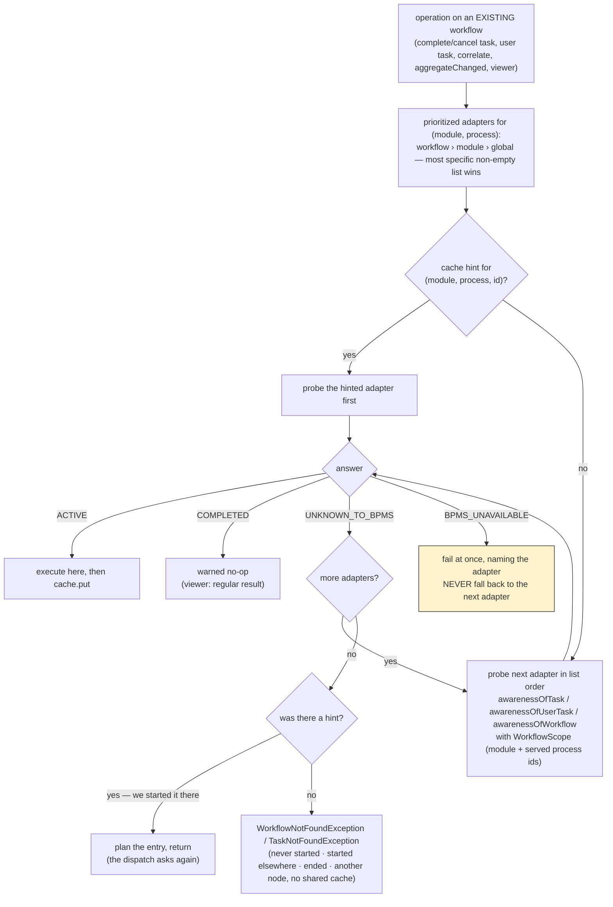

How long the walk may take is the CALLER's decision (`WorkflowLocator.Patience`), because
the same walk runs in places whose cost is not comparable. In **phase one** it runs
inside the application's transaction, holding a database connection and the locks on the
workflow aggregate: it asks every adapter once and never sleeps. At **dispatch** time no
application transaction is open, so an unreachable BPMS is worth two more questions
(500&nbsp;ms apart, fixed — "optimize late") and a read model which has not caught up is
worth its window. A **read** of the viewer/history API waits for the same window, for the
opposite reason: there is no outbox entry behind it which could ask again later, so what
it does not wait for becomes an error in the application. The **election an extension
asks for** waits for that reason too, and it is the one caller which may be doing so
inside a transaction of the application, which is measured below. Decision 27 says why
the split is drawn there. The three patiences are held by
`WorkflowLocatorTest#withoutPatienceAHintedAdapterIsAskedOnce`,
`#withoutPatienceAnUnavailableBpmsFailsAtOnce` and
`#retryingPatienceDoesNotWaitForVisibility`.

At the dispatch the same walk gains the loop the phase-one walk must not have, for a BPMS which
cannot be reached. A workflow which is not visible yet gets no loop at all: the entry goes back to
the store, due in the window, because this thread dispatches the entries of every other workflow
too. Where the first picture ends in an exception, this one ends in an entry which is repeated and
finally blocked.

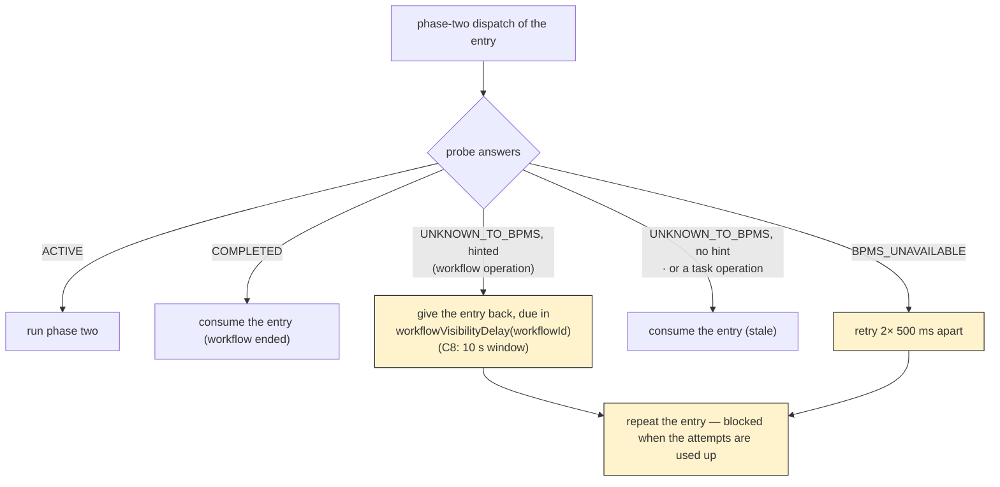

An adapter which cannot ask its BPMS at all says so (`canLocateWorkflows()`, `default true`)
and the core refuses to boot a workflow module which prioritizes it next to another
adapter: such an adapter answers optimistically, the walk stops at the first `ACTIVE`, and
the operations of every adapter behind it in the list would end up in the wrong BPMS. The
check runs once the adapters deployed - Camunda 8 learns from its first failed query
whether the cluster has secondary storage - and before anything touches a workflow. An
application which wants that routing anyway sets
`vanillabp.election.guessing-adapters: ACCEPTED` (per module:
`vanillabp.workflow-modules.<id>.election.guessing-adapters`) and keeps the message as a
WARN. `GuessingAdapterStartupTest` boots such a pairing and expects the refusal on both
platforms, `AcceptedGuessingAdapterStartupTest` the accepted variant.

What the walk cannot do is check the answers, and the SPI is where that duty is
written down: an adapter answers ONLY for the workflows and tasks of the scope it is
asked about, everything else is `UNKNOWN_TO_BPMS`. Every probe is handed that scope as a
`WorkflowScope` — the workflow module and the BPMN processes the calling process service
serves, secondary ones included, which the platform
integrations collect when they register the process services
(`MigrationProcessService.setServedBpmnProcessIds`). Before that a probe knew only the
workflow-aggregate ID, and neither it nor a task ID says whose workflow it is: two
adapter ids may address one backend (the migration from one scoping to another) and
two workflow modules of one backend may carry the same aggregate ID. Only the adapter
can compare the scope, which is why the contract sits in `MigratableProcessService`,
and `ElectionScopeContractTest` holds three halves of it: the walk reaching the holder
where the answers are scoped, stopping at the wrong adapter where one claims more than
it holds, and not claiming a workflow of another workflow module of the same adapter.
The shared-cluster setups of Camunda 8 and Camunda 7 are what happens without it.

Successful elections populate a `WorkflowAdapterCache`
(integration SPI; key = workflow module, BPMN process, serialized aggregate ID →
adapter ID). The next election probes the cached adapter first. Entries are HINTS,
not truth: a stale hit (the adapter answers `UNKNOWN_TO_BPMS`) falls through to the
full walk and repairs the entry; `BPMS_UNAVAILABLE` on a cached adapter follows the
retry-never-fallback contract. The platform integrations provide a bounded,
expiring in-memory default (`InMemoryWorkflowAdapterCache`, 10&nbsp;000 entries /
1&nbsp;h TTL by default, both configurable — see below); an application bean
implementing `WorkflowAdapterCache` replaces it, which is how a cluster shares its
elections. For Hazelcast that bean is shipped, in
[hazelcast-shared-election-cache](https://github.com/vanillabp/hazelcast-shared-election-cache),
where the nodes of the application form the cluster themselves; on any other cache
infrastructure the application writes the bean, which is the case this SPI was written
for. What a hint is worth is held by
`WorkflowLocatorTest#staleCacheHitIsRepaired` and
`#unavailableCachedAdapterNeverFallsThrough`, the bounded default by
`InMemoryWorkflowAdapterCacheTest`, and the replacement by an application bean by
`MigrationElectionTest#applicationProvidedCacheReplacesTheDefault`.

The BPMN process of that key is the one which was running when VanillaBP learned the
answer, and a task of a secondary process is delivered to the instance of THAT process
while the application calls its operations on the primary one. So the write stays where it
is and the READ asks for every id the workflow service serves
(`WorkflowLocator.setBpmnProcessIdsToReadUnder`, fed from `servedBpmnProcessIds`), the
reading instance's own id first. A hint found under another id is dropped respectively
marked where it sits rather than under the own id, because a second entry would leave the
one which is read next time saying the old thing.
`WorkflowLocatorTest#aHintOfACalledProcessIsReadAndItsWindowIsWaitedOut` and
`#aStaleHintOfACalledProcessIsRepairedWhereItLives` hold both halves.

### An ended workflow lets go of its hint

The end of a workflow used to be an inbound delivery like any other, so it REFRESHED the
hint of a workflow which had just become uninteresting, and the entry then waited out a
full time-to-live in a cache a cluster pays for. The end now MARKS the hint instead
(`WorkflowAdapterCache.putEnded`, `WorkflowLocator.rememberWorkflowEnded`), and so does a
probe which answers `COMPLETED`.

A mark is not a deletion, and that is the point. What still arrives after a workflow
ended is a `completeTask` which lost its race with a timeout, a message correlated by an
endpoint which did not learn about the end, an outbox entry dispatched behind it and a
read of the viewer API. With the hint each of them asks the adapter which held the
workflow, hears `COMPLETED` and becomes a warned no-op; without it the full walk runs and
ends in a `WorkflowNotFoundException` as soon as the BPMS has forgotten the instance,
which is a matter of Camunda 7's `history-time-to-live` respectively how long Camunda 8's
secondary storage keeps a finished process. What the mark changes is the lifetime:
`vanillabp.workflow-adapter-cache.ended-time-to-live` (five minutes) against
`.time-to-live` (one hour), validated against each other at startup
(`WorkflowAdapterCachePropertiesTest#endedTimeToLiveHasToBeShorter`).

The key is workflow module, BPMN process and aggregate ID and does not name the instance,
so a second workflow on the same aggregate writes the same entry. Order therefore matters
and is handled where the entry is written: a mark leaves an entry naming ANOTHER adapter
alone, because only the election of that second workflow can have written it. Two
workflows on the same aggregate in the SAME adapter are indistinguishable by the key, so a
late mark shortens the fresh hint - one walk, never a wrong route.

`vanillabp.workflow-adapter-cache.release-on-workflow-end` (default `false`) is what makes
the notification arrive at all. VanillaBP has a BPMS report the end of a workflow only
where somebody asked for it, so this is the third consumer of that one signal next to a
`@WorkflowEnded` method and `vanillabp.delivery.release-on-workflow-end`, and switching it
on attaches a listener respectively a worker to every deployed process of the module.
Where one of the other two asked already, the cache is served at no extra cost. It stays
best effort: the Process-Engine-API reports no end at all and Camunda 8 reports a `CANCELED`
workflow only from its 8.10 line on, so the lifetime remains the backstop rather than the
exception.

An application's own cache decides for itself: `putEnded` is a `default` method falling
back to `put`, so a cache written before this existed compiles and behaves exactly as it
did. A cache which wants the saving implements the method and gives such an entry a
lifetime of its own (Redis: an `EX` of its own; Hazelcast: a per-entry `ttl`).

What holds all of this: `WorkflowLocatorTest#theEndMarksTheHint` and its two
`completed*MarksTheEntry` siblings for the marking, `#aCacheWithoutTheMarkKeepsWorking` for
the `default` method, `InMemoryWorkflowAdapterCacheTest#endedEntriesExpireEarlier` and
`#aSecondWorkflowOnTheSameAggregateWins` for the two lifetimes and the shared key, and
`WorkflowEndedTest#theCacheReleaseAsksForTheEndNotification` for the switch which makes the
notification arrive at all.

### Sizing the election cache, and knowing when to

Both bounds are properties of the platform, not of an adapter:
`vanillabp.workflow-adapter-cache.max-entries` and `.time-to-live`
(`WorkflowAdapterCacheProperties`, validated at startup like everything else, today's
values as defaults). An application running several thousand workflows of one process
at the same time does not run out of memory — the map is bounded, a full cache costs
about 3&nbsp;MB. It runs into EVICTION PRESSURE instead: more hot workflows than
places, so entries are dropped before they are read.

**Why the bound is a number and not a soft reference.** Soft references were
considered and rejected: the JVM clears them only when it is nearly out of heap, so
the cache would grow into the old generation and be reclaimed exactly when the
application is under pressure anyway; every soft reference is visited by full GCs,
which lengthens the pauses this kind of application cares about most; it would trade a
deterministic bound for one depending on GC tuning
(`-XX:SoftRefLRUPolicyMSPerMB`), for a cache whose loss is cheap by design; and the
numbers do not call for it, since 100.000 entries are roughly 30&nbsp;MB and raising
the bound is the cheaper answer. Both memory figures are estimates from the size of one
entry rather than something measured, and a heap dump of an application running a full
cache is what would correct them. An application which really wants soft or off-heap
semantics has the SPI bean for it.

**What is measured, and who owns which number.** There are two sets of them, and the
split is deliberate.

`WorkflowAdapterCacheStatistics` (one per application) counts what the ELECTION asked:
hits, misses, and how often the end of a workflow was marked. The process services wrap
WHATEVER cache is in use into an `InstrumentedWorkflowAdapterCache` reporting there, so
these three exist for the in-memory default, for the shared cache VanillaBP ships for
Hazelcast and for a cache an application wrote itself. A number which disappears once
somebody plugs in their own cache would surprise exactly the operator who needs it. They
are published under `vanillabp.workflow.adapter.cache.*` by `WorkflowAdapterCacheMeters`.

What an implementation knows about ITSELF belongs to that implementation and is published
under a prefix which says which one it is. The in-memory default owns an
`InMemoryWorkflowAdapterCacheStatistics` (created in its constructor, written by nobody
else) with its size, the size of the marks it holds, its evictions, the evictions before
an entry was ever read and the LOST HINTS;
`InMemoryWorkflowAdapterCacheMeters` publishes them under
`vanillabp.inmemory.election.cache.*` and registers NOTHING where the cache in use is
another one. That is the point: a size which cannot be read is a meter which is absent
rather than one reporting NaN forever, and an eviction counter which can never leave zero
(the Hazelcast cache has no size bound at all) is not published either. A cache which
lives somewhere else reports what it knows the same way, under a prefix of its own.

The size of the marks is what tells an operator whether the release works, since it rises
while workflows end and falls again as the shorter lifetime takes those entries away.
Micrometer is OPTIONAL for all of it, and both platforms apply `MeterBinder` beans to
their registries by themselves, so an application without it boots unchanged and reports
nothing.

**The warning is about lost hints, not about a full cache.** A cache which is merely
full is healthy, and an entry evicted unread is not by itself a defect (a workflow
which is started and never operated on afterwards leaves exactly such an entry
behind). It becomes one when that workflow IS looked up later: then the bound, not the
workflow, decided the outcome. The keys of unused evictions are therefore remembered
(hash codes, bounded like the cache), and a later miss on such a key is a lost hint.
Ten of them within an hour produce ONE guiding WARN naming the observed number, the
observation period and the property to raise. Heap pressure is deliberately not the
trigger, because the cache cannot see the old generation and the JVM does not tell it.
`InMemoryWorkflowAdapterCacheStatisticsTest` holds the counting and the rule the warning
follows: `lookupOfAnEvictedEntryIsALostHint`,
`onlyUnusedEvictionsCountTowardsThePressure` and
`evictionPressureIsWarnedAboutOncePerHour`. That the numbers of the election hold for
every cache is `WorkflowAdapterCacheStatisticsTest#theElectionsNumbersHoldForEveryCache`,
and that no meter of the in-memory cache exists while another cache is in use is
`WorkflowAdapterCacheMetersTest#aForeignCachePublishesNothingItCannotKnow`.

The lost hint is detected by the cache rather than by the decorator around it, because
only the cache knows that this key was one it dropped. The miss itself is still counted
where every miss is counted.

The workflow probe takes the aggregate's persistence because a BPMS without a business
key finds the workflow by the process variable carrying the aggregate's ID, and that
variable is named after the aggregate's ID attribute
(`AggregatePersistenceAware.getAggregateIdName()`). The election runs BEFORE every other
SPI method of an operation, so an adapter must never derive the name from a previous
call - Camunda 8 did exactly that once and searched under a placeholder name,
which found nothing on a cluster with secondary storage and reported every workflow as
unknown.

To migrate, one puts the new BPMS first in the priority list and keeps the old one in
the list: new instances start in the new BPMS while existing instances complete in the
old one.

### Waiting for a workflow to become visible

An election which asks a BPMS answering from an eventually consistent read model
(Camunda 8 searches its query API, fed by an exporter) gets an honest "unknown" for a
workflow started moments ago. Turning that into `WorkflowNotFoundException` names causes
which are all wrong, and it hits the most ordinary sequence there is: start a workflow,
then correlate the message which lets it continue.

Four pieces solve it, and the split matters:

1. **The adapter contributes the window, the core does the waiting.**
   `MigratableProcessService.workflowVisibilityDelay()` (a `default` returning
   `WorkflowVisibilityDelay.none()`, so no adapter breaks) answers how long an
   `UNKNOWN_TO_BPMS` may still turn into `ACTIVE` and how often to ask. Camunda 7 answers
   from the very transaction which created the instance and reports none; Camunda 8
   reports `vanillabp.adapters.<id>.workflow-visibility-timeout` (default 10 seconds,
   zero switches it off). Eventual consistency is the core's business, the timing is the
   adapter's. What the core actually asks is `workflowVisibilityDelay(workflowId)`, the
   same window for one workflow, so an adapter which knows that workflow can name a
   shorter one; its default answers the window above, which is what every adapter written
   before this does.
2. **The waiting is bounded by a hint, never blanket.** VanillaBP waits only for an
   adapter the `WorkflowAdapterCache` names for that workflow. A workflow nobody ever
   heard of has no hint and fails immediately - which a wrong ID has to, since waiting
   the full window on every typo would turn a programming error into a timeout.
3. **The cache is filled where VanillaBP knows the answer without asking**
   (`MigrationProcessService.rememberWorkflowAdapter`): when a start is SCHEDULED (the
   elected adapter is decided then), again after its phase two, and on every inbound
   delivery - a task, a user task, a BPMS-initiated start. The end of a workflow is the
   one delivery which marks the hint instead of refreshing it (see above). For the latter the inbound contexts carry the adapter's id
   (`TaskInvocationContext.getAdapterId()` and its siblings, `default null`, implemented
   by all three adapters). A delivery PROVES which BPMS holds the workflow.

   Recording at SCHEDULING time is what makes the sequence work at all: on a remote BPMS
   the instance is created after the commit, so a correlation in the very next
   transaction runs its election before phase two ever ran. Without the early hint it
   would find nothing to expect. The price is the usual one of a hint: a rolled-back start
   leaves an entry behind, and the next operation on that aggregate ID is planned and
   dispatched until the outbox blocks it, instead of failing at the call.

4. **The waiting happens at the dispatch and in a read, and phase one never waits at
   all.** Phase one asks once. Where the answer is "unknown" although a hint says
   the workflow exists, the operation is PLANNED - the aggregate is saved, the outbox entry is written, the caller
   returns - and the dispatch asks again and hands the entry back, due in the window, while
   the BPMS still says nothing. In everyday operation (Camunda 8 lags one to three
   seconds) that costs an attempt and nobody an error; while an exporter is broken it
   costs attempts until the entry is blocked, which is where it becomes visible. Where the
   work hangs on a JOB - a `@WorkflowTask`, an asynchronous task whose completion does not
   arrive - the cluster runs out of job retries and Camunda raises an incident of its own;
   where no job is behind it (a correlation from a REST endpoint), the blocked entry and
   its counter are that place. Decision 27 carries this, including what it costs.

   A read of the viewer/history API (`getProcessDefinitions`, `getWorkflowHistory`) is the
   first of the two callers which wait for themselves. It has no phase two to plan and
   nothing repeats it later, so it waits where a hint says which adapter holds the
   workflow. Asking for the history of a workflow the application started seconds ago is
   what a viewer does all day, and the seconds Camunda 8's exporter lags behind must not
   answer it with
   `WorkflowNotFoundException`. Without a hint the read still fails at once, and a hint
   which never comes true costs the window before the failure names the adapter which was
   expected to answer.

   The election an extension asks for (`WorkflowElection#adapterIdOfWorkflow`) waits the
   same way, for the same reason: nobody repeats an extension's question either. Unlike a
   read it is not free, because an extension which REPORTS something calls it while the
   transaction which wrote what it reports is still open. The Business Cockpit does
   exactly that on every `aggregateChanged`, which is how a report out of a service task
   ends up holding a connection for ten seconds. What that costs is measured below.

**What was deliberately NOT built: an outbox query.** A `START_WORKFLOW` entry still
`OPEN` would prove "too early rather than unknown", and one `DONE` a moment ago would
prove "exactly the window we are waiting for". It was left out:

- the outbox can only ever contribute the POSITIVE half. A workflow does not have to have
  been started by this VanillaBP: a version-1 application which migrated, a start by
  another system, a BPMS-initiated start (which writes no entry at all) and a cleaned-up
  `DONE` entry all leave the outbox silent while the workflow runs perfectly well;
- it would need a new query method in EVERY store implementation (the JDBC store both
  platforms run, the two MongoDB stores, gruelbox where an application still asks for it,
  and any store an application wrote itself);
- what it would buy over the cache is one case: the start ran on ANOTHER node of a
  cluster, whose in-memory cache the correlating node does not share. That case is the
  one the `WorkflowAdapterCache` bean exists for - an application running clustered
  plugs its shared cache in, which is cheaper than teaching every outbox store a query.

The residual is therefore honest and documented: on a cluster WITHOUT a shared cache, an
operation reaching a node which neither started the workflow nor received a delivery for
it has no hint, so it fails at the call while the BPMS catches up. Retrying the business
operation works, and so does a shared cache - which is what the
`WorkflowNotFoundException` says when an eventually consistent adapter is configured.

The other residual is the mirror image: an operation with a hint whose workflow really is
gone (ended long ago and cleaned out of the read model) is planned instead of refused. Its
entry is repeated and finally blocked, and the counter of blocked entries is where it
shows. That is the price of never refusing an operation on a workflow which merely is not
searchable yet.

### What an election costs a caller which holds a transaction

Measured on 2026-09-14 against the BPMS double, Spring Boot, H2 and a HikariCP pool of
four connections, with the double reporting the window and the probe interval the Camunda
8 adapter reports out of the box (ten seconds, 250 ms). The caller opens a transaction,
reads the workflow aggregate through it and then asks the election, which is the shape a
`@WorkflowTask` reporting a change runs in.

|          what the caller meets          | the transaction is open for | the adapter is asked |
|-----------------------------------------|----------------------------:|---------------------:|
| the read model has caught up            |                      3.9 ms |               1 time |
| the read model is behind, a hint exists |                   10 076 ms |             41 times |
| no hint, so nothing is waited for       |                       <1 ms |               1 time |

The wait is the window, near enough: the 41 questions are the first one plus one every
250 ms, and they add 76 ms to the ten seconds. Once the window is used up the walk asks
the other adapters, and it skips the one it already asked, so a second window is never
paid.

What a few such callers do to the rest of the application, measured in the same run with
four of them at once:

|            four reports at once             |                              what was measured                               |
|---------------------------------------------|------------------------------------------------------------------------------|
| each transaction was open for               | 10 046 to 10 072 ms                                                          |
| the pool while they waited                  | 4 active, 0 idle                                                             |
| an unrelated caller asking for a connection | refused after 1 003 ms with `Connection is not available, request timed out` |

The last row is the point. The four reports have nothing to do with each other and
nothing to do with the caller they lock out: four threads sleeping on a BPMS emptied the
pool of the whole application, and everything else it does stopped with them. Four is the
pool size here, so read it as a ratio rather than as a number. A pool of twenty needs
twenty concurrent reports, which one lagging exporter and a handful of busy service tasks
produce without any of them being unusual.

`WhatAnElectionCostsATransactionTest` in
`spring-boot-integration/integration-tests/election-cost-integration-test` holds both
shapes. It runs with a window of 1.5 seconds, because a build should not pay ten seconds
twice for a number which is already written down here.

The middle row of the first table is what an adapter can make smaller. The core asks
`workflowVisibilityDelay(workflowId)` for the workflow it is waiting for, so an adapter which
already knows something about that workflow may answer a shorter window than a freshly started
one needs, and today's window for everything else. Shortening the wait is all it may do: the
answer which comes out of the shorter window is still the honest one, and a workflow which ended
is `COMPLETED` and never `UNKNOWN_TO_BPMS`.

Correlating a message is the operation on which both patiences show up in one call, and the
picture follows such a call from the caller's transaction to the BPMS: phase one asks the adapters
once and lets the caller commit, the dispatch asks again and publishes the message as soon as
the BPMS reports the workflow, which may take an entry or two.

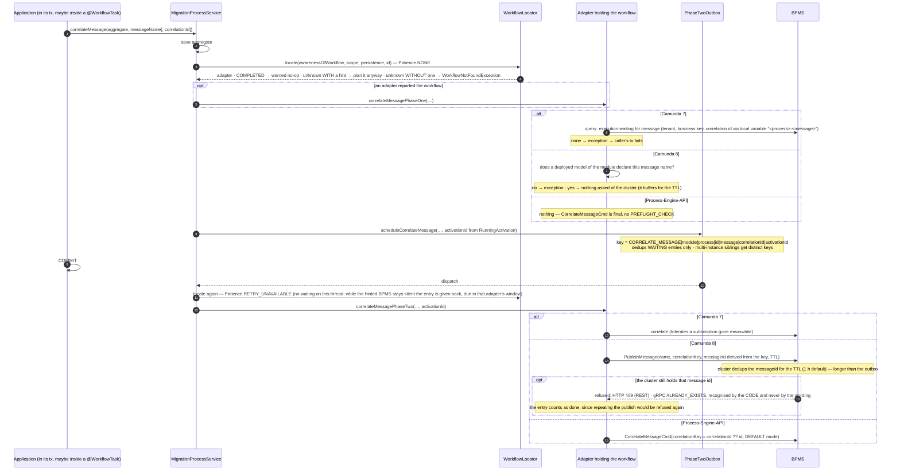

Starting a workflow by a message follows the same shape and derives the plain start's idempotency
key, so a workflow is started at most once per aggregate whichever of the two calls did it.

`WorkflowVisibilityDelayTest` runs the ordinary sequence on both platforms
(`correlationIsPlannedAndDispatchedWhenTheWorkflowShowsUp`, `unknownWorkflowStillFailsFast`),
`WorkflowLocatorTest#withoutAHintAnUnknownWorkflowIsNotExpected` and
`#hintedAdapterIsAskedAgainWithinItsVisibilityWindow` hold the two halves of the hint rule,
and the read path is `ViewerApiTest#readWaitsForAnEventuallyConsistentAdapterToCatchUp`
together with `#readFailsAfterTheVisibilityWindowPassed`.

### The election may carry the BPMS' own id of the workflow

`MigratableProcessService.awarenessOfWorkflow` has a fourth argument, and the paths which WAIT
pass it: the election an extension asks for, and the read of the viewer API. It is the BPMS' own
id of the workflow, `null` where VanillaBP holds none.

Why it is worth passing, measured on three Camunda 8 clusters in September 2026: the engine
knows a new instance 16 to 19 ms after the create was sent, while the search which
`awarenessOfWorkflow` uses finds it after 167 to 1324 ms. After a cancellation the engine says
"gone" after 21 ms and the search needs 176 to 2068 ms to agree. So the engine answers far
earlier than its index, and every command which asks it addresses a key.

- An adapter may SHORTEN A YES with it: ask the engine by the key and answer `ACTIVE` without
  waiting for the read model.
- It may NOT turn a negative answer into `UNKNOWN_TO_BPMS`. An engine forgets a workflow the
  moment it ends, so an unknown key does not tell `COMPLETED` from `UNKNOWN_TO_BPMS`, and only
  the second of the two lets the election move on to the next BPMS. In a migration setup that
  would send the next operation to the wrong BPMS.
- The default drops the id and calls the three-argument question, so every adapter written
  before this keeps compiling and behaving (`ElectionWithAWorkflowIdDefaultTest`).
- Where the core takes the id from: the open delivery records of that aggregate first, then the
  election cache, which keeps the id next to the adapter id since it learns both from every
  delivery. Nothing new is asked of any BPMS for it.

`WorkflowAdapterCache.hintOf` is what reads both in one call, because a shared cache charges a
round trip per read; `put(..., adapterId, workflowId)` is what writes them. Both are `default`
methods, so a cache an application wrote stays valid and simply keeps no id.

The window the core waits out carries the same id: it asks `workflowVisibilityDelay(workflowId)`
rather than the adapter's one window, so an adapter may be patient with a workflow which was
started moments ago and quick with one it already knows is gone. The rules are the ones above,
and the default answers `workflowVisibilityDelay()`.

### Deployment pipeline

`DeploymentService` orchestrates deployment per workflow module:

1. Resolve the adapters the module has to be deployed to and find the matching
   `AdapterDeploymentService` by adapter ID. This is the **union** of the module's
   effective prioritized-adapters list and every adapter named in a workflow-level
   `prioritized-adapters` override of that module: BPMS election is
   process-granular while deployment is file-granular, so an adapter prioritized
   for a single workflow only still has to receive the module's resources —
   otherwise starting that workflow would fail at runtime. Every adapter of the
   union receives the module's *full* resources (per-process filtering was
   considered and rejected: BPMN files may contain several processes and adapters
   deploy whole files; extra processes deployed to an adapter are inert because
   workflow starts are routed by the election, and during a BPMS migration having
   the module's complete model in both BPMS is even desirable).
2. Load the BPMN resources (either from an adapter-specific `resources-location` or
   the generic VanillaBP BPMN files). The loader is asked per file extension, so the
   same location answers for `.bpmn` and for `.dmn`.
3. For each file run the pipeline `readBpmn` → `prepareBpmn` (per process) →
   `wireBpmn` (adapter) → `wireBpmn` of all matching `ExtensionWiringService`s.
   The adapter-specific *processing context* (generic parameter `PC`) is accumulated
   across all executable processes of a file and across all files of a module.
   Extensions receive the same processing context as the adapter's `wireBpmn`;
   extensions are matched by assignability, so extensions may declare interfaces
   as model or processing-context type.
4. Read the module's `.dmn` files into the same processing context (`readDmn`), after
   its processes: a decision a business rule task calls belongs to the module and is
   deployed with it, and the context it is added to is what reading a process produced.
   A module without an executable process is skipped as before — and the warning says
   that its decision tables are not deployed either, because a decision travels with the
   processes calling it and never on its own. The SPI method is a `default` which takes
   no file and says so once per file, so an adapter written before this existed keeps
   working and an application is told rather than left with a business rule task nobody
   deployed anything for.
5. `deployResources` pushes the result to the BPMS. A failing deployment aborts
   booting unless the adapter's `deployment-failure` policy is `warn` *and* the
   adapter is first priority neither for the module nor for any of its workflows.
   After all adapters were processed, configured workflow IDs
   (`vanillabp.workflow-modules.<module>.workflows.<id>`) matching no executable
   BPMN process found are reported by a WARN naming the known process IDs (not a
   failure — the BPMN may arrive later, e.g. during a BPMS migration; process IDs
   are known only after `readBpmn`, which is why this check lives in the pipeline
   and not in the early properties validation).
6. Once the application is ready, `startWorkflowProcessing` is called for adapters and
   extensions — only then workflows are actually processed. It is called for *every*
   adapter resources were deployed to (not only the highest-priority one), since
   during a BPMS migration all configured BPMSs have to keep processing workflows.
7. On graceful shutdown of the application, `stopWorkflowProcessing` is the
   counterpart of step 6, executed in reverse order: extensions are stopped first (in
   reverse wiring order), then the adapters. It is wired by the platform integrations
   (Spring Boot: `SmartLifecycle.stop()`; Quarkus: a `ShutdownEvent` observer) so no
   new workflow jobs are processed while web/messaging infrastructure is being torn
   down.

The pipeline is a protocol rather than a set of calls, which is what the picture shows: the order
the core calls an adapter in, and the points at which the adapter calls back into the core
while it reads a file.

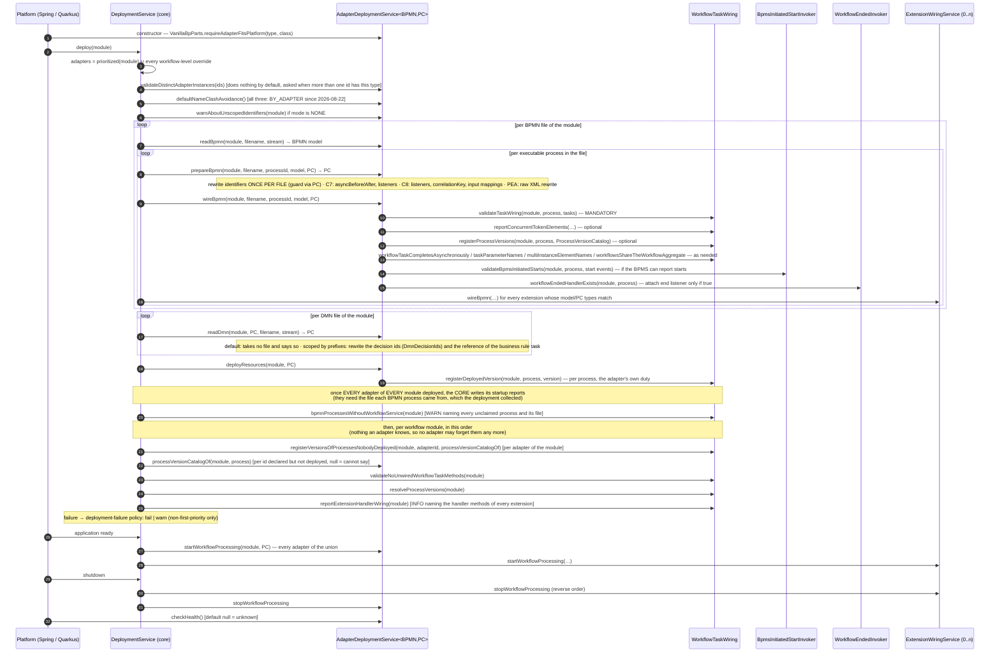

`DeploymentServiceTest` holds the pipeline itself, the deployment union of a
workflow-level override included (`workflowLevelAdapterIsIncludedInDeploymentUnion`), the
WARN about a configured workflow id no BPMN process matches
(`unknownConfiguredWorkflowIdIsWarned`) and the reverse shutdown order
(`extensionWiringServicesAreStoppedBeforeAdapters`). `DeploymentPipelineTest`,
`MultiAdapterDeploymentTest` and `ShutdownReverseOrderTest` run the same against a booted
application per platform.

### Name-clash avoidance (`NameClashAvoidanceSupport`)

One adapter-scoped property decides how a workflow module's identifiers are kept
apart from another module's: `name-clash-avoidance` = `BY_ADAPTER` (VanillaBP 1's
behavior — the BPMS' own isolation, e.g. a tenant named after the module) |
`USE_PREFIX` (no tenant; VanillaBP prefixes the identifiers, separator `__`) |
`NONE`. The core owns both the resolution (most-specific-wins across workflow >
workflow module > adapter) and the composition of the strings
(`NameClashAvoidanceService implements NameClashAvoidanceSupport`, handed to every
adapter as a platform bean).

Without any configuration the ADAPTER's default applies
(`AdapterDeploymentService#defaultNameClashAvoidance`, `BY_ADAPTER` unless
overridden). No shipped adapter overrides it: all three answer `BY_ADAPTER`, because that
is what VanillaBP 1 deployed and an upgraded application has to find its workflows in
their tenants. Both Camunda adapters answered `NONE` for eleven days, which is what a
Camunda 8 cluster from the stock image needs - it has multi-tenancy switched off and
rejects a deploy command carrying a tenant id - and that case is answered by a guiding
boot failure naming `use-prefix` and `none` rather than by a different default. The platform integrations
hand the adapters' deployment services to the service as a lazily resolved supplier
(adapters receive the service themselves, so they cannot be injected).

`BY_ADAPTER` means "the BPMS' own isolation", and what that IS the core does not know
(a tenant, a namespace, a database of its own). It therefore computes none of it: the
adapters derive the tenant themselves from the resolved mode (`Camunda8Scoping` and
`Camunda7Scoping`, duplicated on purpose - the rule is one line and the concept is
theirs). The core answers `modeFor` and nothing else.

The same split holds for validating: an adapter which carries configuration only
BY_ADAPTER could honor hands the PROPERTY KEY to `validateNoneNameClashStrategy`, and
the core answers whether BY_ADAPTER applies anywhere for that adapter - if it does
not, the boot fails naming the property, the modes which do apply and the two ways to
reconcile them. Both Camunda adapters pass their `tenant-id` this way.

And for asking the BPMS itself: Camunda 8 looks the tenant up in the cluster before
deploying (a cluster without multi-tenancy, or an unknown tenant, becomes a message
naming the property to change), while Camunda 7 has nothing to ask - a tenant id is an
attribute of the deployment there and the engine creates nothing.

Since `NONE` protects nothing, the core has the ADAPTER report it once per workflow
module and adapter id while the mode is resolved, i.e. at startup
(`AdapterDeploymentService#warnAboutUnscopedIdentifiers`). What can be used instead
is BPMS knowledge: Camunda 8 offers prefixing, a tenant per module on a
multi-tenancy cluster or a cluster per module, Camunda 7 offers prefixing, a tenant
per module or an engine per module (`data-source-name`, `table-prefix`). The default
implementation names what every BPMS can offer.

An adapter only decides WHERE to apply the result:

- in `prepareBpmn`, on its own model type — only the adapter knows it. Note the
  pipeline calls `prepareBpmn` once per PROCESS while all processes of a file share
  ONE model, so a model must be rewritten **once per file** (the adapters guard this
  by checking whether the file is already in the processing context);
- at every runtime boundary, outbound (`scoped*`) and inbound (`plain*`). Inbound
  always strips a KNOWN prefix, never "everything up to the first separator".

The result is transparent: registries, `ProcessService` calls, BPMN files and
configuration keep the PLAIN identifiers; only the BPMS sees scoped ones. Which
identifiers actually need scoping is BPMS-specific and documented in each adapter's
wiki (Camunda 7 does not prefix task definitions — they are process-local
expressions; Camunda 8 must prefix job types — they are subscribed cluster-wide).

Two guardrails belong to adapters:
`validateNativeIsolationSupported(adapterId, workflowModuleId, bpmsDescription)` is
called while DEPLOYING by an adapter whose BPMS has no isolation of its own (it
rejects `BY_ADAPTER`; `validateDistinctAdapterInstances` is the wrong place, the core
invokes that only for more than one id of a type), and
`validateNoCollidingProcessIds(adapterId, deployedProcesses)` is called once the
deployed processes are known. Changing the mode is a BPMS **migration**, not a
property change — hence a differing mode makes two adapter ids of one type distinct.

`validateNoCollidingProcessIds` is the one check of this family which REFUSES, because it
is the one clash which loses a model: the BPMS keeps one definition under the shared
identifier and not the other, so a workflow module would run on a model nobody deployed.
The two sides of such a clash live in two workflow modules and a deployment is per workflow
module, so the core remembers what earlier calls of the boot passed, per adapter id, in the
same map the two reports below fill. One map, because all three ask the same question: which
workflow module already reaches the BPMS under this form. An adapter therefore hands over the
processes of the module it is deploying and nothing wider, and two adapter ids never see each
other's processes, which is what a migration between two ids of one BPMS type needs. The boot
then ends while the second of the two modules deploys, with the first one already in the
BPMS - decision 41 of this repository says why that is the lesser evil.

What an equal pair of strings means depends on the mode, and under `BY_ADAPTER` the core
cannot say. Nothing is prefixed there, so the scoped form is the plain form, and two workflow
modules which a tenant keeps apart arrive as two equal strings: refusing them would end a
boot which is correct today, in the DEFAULT mode. The isolation mechanism is the adapter's
knowledge, so the core asks
`AdapterDeploymentService#ownIsolationSeparatesWorkflowModules(one, another)` and refuses only
where the answer is that nothing separates the two. The default answer is `false`, which
reads as "my isolation separates nothing" and is the honest answer for a BPMS without any.
An adapter answers about the scope it would REALLY deploy those two modules to rather than
about a property it reads: `tenant-id` is resolvable per adapter, per workflow module and per
workflow, so two modules can land in one tenant without a single line saying so. Under
`USE_PREFIX` the core composed both strings itself and asks nobody, under `NONE` nothing is
scoped and nothing separates the two by definition, and a mixed configuration is how one
module's prefixed form meets another module's plain id.

`validateNoCollidingProcessIds` compares one application's deployment against itself, which
leaves out whatever somebody else put into the same BPMS earlier: another application's
process id, a decision id of a module deployed years ago. Asking about those is the
adapter's work, because only it can query its own BPMS, and
`reportIdentifiersTheBpmsAlreadyHolds(adapterId, workflowModuleId, found)` is where the
answer arrives. The adapter hands over PLAIN identifiers, a `ScopedIdentifierKind` per
finding, a sentence of its own naming the holder and whether it can prove the holder is
not an earlier deployment of this application; the core composes the scoped form, resolves
the mode plus the property which set it, and writes one WARN per workflow module and
adapter id listing every finding. It never throws and never logs an ERROR, because the
deployment on the other side may belong to an application which runs correctly. An adapter
which cannot ask its BPMS calls nothing at all.

A query answers for a BPMN process id and a DMN decision id, and only where the BPMS keeps
a repository to search (Camunda 7, Camunda 8). The other kinds are in no index, which is not
the same as nobody being able to answer: those names live in a BPMN model, and both Camunda
adapters already read models a BPMS hands back. A task definition is read off a model as
well; what differs is whether it is scoped at all, which is process-local on Camunda 7 and
cluster-wide on Camunda 8. What rules the complete answer out is the
cost of one model read per version a BPMS holds, which grows with the years. So that question
is asked only where a model is being read anyway, which is the third check below.

Two more checks are about the workflow modules of THIS application.
`reportIdentifiersTheModelsDeclare(adapterId, workflowModuleId, declared)` takes what the
adapter read out of the models it deploys - it rewrites every message name, signal name,
error code, escalation code and task definition while it scopes that model anyway, so it
holds them for free - and the core warns where two workflow modules end up under one scoped
form. A task definition is the worst case of the set where a BPMS subscribes to it
cluster-wide: two modules using one job type under `none` make the worker of one fetch the
jobs of the other. A `ModelIdentifier` therefore carries the BPMN process for a task
definition, since those are scoped per process unless the application switched that off, and
two processes of ONE module sharing one stays silent either way. Under
`use-prefix` the forms differ and nothing is reported; `none` and a `by-adapter` adapter with
one `tenant-id` for every module are the cases it catches. Under `by-adapter` the message says
that VanillaBP cannot see whether the BPMS separates the two, because the isolation mechanism
is the adapter's knowledge. Several processes of ONE module
sharing a name is the scope working and stays silent. It warns rather than refusing, unlike
the process-id check: both models stay as they are, and two modules sharing a name may be a
design.

`ProcessVersionCatalog#identifiersOfVersion` reaches the name a workflow module deployed years
ago, read from a model the BPMS still holds, and `reportIdentifiersOfHeldVersion` holds it
against what the other modules deploy today. `DeployedProcessVersionsCheck` asks it in the
loop which already reads those models and already knows the workflow count per version, so it
costs no query and no extra fetch where the engine caches parsed definitions. A held version
of the module which still deploys the name is continuity and says nothing. The background of
all three is decision 40 in the repository's `DECISIONS.md`.

`NameClashAvoidanceServiceTest` goes through all of it: the resolution and the composition
(`mostSpecificLevelWins`, `prefixComposesIdentifiers`, `readingBackStripsKnownPrefixOnly`),
the adapter default (`defaultsToByAdapter`) and both guardrails
(`byAdapterIsRejectedWithoutNativeIsolation`, `collidingProcessIdsAreReported`).
`IdentifiersTheBpmsAlreadyHoldsTest` reads the warning about what the BPMS already held, per
kind and per mode, `CollidingIdentifiersOfWorkflowModulesTest` the two about this
application's own modules, `OldProcessVersionsTest` that a held version is asked in the loop
reading its model, and `StartupQuestionCostTest` keeps each of them at one message per
workflow module respectively per held version.

### Workflow-task processing

`@WorkflowTask` methods are executed by the core (package `workflowtask`): the
platform integration registers every `@WorkflowService` class under all BPMN
process IDs it declares (`bpmnProcess` + `secondaryBpmnProcesses`) with the
`WorkflowTaskRegistry` (scanning methods and building parameter binders once at
startup). Adapters interact through two adapter SPIs which the registry implements
together - `WorkflowTaskWiring` while an adapter deploys, `WorkflowTaskInvoker` in its
worker threads.

What counts as such a class is checked before anything is registered. An interface carrying
`@WorkflowService`, and an annotation of the application composing it, are refused - by Spring Boot
while the application starts, by Quarkus while it is built - and
`WorkflowServiceBelongsOnAClass` is the message both platforms say it with. VanillaBP reads the
`@WorkflowTask` methods off the annotated type, and Java inherits a method annotation from a
superclass and not from an interface, so the platforms would not even read the same methods: Spring
Boot sees the bean's class, Quarkus the interface its index reports. A subclass of an annotated
class stays a workflow service, which is what `@Inherited` promises and what a declaration shared
by several classes uses: the class handed to the registry is that SUBCLASS on both platforms, so
its methods, its BPMN process id and its workflow module are the ones in play (see decision 32 in
the repository's DECISIONS.md).

Two ways of writing a handler method are reported instead of served, and
`HandlerMethodsNobodySees` builds that report, once per workflow service class, from here so both
platforms write the same one. A `@WorkflowTask`, `@WorkflowStartedByBpms` or `@WorkflowEnded`
method which is not public is not among the methods the scanners read, and an override which
repeated none of the annotations replaced the annotated method with one carrying nothing, because
Java never inherits a method annotation. Both look to the developer like a handler which is right
there in their source, and both used to arrive as the wiring validation asking for a method that
exists. It is a WARN rather than the end of the boot, since an application whose model carries the
task ends its boot anyway, on the message about that task, and this is the sentence saying why the
method was not found. Serving such a method by reflection was refused: from the moment VanillaBP
lifts the visibility of a handler, which methods a class offers stops being the decision of
whoever wrote the class.

They were one interface of thirty methods until it became clear that a
mandatory call an adapter can forget will be forgotten: Camunda 7 forgot the reverse
wiring check for a year, and a typo in a task definition stayed silent until a workflow
reached the task.

1. During `wireBpmn`, through `WorkflowTaskWiring`: `validateTaskWiring(module, process,
   tasks)` reports every BPMN task without a `@WorkflowTask` method, all defects in ONE
   guiding exception; throwing from `wireBpmn` honors the deployment-failure policy. The
   other wiring calls answer what the adapter needs about the model: which parameters a
   delivery has to carry, whether a task may stay open, which processes share an
   aggregate, which elements can put a second token into a workflow.

   A process NO `@WorkflowService` class claims is the one case that call does not
   validate. A BPMN file goes to the BPMS as a whole, so a process modelled next to the
   one the application asked for is deployed with it, and the file may well belong to
   somebody else: a called process a modeller drew alongside the calling one, or a
   process which moved out of the application while its model stayed. Asking such a
   process for `@WorkflowTask` methods ended the boot over a model the application cannot
   change, and the message it wrote - add a workflow service for this process - is the
   right sentence only where the application means to serve it. The registry collects the
   process instead, and the deployment reports the module's unclaimed processes in one
   WARN naming each process, its file and what it costs. Where a service DOES claim the
   process, nothing changed: an unmatched task ends the boot as before, because that is a
   defect the developer can fix in their own code.

   **What the core does on its own**, once the last adapter of a workflow module finished
   deploying: four calls on `WorkflowTaskWiring`, of which three run per module. The
   report about the processes no `@WorkflowService` class claims comes first, from
   `bpmnProcessesWithoutWorkflowService(module)`, and it is written with the deployment's
   other startup reports rather than inside the per-module checks, because those reports
   name the file each BPMN process came from and that map belongs to the deployment as a
   whole.

   That report is also where a platform may add a sentence of its own, through
   `UnclaimedBpmnProcessHints` - one question, one answer, handed to `DeploymentService`
   like `workflowTaskWiring` is. The Spring Boot integration implements it and Quarkus
   does not, because the answer differs per platform while the report does not: on Spring
   Boot a class carrying `@WorkflowService` which nobody made a bean of is invisible to the
   discovery (decision 21 of `DECISIONS.md`) and only reading class resources can name it,
   which is Spring's work and must not enter the core; on Quarkus the same case fails the
   BUILD, because the build knows its bean set. The hint is asked ONLY where a process is
   actually being reported, so a healthy boot pays nothing, and its lines go inside the
   module's existing WARN block rather than into a warning of their own - one report per
   workflow module, not two which have to be read together. An implementation which throws
   is ignored: a report must not turn a warning into a failed boot.

   The three per-module calls follow, in an order which matters. Every adapter of the
   module is asked first, through
   `registerVersionsOfProcessesNobodyDeployed(module, adapter, ...)` and the adapter's
   `processVersionCatalogOf`, what its BPMS still holds for a BPMN process the
   application declares without bringing a model - the id a rename left behind. Those
   versions have to be in before `validateNoUnwiredWorkflowTaskMethods(module)`, the
   other direction of the wiring check where every method has to match a task somewhere
   in the module: without them a method kept for a renamed process reads exactly like a
   method wired to nothing. `resolveProcessVersions(module)` goes last, because a method
   serving no task at all is the more basic defect and the developer should read about it
   first.

   All four need nothing an adapter knows, so the core picks the moment instead of asking
   every adapter author to remember it. The reverse check stays exactly as loud as it
   was: an unclaimed process is never compared against methods, so it can neither excuse
   nor hide one.
   `registerDeployedVersion` stays with the adapter: only it knows which version its BPMS
   ended up with.

2. At runtime: `invokeWorkflowTask(module, process, TaskInvocationContext)` - the
   core resolves the handler (see [Which method serves a delivery](#which-method-serves-a-delivery)),
   loads the aggregate by its serialized ID, invokes the method with bound
   parameters and saves the aggregate, all within one transaction run by the
   platform's `TransactionRunner` (a new transaction, or the caller's for embedded
   BPMS - `TaskInvocationContext.runInCurrentTransaction`). Outcomes: normal
   return = COMPLETED (or COMPLETION_PENDING for `@TaskId` methods - completion
   arrives via `ProcessService#completeTask`); `TaskException` = BPMN_ERROR with
   the aggregate changes COMMITTED (the restored V1 contract); any other exception
   rolls back and propagates - the adapter applies its BPMS' retry semantics and
   must not complete the task.

One delivery of one task runs through the core as the picture shows: the delivery log is read
before the aggregate is loaded, the handler runs inside the one transaction together with the
aggregate and the record, and the answer to the BPMS follows that commit on a remote BPMS while
Camunda 7 gives it inside the engine's own transaction.

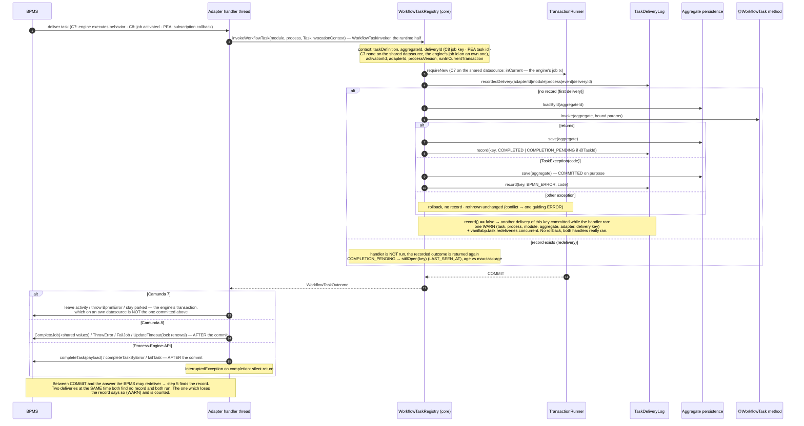

`WorkflowTaskRegistryTest` holds the wiring calls and the outcomes one by one
(`validateTaskWiring`, `validateNoUnwiredWorkflowTaskMethods`,
`taskExceptionYieldsBpmnErrorAndCommits`, `otherExceptionPropagatesWithoutSaving`), and
`WorkflowTaskProcessingTest#taskProcessingCoversAllOutcomesAndBindings` runs the same
outcomes through a booted application on both platforms.

What an adapter hands the core is a bag of getters per delivery, and the picture lists the three
of them next to the invoker interfaces which receive them: a task delivery, a workflow the BPMS
started by itself and the end of a workflow.

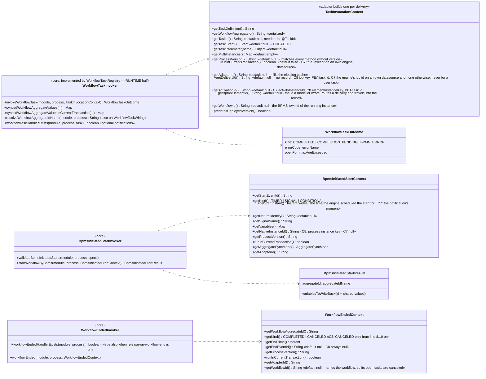

An adapter's `AdapterDeploymentService` extends `ExtensionWiringService`
("the wiring service with deployment"): preparing/wiring and starting/stopping of
workflow processing are inherited, reading and deploying of BPMS resources is added.
There is deliberately no DMN model type parameter yet — DMN support will be added to
the interface once designed.

#### Which method serves a delivery

A `@WorkflowTask` method is wired by one of two keys, and the method says which:
`taskDefinition` names what the BPMS subscribed to (a Camunda 8 job type, the expression of a
Camunda 7 service task), `id` names the BPMN element itself. A method setting neither is wired by
its own name and answers to both.

A delivery reports both keys as well: `TaskInvocationContext.getTaskDefinition()` and
`getBpmnElementId()`. The routing matches a method's key against the delivery's key of the same
kind, which is the pair `validateTaskWiring` matches against while the application boots. That the
two use the same pair is the point: a wiring the boot accepts has to be a wiring a delivery finds.
Until this was so, a service task wired by an expression whose method named the element id passed
the boot without a word and failed at the first delivery, which the application then learnt from an
incident.

The element id is compared against the reported task definition as well, for an adapter which names
no element of its own. There the one value it reports IS the element id, and a method wired by the
element id is reachable. An adapter which names neither the element nor an id-shaped task
definition cannot serve such a method at all, which is why `getBpmnElementId()` is worth answering
even though it is `default null`.

`WorkflowTaskRoutingTest` holds all of it, including the message a delivery nobody serves produces:
it names both keys, because a reader who only sees the task definition looks for a method under a
name their model does not carry.

#### A business key which is not the aggregate's id (`BusinessKeyCheck`)

VanillaBP names a workflow by its workflow aggregate and by nothing else. A BPMS which keeps a
business key of its own gets that id written into it wherever VanillaBP starts the workflow:
Camunda 7 always, Camunda 8 from cluster 8.10 on. A workflow started past VanillaBP can carry a
key somebody else chose while it also carries the variable with the aggregate's id, and then two
values say different things about one instance.

An adapter reports what its BPMS keeps through `getBusinessKey()`, which exists on all three
contexts the BPMS hands a workflow over with: `TaskInvocationContext`, `WorkflowEndedContext` and
`BpmsInitiatedStartContext`. The core compares it against the aggregate's id and refuses the
delivery where the two disagree. It raises no incident itself on any BPMS, here as everywhere: the
invocation ends, and the BPMS applies what it applies to any failing handler, which is a retry and
then an incident on both Camunda engines.

A start the BPMS performed on its own has no aggregate yet, so the comparison happens where the
id is final and still inside the transaction the start opened. A refusal there takes the aggregate
with it rather than leaving one behind which the instance does not name.

What says nothing does not contradict, on either side. An absent business key is the ordinary
state of every Camunda 8 workflow up to cluster 8.9 and of every workflow on a BPMS without
business keys. An absent aggregate id is the workflow an application takes over after upgrading
from version 1 on Camunda 7: version 1 wrote no process variables there, so such an instance
carries its identity in the business key and nowhere else, and reading a missing variable as a
deviation would send every migrated workflow into an incident at its first delivery.
There is no way to switch the check off, because a disagreement is a defect in whatever started
the workflow rather than a matter of taste. It is
[decision 69](../DECISIONS.md), and `BusinessKeyIsTheAggregateIdTest` holds the three places, the
empty key, the key which carries the id, and the start which leaves nothing behind.

#### Deployment-failure policy

By default, a failing deployment of any configured adapter aborts booting of the
application. During a BPMS migration the old BPMS may be temporarily unreachable —
setting `vanillabp.adapters.<id>.deployment-failure` to `warn` lets the application
start anyway if a NON-first-priority adapter fails to deploy (the failure is logged
and that adapter does not process workflows). A failure of the first-priority adapter
always fails the boot, regardless of the policy, because new workflows could not be
started otherwise. Both halves are held by
`DeploymentServiceTest#nonPrimaryAdapterFailureWithWarnPolicyBootsAnyway` and
`#primaryAdapterFailureFailsEvenWithWarnPolicy`, and per platform by
`DeploymentFailureWarnTest` and `DeploymentFailureFailTest`.

#### The variables a handler reads (`taskParameterNames`)

A `@TaskParam` takes what the BPMS GENERATED on this path through the model: the target of
an input or output mapping, the result of a script or a decision, a value the model
computed rather than the workflow aggregate holds. Most applications need none of it, and
it can never be ruled out, because a model may produce a value the application has to see.

Those names exist in exactly one place, and it is here. `WorkflowTaskScanner` reads them
off the annotations while it builds the parameter binders, `WorkflowTaskHandler` keeps them
and `WorkflowTaskRegistry#taskParameterNames(module, process, taskDefinitionOrActivityId)`
reports the union over every handler serving that element - a union, because methods
serving different process versions share one BPMN element and whichever of them runs has to
find its variable. The list is sorted and duplicate-free, which a subscription comparing
itself across restarts needs (a Camunda 8 job stream is equivalent to another one only when
the fetched variables match).

Why the core has to say it: at runtime an adapter pulls the values one name at a time
through `TaskInvocationContext#getTaskParameter(name)`, and by then the delivery has already
happened. A BPMS which ships a variable payload with every delivery has to know the names
BEFORE it subscribes, and the only other place it could look is the BPMN model - which is a
guess, since the model may declare names nobody reads and a handler may read a name no model
declares. Camunda 8 derived the list that way for a while; the model scan is gone rather
than kept as a second source for one answer.

The method is a `default` returning an empty collection, so an adapter which never heard of
it keeps the behaviour it had. BPMS-initiated starts deliberately have no counterpart: the
core copies EVERY variable such a start carries into the workflow aggregate it builds
(`BpmsInitiatedStartExecution#writeVariables`), so a start worker has to ask for all of them
regardless of what any `@TaskParam` names. The union and its order are held by
`WorkflowTaskRegistryTest#theUnionOfEveryMethodServingTheElement`,
`#theDeclaredNamesAreReported` and `#theDefaultAnswersNothing`.

#### The iterations a handler wants the item of (`multiInstanceElementNames`)

A multi-instance element hands three things to a handler: which round it is in, how many
rounds there are, and the item of the round. The first two every model answers. The item is
the one a model may never name: a Camunda 7 element without `camunda:elementVariable` and a
Camunda 8 one without `inputElement` iterate without saying what the current value is
called. A handler asking for it then receives `null`, and nothing says why.

Both of those are legitimate on their own. An element which iterates a fixed number of times
is a model somebody meant to write, and so is a handler which reads the index and the total
only. What nobody means is the two together, and neither side can see it alone: only the
adapter reads the BPMN, only the core scans the handlers.

So the core answers what it sees.
`WorkflowTaskRegistry#multiInstanceElementNames(module, process, taskDefinitionOrActivityId)`
reports the element ids the methods serving that element ask an item for - the value of
`@MultiInstanceElement`, and where the parameter names a resolver bean instead, what
`MultiInstanceElementResolver#getNames()` reports. The answer is the union over every method
serving the element, for the reason `taskParameterNames` unions its answer: methods serving
different process versions share one BPMN element and all of them read their item out of the
model the adapter is asking about. Sorted and duplicate-free.

The resolver bean is looked up when the answer is first needed, not while the workflow
service is scanned: the beans of an application are not all built at that point. A resolver
bean nobody defined answers nothing here, because the parameter binder built for the same
parameter already says what is missing and how to define it.

An id which is no element of the model being asked about is no finding. The multi-instance
chain crosses a call activity, so a task of a called process asks for an element of its
caller, and the model at hand is the wrong place to look for it. An adapter therefore
refuses only what it can see: an element of ITS model, multi-instance, with no item, and a
handler asking for that item.

The method is a `default` returning an empty collection, so an adapter which never heard of
it keeps the behaviour it had. The other two multi-instance annotations have no counterpart
and need none: every multi-instance element answers an index and a total, so there is
nothing to check. Held by `WorkflowTaskRegistryTest#theNamedElementIsReported`,
`#countingAsksForNoItem`, `#theResolverBeanIsAsked`, `#aMissingResolverBeanReportsNothing`,
`#theUnionOfEveryMethodServingTheElement` and `#theDefaultAnswersNothing`.

#### What a `@TaskParam` may be declared as (`ValueConversion`)

An adapter hands the value over as its BPMS deserialized it and converts nothing. The
conversion into the declared type happens once, in the platform, in `ValueConversion`,
which serves the parameters of a `@WorkflowTask` method, the parameters of a
`@WorkflowStartedByBpms` method and the attributes an aggregate gets when the BPMS started
the workflow.

What it does:

|      the value the BPMS reported       |   the declared type    |                        what the parameter gets                         |
|----------------------------------------|------------------------|------------------------------------------------------------------------|
| anything the type already holds        | that type, or `Object` | the value itself                                                       |
| `null`                                 | a wrapper type         | `null`                                                                 |
| `null`                                 | a primitive type       | the invocation fails, naming the input mapping as the way out          |
| a number                               | another number type    | the same number, or a failure where it would not be the same number    |
| a number                               | `String`               | its `toString()`                                                       |
| the text of a number                   | a number type          | the number, or a failure where the text is no number                   |
| `"true"` or `"false"`                  | `Boolean`              | the boolean                                                            |
| the name of an enum constant           | that enum              | the constant, or a failure where the enum has no constant of that name |
| the text a value type travels as       | that type              | the value, or a failure where the text is none that type travels as    |
| the text of a `Calendar` or a `Locale` | that type              | the invocation fails, naming the type to declare instead               |
| everything else                        | anything               | the invocation fails, naming the value's class and the declared type   |

The row worth reading twice is the one about numbers. A number travels through its decimal
form, never through `intValue()` or `doubleValue()`, and the converted value is handed over
only where it reads back as the same number. Comparison is numeric, so a scale the target
type cannot keep is no reason to refuse:

|      what the aggregate shared       | declared as |     what arrives     |
|--------------------------------------|-------------|----------------------|
| `new BigDecimal("120.50")`           | `Double`    | `120.5`              |
| `new BigDecimal("120.50")`           | `int`       | the invocation fails |
| a `Long` of `3000000000`             | `long`      | `3000000000`         |
| a `Long` of `3000000000`             | `int`       | the invocation fails |
| `new BigInteger("9007199254740993")` | `Double`    | the invocation fails |
| a `Float` of `0.1f`                  | `Double`    | `0.1`                |
| `"120.50"`                           | `int`       | the invocation fails |

A failure ends the invocation, so the BPMS raises the incident it raises for any other
failing task, and the message names the value, the declared type and the number which
would have arrived instead. The alternative is a handler acting on a number nobody wrote,
which is why this is a refusal rather than a rounding rule. It is
[decision 55](../DECISIONS.md), and `UPGRADE.md` says what it means for an application
coming from version 1. The cases are held by
`WorkflowTaskScannerEdgeCasesTest`, nested class "Task-parameter conversion", and by
`AggregatePropertyWriterTest` for the writing side. `TextValueRoundTripTest` holds the way
out and the way back against each other: it asserts the text every one of those types is
shared as and that the same text comes back as the same value.

The message names the parameter as the developer wrote it where the application was
compiled with `-parameters`, which `spring-boot-starter-parent` sets. Without the flag
javac keeps no names and the message says `arg1`.

The other row worth reading twice is the one about text. A workflow aggregate shares an
enum as the name of its constant, and a value type such as a `UUID` or a `LocalDate` as the
text `TextValueTypes` names for it, which for most of them is the text the type writes
itself. The way back reads exactly those texts, so a handler declares the type the
aggregate holds and gets the value the aggregate held:

|             what the aggregate shared              | what the BPMS carries  | declared as |
|----------------------------------------------------|------------------------|-------------|
| `UUID.fromString("f81d4fae-7dec-...")`             | `f81d4fae-7dec-...`    | `UUID`      |
| `Decision.APPROVED`                                | `APPROVED`             | `Decision`  |
| `LocalDate.parse("2026-09-16")`                    | `2026-09-16`           | `LocalDate` |
| `Instant.parse("2026-09-16T18:15:30Z")`            | `2026-09-16T18:15:30Z` | `Instant`   |
| `Duration.ofMinutes(90)`                           | `PT1H30M`              | `Duration`  |
| `Date.from(Instant.parse("2026-09-16T19:55:30Z"))` | `2026-09-16T19:55:30Z` | `Date`      |
| `TimeZone.getTimeZone("Europe/Berlin")`            | `Europe/Berlin`        | `TimeZone`  |

The types carried both ways are `UUID`, every enum, the `java.time` values `Instant`,
`LocalDate`, `LocalTime`, `LocalDateTime`, `OffsetDateTime`, `OffsetTime`,
`ZonedDateTime`, `Year`, `YearMonth`, `MonthDay`, `Duration`, `Period`, `ZoneId` and
`ZoneOffset`, plus `java.util.Date` and `java.util.TimeZone`. `DayOfWeek` and `Month` are
enums and come along with every other enum. A text in any other form is refused, and the
message shows a text the type does travel as. A constant name the model invented is
refused too, naming the constants the enum has, because a handler reading such a name
would act on a value nobody declared.

**That list is a selection, not a promise about the JDK.** It holds what a workflow
aggregate carries often enough to be worth carrying, and a type missing from it is a type
nobody has needed yet rather than a type ruled out. Somebody who misses one opens an
issue, and it is added with the text it travels as. Everything else the JDK wrote still
reaches the BPMS as its own text, one way, and a parameter declaring such a type is
refused.

Timers are where a model reads these texts back, so two limits belong here. Camunda accepts
a date, a duration and a cycle in a timer event. A `Duration` carries days, hours, minutes
and seconds, a `Period` carries years, months and days, and neither of them carries the
combined form `P3Y6M4DT12H30M5S`. A cycle such as `R5/PT10S` and a cron expression are no
`java.time` value at all, so share them as a `String`.

The second limit is visible in the model. `java.time` writes a duration of a day or more in
hours, so `Duration.ofDays(14)` reaches the BPMS as `PT336H` rather than as `P14D`. A timer
fires at the same moment either way, because the engine reads both forms, but the text an
operator reads is not the text the application wrote. Where the wording has to survive,
share the value as a `String`.

**A `Date` and a `TimeZone` travel as a text built for them**, not as the text they write
themselves, and that is the one place where the way out does more than call `toString()`.
A `Date` is a count of milliseconds and carries no zone, so it travels as the instant it
holds and the milliseconds survive. The text is the same whichever server wrote it, which
an offset in the zone of the JVM would not be: two nodes of one application would write
two texts for one value, and a value written in summer would read differently from the
same value written in winter. What an operator gives up for that is local time in the
model. Every subclass travels the same way, so an attribute declared `Date` which a JPA
provider fills with a `java.sql.Timestamp` carries the same text as a plain `Date`, down
to the millisecond and no further.

A `TimeZone` travels as the id of its zone, which is what `toZoneId()` answers, and
`TimeZone.getTimeZone(ZoneId)` reads it back. Measured on 2026-09-17 against Java 21: a
zone with a fixed offset survives as it was written, so `GMT+05:30` is shared and read
back as `GMT+05:30`. A three-letter id does not, because it is no zone name. `IST` is
shared as `Asia/Kolkata` and `EST` as `-05:00`. It is the same zone with the same rules
under the name it really has, and an application comparing ids has to know that.

`java.util.Calendar` and `java.util.Locale` stay refused on the way back although such a
text looks readable, and the message says which type to declare instead. A `Calendar` is written
as its debug form, 769 characters naming every field of the implementation, and no point
in time can be read out of it without guessing which of its fields to trust. A `Locale` is
written as `de_DE`, which no `Locale` method reads back, and `Locale.ROOT` is written as an
empty text.

**An aggregate which shares a `Calendar` attribute does not boot.** Such a text is no
value, so the application is not allowed to send it, and `validateSyncModel` reports the
attribute as a defect. The message names the attribute, the class it belongs to, the type
it is declared as and what the BPMS would be given, and it says to share an `Instant` for
the point in time, with a `TimeZone` or a `ZoneId` next to it where the zone matters too.
Leaving the attribute out of what is shared would be worse than refusing it: a process
variable which quietly stopped being written makes a model read null and take a branch
nobody chose. Where no model needs the attribute, `@NoSyncWithBPMS` says so and the
application boots.

A boot which fails may not rest on a guess, so the refusal asks whether the attribute
really is shared, along the same chain a sync point walks. A class states its own mode or
inherits from the attribute holding it, and an attribute may state its own. The walk starts
out sharing, because `FULL` is the default of every adapter. A `Calendar` inside a nested
object or as the element of a collection is refused the same way, because it is the same
walk.

Every other attribute whose text nothing reads back is named while the application boots,
once per attribute, with the type to share instead. It works on the way out and fails on
the way in, and the way in is a task handler, so without that word the application learns
about it when a model first maps the value into one. That one is a warning and the
application boots: `validateSyncModel` is not told the adapter's default and therefore
cannot know whether the attribute is shared at all, and a warning which is wrong costs a
log line. An attribute marked `@NoSyncWithBPMS` is left out of it. Why the list is asked
about the type a value IS rather than about the package its class sits in is
[decision 58](../DECISIONS.md), and the refused `Calendar` is
[decision 59](../DECISIONS.md).

**An aggregate which shares EVERYTHING does not boot either, unless its workflow says
so.** An aggregate carrying no `@NoSyncWithBPMS` anywhere hands every attribute it reaches
to the BPMS, and nobody decided that: it is where an application lands by doing nothing.
`FullSyncCheck` asks the sync model once per registered workflow, through
`WorkflowAggregateSync.everythingSharedWithBpms`, and the answer is the attributes of the
aggregate itself where nothing at all is held back, and empty otherwise. The message names
the workflow, the aggregate and those attributes, and it offers the two ways on: say what
the models need, or write the permission at the workflow.

```
vanillabp.workflow-modules.<workflow-module>.workflows.<bpmn-process-id>.allow-full-sync-with-bpms: true
```

The permission is read at the workflow and at no other level, which is the one exception
from the resolution of [decision 7](../DECISIONS.md). An inherited permission would cover
the workflow somebody adds next week. The key is bound at the application, at a workflow
module and in an adapter section as well, and `MigrationAdapterProperties` refuses it there
with a message naming where it belongs, so nobody is left believing it was given. The ID
attribute is not counted: it travels whatever the sync model says, so an aggregate made of
nothing but its ID starts. A secondary BPMN process is covered by the permission of the
process it belongs to. The reasoning is [decision 66](../DECISIONS.md).

**What to share, and as what.** A workflow aggregate carries the results a model decides on
and the values an operator reads, not every field of a business object. So a `@TaskParam`
reads a decision or a number somebody looks at, and the types worth declaring are the ones
such a value needs: `String` in both directions, the integral types among each other where
the value fits, a decimal to a decimal, and a decimal to a floating type where the value
survives. A decision the model acts on travels as the name of an enum constant and a point
in time as the text `java.time` writes, and each of them comes back as the type the
aggregate declared. A value nobody computes with travels best as text, because every BPMS
carries text and text loses nothing on the way. A type of the application's own is refused, and
stays refused: a BPMS variable is a plain value and only the application knows what its own
types mean.

**What the BPMS decides, and VanillaBP does not.** Which Java type a value comes back as is
the engine's answer, and the three of them differ. Camunda 7 returns the class it stored,
so a `BigDecimal` it wrote is a `BigDecimal` again. Camunda 8 holds JSON, so a decimal
comes back as a `Double` and a whole number as a `Long`, and no value the cluster returns
is ever a `BigDecimal`, a `BigInteger` or a `Float`. The Process-Engine-API answers
whatever its backend stored. `@TaskParam Object` is therefore the one declaration whose
answer is BPMS-shaped, and it is the hatch for a handler which wants to see what the engine
really sent. A typed parameter is served on all three, because the conversion builds the
target from the number's decimal form. This paragraph and the next one report a
measurement taken on 2026-09-16, against Camunda 7.24 in both of its serialization worlds,
a Camunda 8.9.19 cluster and the Process-Engine-API's in-memory engine; no test holds
them.

Whether a `@TaskParam` finds anything at all without an input mapping is decided by the
model as well. Camunda 7 reads the task execution's own scope, so a task standing straight
in the process sees a process variable while the same task on a parallel branch or in an
embedded subprocess sees `null`. Camunda 8 resolves a job's variables up the scope
hierarchy and finds the variable wherever the task sits. Declare the input mapping rather
than relying on either.

#### Deliveries VanillaBP already processed (`TaskDeliveryLog` SPI)

The inbound counterpart of the outbox. A remote BPMS reports the outcome AFTER the
local transaction was committed, so a crash in between makes it deliver the same task
again - which used to run the `@WorkflowTask` method a second time. The core now
remembers a processed delivery and answers a repeated one from the record.

Everything about those records lives in `DeliveryRecords`, one per process service: it
resolves the store, keys a delivery, answers a repeated one, measures how long a task has
been open, and reads a record to tell which adapter holds a task. It takes the adapters as
a parameter where it needs them, the way `WorkflowLocator` does - which adapters serve a
BPMN process is the process service's business, not the records'.

- The identity of a delivery comes from the adapter:
  `TaskInvocationContext.getDeliveryId()` (Camunda 8: the job key; Process-Engine-API:
  the task ID; Camunda 7: none, see below). `TaskDeliveryKey` (package `workflowtask`)
  qualifies it with adapter ID, workflow module, BPMN process and event, so an ID only
  has to be unique within its own BPMS, and hashes the result where it would outgrow
  what a store can index (512 characters, MySQL's unique-key limit with utf8mb4).
- The record is written in the handler's own transaction
  (`MigrationProcessService.executeWorkflowTask`): read before the aggregate is loaded,
  written after it was saved, and it carries the OUTCOME (`WorkflowTaskOutcome.Kind`
  plus BPMN error code and name). A repeated delivery therefore reports the recorded
  outcome again - skipping both handler and answer would leave the task open forever.
  A handler which threw leaves no record: the rollback took it, and the BPMS' retry
  runs the handler again.
- Two deliveries of one task which OVERLAP are the case a record written after the work
  cannot catch: both read no record, both run the handler, and the second `record(...)`
  finds the key taken and returns `false`. Nothing is rolled back there, because both
  handlers really did their work. What the core does with that knowledge is say it out
  loud: `DeliveryRecords#reportHandlerRanTwiceAtTheSameTime` writes one WARN
  naming the task, the workflow, the adapter and the delivery key, and counts the case as
  `vanillabp.task.redeliveries.concurrent`, the counterpart of
  `vanillabp.task.redeliveries.deduplicated`. Both halves are held by
  `InboundIdempotencyTest#twoDeliveriesAtTheSameTimeAreNamedAndCounted`, on Spring Boot
  and on Quarkus.
- `TaskDeliveryLog` and `TaskDeliveryLogAware` live in the integration SPI next to
  `PhaseTwoOutbox`, with the same per-aggregate resolution
  (`TaskDeliveryLogResolver`, implemented per platform): a record has to ride the
  aggregate's own transaction. `JdbcTaskDeliveryStore` and
  `TaskDeliveryRetentionCleanup` (package `delivery`) hold the SQL respectively the
  cleanup schedule both platforms share; the connection comes from
  `JdbcConnectionAccess`, the one piece which cannot be platform-neutral. Whether a
  table is there is asked of the JDBC metadata by `jdbc.JdbcSchema#tableExists`, used
  by every store which either creates its table or verifies that the application
  created it - including the gruelbox outbox a Spring Boot application may opt into,
  whose table is gruelbox's and therefore not shipped by `vanillabp-schema`.
- The switch is the adapter-scoped `deduplicate-deliveries` (default `true`),
  resolvable per workflow module, workflow and task like every adapter-scoped key.
- An adapter says whether it needs this at all:
  `MigratableProcessService.deliversTasksAtLeastOnce()` (default `false`). It decides
  the startup report only - at runtime nothing is remembered where no delivery ID
  arrives. Camunda 7 answers `false` on purpose: it delivers tasks inside its own
  transaction, so a redelivery proves that nothing was committed.
- Without a store there is a guiding WARN at startup
  (`validateTaskDeliveryLogAtStartup`, once per process service) instead of a failed
  boot. Unlike the outbox, nothing is broken without a log - the behaviour is the one
  every VanillaBP had before, and the wiki's rule about idempotent handlers covers it.

Camunda 7 on an own engine datasource is the mode which makes a redelivery visible to the core at
all, and the picture shows why: the engine's job transaction is one the application's persistence
cannot join, so the record commits before the engine rolls its job back, and the job the engine
runs again is answered from the record without entering the `@WorkflowTask` method.

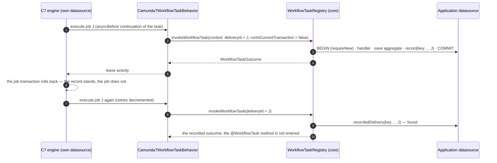

Two deliveries of that mode carry no identity at all, the notification about a user task and the
one about a cancelled task. Both travel with whatever job the engine happens to run, and one such
job creates respectively cancels every task the token reaches, so its id would name several
deliveries at once.

`InboundIdempotencyTest` holds the mechanism at both levels: in the core
(`repeatedDeliveryIsAnsweredFromTheRecord`, `aRolledBackDeliveryIsProcessedAgain`,
`deliveriesWithoutAnIdentityAreNotDeduplicated`, `aMissingDeliveryLogIsReportedAtStartup`)
and once per platform against a booted application. `TaskDeliveryKeyTest` holds the
qualification and the hashing.

#### The end of a workflow releases its records

Age alone is a poor answer to "how long does a record have to be kept": seven days are
too long for a busy application and too short for a task genuinely open longer than
that. The end of a workflow is the exact statement the retention only approximates,
since nothing of an ended instance can be redelivered.

- The switch is `vanillabp.delivery.release-on-workflow-end` (`DeliveryProperties`,
  resolved by `MigrationAdapterProperties.releasesDeliveryRecordsOnWorkflowEnd`), global
  and per workflow module, default `false`. It is adapter-INDEPENDENT: the records of
  every BPMS live in the store of the aggregate, so this is a question about the
  application's data.
- Off by default because the end of a workflow is reported only where it is used:
  adapters ask `WorkflowTaskRegistry.workflowEndedHandlerExists` while wiring, and that
  method answers `true` where the release is switched on, even without a
  `@WorkflowEnded` method. That is the whole reason no adapter had to change for this.
- The deletion runs in `WorkflowEndedHandlers.workflowEnded`, inside the transaction that
  notification opens anyway, bounded by workflow module, BPMN process, aggregate and by
  an `Instant` taken BEFORE the notification is processed. The time bound is what keeps
  the records of a SECOND workflow on the same aggregate, which is possible since
  aggregates outlive their workflows.
- `TaskDeliveryLog.releaseRecordsOf(...)` has a default deleting nothing, so every store
  written before this stays valid. Whether a store implements it is answered by
  reflection over the class the platform integration hands out
  (`TaskDeliveryLogResolver.storeClassOf`, which unwraps CDI client proxies respectively
  Spring AOP proxies - a proxy overrides the default method and would claim a release
  which does not exist). A store which cannot release plus the option switched on is one
  WARN at startup; with the option off nothing is logged.
- The retention stays for everything the end of a workflow does not cover: workflows
  still running, aggregates whose workflow never ends, stores without the release.

`DeliveryRecordReleaseTest` holds every one of those bullets, in the core and once per
platform.

#### How old an open task is

A `@TaskId` handler leaves its task open, and from there on nothing asks whether the
completion is still coming: the BPMS keeps redelivering the task, the core answers every
redelivery from the record it wrote when the handler ran, and a Camunda 8 adapter renews
the job's lock on the way. A workflow waiting forever therefore looks exactly like one
waiting legitimately.

- `TaskDelivery` carries `recordedAt`, the moment the delivery was processed. Every store
  persisted it from the beginning, because the retention deletes by it; what came later is
  the SPI component and the mapping in the four stores. The core sets the value when it
  builds the record, so the timestamp is the processing moment and not whatever a store's
  clock says.
- `DeliveryRecords.stillOpen` measures the distance to now on every redelivery
  answered with `COMPLETION_PENDING` and compares it to
  `MigrationAdapterProperties.maxTaskAge(module, process, task)`
  (`vanillabp.delivery.max-task-age`, default `P30D`, `0` switching it off). The property is
  adapter-INDEPENDENT like the rest of `DeliveryProperties`, and it resolves globally, per
  workflow module, per workflow and per task, most specific first - which is why
  `WorkflowAdapterProperties` and `TaskAdapterProperties` gained a `delivery` section.
- The report is one WARN per delivery key rather than per redelivery, remembered in a
  bounded LRU map of the process service. Forgetting an entry costs one repeated message,
  which is why nothing durable is involved.
- What happens beyond the report belongs to the BPMS. `WorkflowTaskOutcome` therefore
  carries `openFor` and `maxAgeExceeded`, and an adapter which has somewhere better to put
  the finding reads them - Camunda 8 stops renewing the lock and fails the job into an
  incident where `async-task-max-age-action` says so. An adapter without a lock to renew
  ignores both and the report is all that happens.
- Deliberately no callback into the application. An application which knows its task is
  obsolete has `ProcessService#cancelTask`; one which lost track of it could not answer a
  liveness question truthfully anyway.
- The record itself used to expire with the retention while its task was
  still open, which is the exposure the retention shrank from the old fourteen-day horizon
  without removing it. A second timestamp on the record closed it (see the next section);
  the age measured here keeps counting from the first one,
  which is why refreshing that one was never an option.

The measurement and its property are `OpenTaskAgeTest`, from `anOverdueTaskIsReportedOnce`
through `theMaximumAgeResolvesMostSpecificFirst` to `zeroSwitchesTheReportOff`.

#### The retention of a record is its own property

`vanillabp.delivery.retention` decides how long a record is kept, and it defaults to
`vanillabp.outbox.retention`, which is where the number lived while one property governed
both windows. They stopped being one kind of thing when the outbound deduplication window
ended with the dispatch (decision 22): on the outbox side the retention only decides how
long a dispatched entry stays readable during support, on this side it decides whether a
late redelivery runs the business code again. An installation shortening the one to keep
its table small was shortening the other with the same hand. That two questions of
different kinds get two properties is decision 24.

- The resolution is `DeliveryProperties.resolveRetention`, called by
  `MigrationAdapterProperties.resolvedDeliveryRetention` on Spring Boot and by the lazy
  `getDeliveryRetention` of the two Quarkus logs, which cannot ask a bound properties
  object at the moment they need the number.
- It is read GLOBALLY, unlike `release-on-workflow-end` and `max-task-age` next to it. One
  `TaskDeliveryRetentionCleanup` per store deletes by age across the whole table
  respectively collection, so a value per workflow module would have to be honored by a
  different deletion in each of the four stores to mean anything.
- Where exactly one of the two numbers is moved away from the default, the startup says
  which window applies to what (`MigrationAdapterProperties.reportRetentionSplit`). The
  trigger is "differs from the default" rather than "was written down", because a bound
  property cannot tell those apart.
- No startup check compares the retention against what an adapter can redeliver within,
  which was the alternative to splitting and is refused by decision 24. What an adapter
  knows is the INTERVAL at which it hands unacknowledged work out again - the Camunda 8
  `async-task-lock-renewal` - and the horizon is set by how long the application is stopped
  and by whoever resolves an incident. A check against the interval would pass in exactly
  the installations about to run business code twice.

Move one of the two numbers away from its default and `DeliveryRetentionTest` says which
window applies to what: `theDeliveryHalfFollowsTheOutboxRetention`,
`theOutboxDoesNotFollowTheOtherWayRound`, `movingOnlyTheOutboxNumberIsReported`,
`agreementIsSilent`.

#### The record of a task which is still open

The record which answers the redeliveries of an open task was deleted once the retention
passed, seven days by default. A task open for longer lost the record, and the next
redelivery reached the `@WorkflowTask` method a second time.

The record therefore carries a second timestamp. `RECORDED_AT` keeps meaning the moment the
handler ran, which is what the age of an open task is measured from, and `LAST_SEEN_AT`
carries the moment the BPMS last redelivered that task. The retention cleanup deletes by the
second one, so a task which is still being redelivered keeps the record answering it while
the record of a task nobody hands out any more expires as it always did.

- `DeliveryRecords.stillOpen` is the trigger, and it belongs to the core rather
  than to any adapter: it runs on every redelivery whose recorded outcome is
  `COMPLETION_PENDING`, whichever BPMS redelivered. It reports the key to the store through
  `TaskDeliveryLog.stillOpen(deliveryKey)`, whose default implementation does nothing, so
  a store written by an application stays valid.
- Nothing is written there. The redelivery runs in the transaction of the workflow
  aggregate, and an UPDATE per renewal of every open task has no business in it, so the key
  lands in `OpenTaskTouches` and the timer which already runs the retention cleanup writes
  what accumulated. Losing that memory to a crash costs one interval of refreshments,
  because a record only expires when a whole retention passes without a single one. The
  memory is bounded for the same reason.
- Writing goes in blocks of `OpenTaskTouches.BLOCK_SIZE` keys: one
  `UPDATE ... SET LAST_SEEN_AT = ? WHERE DELIVERY_KEY = ?` executed as a JDBC batch instead
  of an `IN` list, whose length is capped differently by every database (Oracle at 1000
  expressions, SQL Server at about 2100 parameters). The MongoDB stores of both platforms
  do the same with an unordered bulk write per block.
- Two alternatives were rejected for the same reason: a cleanup which skips
  `COMPLETION_PENDING`, and one collective `UPDATE ... WHERE OUTCOME = 'COMPLETION_PENDING'`.
  Either of them keeps the record of a task which never completes alive for good, and a
  store which only grows is worse than the defect being fixed.
- The column belongs to `io.vanillabp:vanillabp-schema` (changelog plus generated SQL). The
  startup check used to look at the TABLE only, which is exactly the case a new column
  slips through: a table created by an earlier version exists, so the check passed and the
  missing column would have surfaced at the first delivery. `validateSchemaExists` and
  `createSchemaIfNotExists` therefore verify the columns added later as well, and the
  message names the `ALTER TABLE` which repairs it.

`OpenTaskRecordRetentionTest` holds the two timestamps and the expiry,
`OpenTaskTouchesTest` the bounded memory and the blocks, `OpenTaskRetentionTest` the
survival of an open task's record on both platforms, and
`JdbcTaskDeliverySchemaTest#aMissingColumnIsReportedAtStartup` the check which now reads
columns instead of only the table.

#### The record answers which BPMS holds a task

A workflow is located by asking the adapters (decision 25), and for a task that question was
asked twice on Camunda 8: the election sends `newUpdateTimeoutCommand` against the job, and the
adapter's phase one sends the same command again a moment later as its pre-commit check. The
record of that task's delivery knew the answer to the first one all along - it names the adapter
which delivered - so every call naming a task reads it before it walks anybody. Why that is not
the registry decision 25 rejected is decision 30.

- The record carries `TASK_ID`, the BPMS' identity of the task, and `TASK_CLOSED_AT`, the moment
  the application's completion of it reached the BPMS. `DeliveryRecords.record`
  writes the first from `TaskInvocationContext.getTaskId()`, and both columns are nullable, so a
  record written before them is not part of any answer.
- `TaskDeliveryLog.recordOfTask(module, process, aggregateId, taskId)` is the question, and it is
  the record which reported `COMPLETION_PENDING` - the only outcome which leaves a task for the
  application to complete later. `markTaskClosed` is the note. Both are `default` methods
  answering nothing respectively doing nothing, so a store an application wrote stays valid and
  its election walks as it always did.
- The record sits under the BPMN process id of the process which DELIVERED the task, and for a task
  a called process handed out that is the secondary id, while the application completes it on the
  primary process service. So the read walks every id the workflow service serves
  (`DeliveryRecords.setBpmnProcessIdsToReadUnder`, fed from `servedBpmnProcessIds`), the reading
  instance's own first, and so does the note, which stops at the id whose row it marked. The write
  moves nowhere, so a record still says which process handed the task out.
- `DeliveryRecords.locate` turns the record into the `Location` the
  walk would have produced: an open record elects the adapter it names, a closed one is the warned
  no-op with the message it always had, and everything else answers `null` and lets
  `WorkflowLocator` decide. `null` is the answer to a missing store, `deduplicate-deliveries`
  switched off, a passed retention, a BPMS which reports no delivery identity (Camunda 7 delivers
  in the application's transaction, so a redelivery proves nothing was committed) and an adapter
  which is not prioritized for this workflow any more.
- What decides whether it is asked at all is the CALL and not the operation: the arguments name a
  task, or they do not. That is why `aggregateChanged(aggregate, taskId)` is routed by the record
  as well, although `AGGREGATE_CHANGED` is elected by whoever holds the workflow - while the task
  is open, the BPMS holding it is the BPMS holding the workflow around it, and on Camunda 8 that
  saves a search against the secondary storage. A CLOSED record answers only the operations which
  end the task themselves (`endsTheTaskItNames`), because the scope a
  push writes into outlives the task and so may the workflow. The same predicate decides the note:
  a push completes nothing, so it never marks a record closed.
- The note is written in `addressWorkflowPhaseTwo`, after phase two succeeded, on the dispatching
  thread. Not when the caller asked: until phase two ran the task is still open for the BPMS, and
  on Camunda 8 this very record is what answers the redeliveries which renew the job's lock. A
  second call inside that window is refused by the outbox' idempotency key (decision 22), and that
  key is free again from the dispatch on - which is where the record takes over. A failed note is
  a WARN and nothing more: the completion reached the BPMS, and repeating it because a note failed
  would be the worse mistake.
- `TASK_ID` is indexed (`<table>_TASK`, the MongoDB stores index `taskId`). The read happens once
  per task operation, and a scan there would cost more than the round trip it saves. The index
  spans that column alone, because one over the three narrowing columns would exceed the
  key-length limit of MySQL and of a DB2 database using 4K pages - `AGGREGATE_ID` holds up to 1024
  characters.
- What stays: phase two elects by probing, so a workflow which changed its BPMS between the call
  and the dispatch is still found, and the adapters keep their phase one, so a task which
  disappeared between the delivery and the call still fails synchronously.
- What is deliberately NOT routed this way is `correlateMessage` and an `aggregateChanged` without
  a task id. Nothing names a task there, so no record is about them, and the question "did any
  delivery of this aggregate name an adapter" is a different one: it answers where to route, not
  whether the workflow is alive. Whether the record's meaning is widened that far is its own
  decision, and `vanillabp.task.elections.from.record` is the number to decide it on.
- That counter is what the record answered, tagged by adapter, workflow module, BPMN process and
  operation. Only the answers are counted. A store which does not implement `recordOfTask` returns
  nothing, and nothing looks exactly like a task no record was ever written for, so counting the
  fallback would report a defect where there is none - the counter is read against how many task
  operations the application makes.

##### A cancellation from the BPMS closes the record

The note above is written where the APPLICATION asked for something. A task the BPMS takes away
was asked for by nobody, so a second place writes it: the delivery of
`TaskEvent.Event.CANCELED`.

- The mark runs on the delivery path, inside the transaction of that delivery
  (`MigrationProcessService.recordTheDelivery`). It is safe there for the reason it is not safe
  when a caller merely asks: a task the BPMS cancelled is never handed out again, so no
  redelivery is left which would need the record to renew its lock.
- The cancelling delivery reports `COMPLETED` and never `COMPLETION_PENDING`.
  `isAsynchronousTask` is true for every method with a `@TaskId` parameter, a user-task method
  included, so answering by the method alone wrote a second OPEN record for a task nobody can
  complete any more - and `recordOfTask` then answered with the younger of the two.
- The cancellation keeps a record of its own, because the event is part of the delivery key and
  a BPMS repeating the cancellation must not run the method a second time. That record is
  written first and the mark follows, so every row naming the task carries the moment it was
  closed.
- A method which does NOT subscribe to `CANCELED` is untouched. Its delivery returns before the
  transactional work and writes nothing, so the record of that task stays open until the next
  wake-up of that workflow or the end of it closes it.
- `markTaskClosed` closes EVERY record naming the task, in all four stores, which is decision 72
  in the repository's `DECISIONS.md`. The count it returns is what it closed in that call, and
  that is what lets two application instances claim one task against each other.

`CanceledTaskTest` holds it on both platforms, and the two `MongoTaskDeliveryLogTest` classes
hold the store side of closing every row.

##### The open tasks of one workflow aggregate

`TaskDeliveryLog.openTasksOfAggregate(module, process, aggregateId)` answers the records of that
aggregate which reported `COMPLETION_PENDING` and which `markTaskClosed` has not stamped - the
tasks the application still owes an answer for. An extension showing what a workflow is waiting
for reads that instead of keeping a memory of its own, which is what the Process-Engine-API half
of the Business Cockpit did and lost on every restart.

- Oldest first, by the moment the handler ran, which is the order the tasks were handed out in.
- No paging and no limit: a workflow has as many open tasks as its BPMN process has tokens
  waiting, which is bounded by the model rather than by the age of the application.
- The default answers an empty list, so a store an application wrote stays valid and its caller
  falls back the way it falls back for `recordOfTask`.
- The index: the MongoDB stores index `aggregateId`, which is the selective column and costs
  nothing there. The SQL tables cannot - `AGGREGATE_ID` holds up to 1024 characters and an index
  over it exceeds the key-length limit of MySQL with utf8mb4 and of a DB2 database using 4K
  pages, the same wall `deleteRecordsOf` ran into. So they index what "open" means instead,
  `<table>_OPEN` over `OUTCOME` and `TASK_CLOSED_AT`, which narrows the read to the tasks the
  BPMS hands out right now rather than to everything ever recorded. An application with very many
  concurrently open tasks adds an index over `AGGREGATE_ID` itself, prefixed the way its database
  spells it. What "very many" means is measured below.

What the read costs, measured on PostgreSQL 16.15 and MongoDB 7.0.40 in September 2026, with the
table in memory, as the median of a thousand driver calls each answering three open tasks:

| concurrently open tasks |  the plan PostgreSQL picks   | PostgreSQL | MongoDB |
|------------------------:|------------------------------|-----------:|--------:|
|                     501 | bitmap index scan on `_OPEN` |    0.22 ms | 0.29 ms |
|                    5001 | bitmap index scan on `_OPEN` |    0.68 ms | 0.28 ms |
|                   50001 | bitmap index scan on `_OPEN` |    5.73 ms | 0.27 ms |
|                  100002 | parallel sequential scan     |   14.70 ms | 0.27 ms |
|                  500001 | parallel sequential scan     |   34.30 ms | 0.27 ms |

PostgreSQL does take `_OPEN`, and it keeps taking it until the open stock is about a fifth of the
table, which happened between 50001 and 100002 open records. Which plan wins barely changes the
cost: the index leads to the open records, and every one of them is read from the table and dropped
again except the three the caller asked for. Both shapes are one pass over the open stock, so the
curve is a straight line through the switch, about 0.11 ms per 1000 open tasks. What the index
really removed is the growth with history, and that it holds: the index scan examined 501 entries
in 0.17 ms whether the table held one million records or two million.

Two findings for whoever repeats this. A statement with the values written into it gets a different
plan from the one the PostgreSQL JDBC driver sends, which is a server-side prepared statement from
the fifth call on, and at 50001 open records the first already reads the whole table while the
second still uses the index. And the 501-open case slows from 0.2 ms to 3.2 ms once the table
passes a million rows, which is not the scan: PostgreSQL estimates `OUTCOME` and `TASK_CLOSED_AT`
as independent, expects a quarter of the table to be open and starts two parallel workers it does
not need. Forbidding them puts the call back at 0.21 ms. An extended statistics object over the two
columns does not repair the estimate, which was tried.

MongoDB stays at a quarter of a millisecond everywhere, because `aggregateId_1` examines three keys
and three documents however large the collection is. The same call with that index dropped became a
collection scan over 700001 documents at 159 ms, which is the difference between the two store
families in one number.

The decision behind these numbers is to ship no further index. An index over `AGGREGATE_ID` makes
the SQL read flat as well, 0.14 ms at every size measured, but no spelling of it is accepted
everywhere: MySQL with utf8mb4 needs `AGGREGATE_ID(255)`, PostgreSQL does not parse that, and DB2
with 4K pages has no prefix syntax and no room for the column. Shipping it would put a different
index on different products in the runtime DDL and in the changelog, which decision 16 in the
repository's `DECISIONS.md` speaks against, and it would be maintained on every insert for a read an
extension makes once per screen. The wiki page `Workflow-tasks` carries the numbers for readers and
asks anybody who reaches these sizes to open an issue.

`OpenTasksOfAggregateTest` holds the SQL, `OpenTaskRetentionTest` holds it through a booted
application on both platforms, and the two `MongoTaskDeliveryLogTest` classes hold the MongoDB
stores.

`TaskElectionFromDeliveryRecordTest` holds the routing
(`anOpenRecordElectsTheAdapterWithoutAnyProbe`,
`aClosedTaskIsTheWarnedNoOpWithoutAnyProbe`, `withoutARecordTheAdaptersAreProbed`,
`theRecordIsClosedAfterPhaseTwoAndNotBefore`), the push into the scope of a task
(`anAggregatePushNamingATaskIsElectedFromTheRecord`,
`anAggregatePushWithoutATaskProbesAsItAlwaysDid`,
`aClosedTaskDoesNotDecideAboutTheWorkflowAroundIt`,
`anAggregatePushLeavesTheRecordOfItsTaskOpen`), the record of a called process
(`aRecordOfACalledProcessAnswersTheOperationOnThePrimaryService`,
`theRecordOfACalledProcessIsClosedAfterPhaseTwo`) and the counter
(`anAnswerFromTheRecordIsCounted`); `TaskRecordLookupTest` holds the store side of it and
`MicrometerVanillaBpMetricsTest#electionsAnsweredFromTheRecordAreCounted` the meter.

##### The open tasks of one workflow of the BPMS

`TaskDeliveryLog.openTasksOfWorkflow(module, workflowId)` answers the same records by another
key: the BPMS' own id of the running instance. The question above is the one an extension asks,
which holds an aggregate and wants everything waiting for somebody. This one is the question a
delivery raises, because what else is open IN THAT WORKFLOW is what the core may probe.

Three things follow from the different key.

- An aggregate may carry a second workflow, and that one is not in this answer.
- A task a called process handed out carries the secondary BPMN process id while belonging to
  the same instance, so the BPMN process is not part of the question. The read by aggregate has
  to be repeated per BPMN process the workflow service serves; this one covers them in one go.
- A record whose adapter named no workflow is invisible here, and so is a record written before
  `WORKFLOW_ID` existed. The Camunda 7, Camunda 8 and Process-Engine-API adapters all report the
  id.

`WORKFLOW_ID` carries an index of its own, `<table>_WORKFLOW`, which `AGGREGATE_ID` cannot: the
column is `VARCHAR(255)` and stays inside the key-length limit of every database this runs on,
the same way `TASK_ID` does. The MongoDB stores index `workflowId` next to `aggregateId`.

What the index buys, measured on PostgreSQL 16.15 in September 2026 with the table as
`JdbcTaskDeliveryStore.createTable` builds it, 1.5 million closed records as history and the
target instance holding three open tasks:

| concurrently open tasks in the installation | read by aggregate, without an index over it | read by `WORKFLOW_ID`, with one |
|--------------------------------------------:|--------------------------------------------:|--------------------------------:|
|                                         503 |                                    0.107 ms |                        0.029 ms |
|                                       5 003 |                                    0.490 ms |                        0.009 ms |
|                                      50 003 |                                    4.582 ms |                        0.010 ms |
|                                     500 003 |                                   49.975 ms |                        0.010 ms |

The read by aggregate follows what the whole installation has open, because the index it uses
says only what "open" means. The read by workflow does not move at all.

The write side pays for the index: a bulk insert of 200000 records took 2.63 s with it and
1.03 s without, so about 8 microseconds per record. That is the trade, and it is worth taking
here - a record is written once per delivery, and this read happens once per wake-up of a
workflow whose BPMN process has an asynchronous task at all.

MongoDB was not measured. Both MongoDB stores index `aggregateId` already and answer in 0.27 ms
at every size, so an index over `workflowId` is the same move there.

The index ships in the runtime DDL of all three stores which build their own storage and in the
changeset `vanillabp-task-delivery-workflow-2.0.0` of `io.vanillabp:vanillabp-schema`. An
application which created its table before the index existed is told at startup which statement
adds it, the way it is told about a missing column.

`OpenTasksOfWorkflowTest` holds the SQL and reads the plan the database prints, so a statement
which stops using the index fails there rather than in an installation with many open tasks. The
two `OpenTaskRetentionTest` classes hold it through a booted application on both platforms, and
the two `MongoTaskDeliveryLogTest` classes hold the MongoDB stores.

##### What a record says about the element and the workflow

Two more fields travel with every record: `bpmnElementId`, the `id` attribute a modeller wrote on
the element, and `workflowId`, the BPMS' own id of the running instance. `workflowId` is there for
whoever looks at the task from outside and VanillaBP reads none of it; `bpmnElementId` is read by
the routing as well, see [Which method serves a delivery](#which-method-serves-a-delivery).

- `TaskInvocationContext.getBpmnElementId()` and `getWorkflowId()` are where they come from, both
  `default null`, so an adapter which names neither keeps working and its records carry nothing
  there. Camunda 7 knows both from the execution, Camunda 8 from the activated job, and the
  Process-Engine-API reports them as task meta.
- `taskDefinition` is not the same question. A handler is registered under the task definition OR
  under the element id, so the two carry the same text only where the model names no task
  definition - a Camunda 8 job type or a Camunda 7 topic stands there otherwise. An extension
  which wants the element of the model reads `bpmnElementId`.
- The SQL tables get `BPMN_ELEMENT_ID` and `WORKFLOW_ID`, both `VARCHAR(255)` and nullable, the
  MongoDB documents two fields of the same names. Neither is indexed: nothing reads a record by
  them, and an index maintained on every insert for a column nobody filters by is a cost without
  a reader.
- A record written before the columns existed carries neither, the same way it carries no
  `TASK_ID`. The startup check names them with what a reader of the log loses
  (`JdbcTaskDeliverySchemaTest#aTableWithoutTheElementColumnsIsReported`), and the changeset
  `vanillabp-task-delivery-element-2.0.0` of `io.vanillabp:vanillabp-schema` adds them.

##### What the log does not hold

The records are the work the APPLICATION was handed. A user task the application has no
`@WorkflowTask` method for leaves none, and `openTasksOfAggregate` does not name it. Not because
the delivery is missing: the adapters put their lifecycle listeners on every user task of the
model, so such a task reaches VanillaBP like any other and the adapter finishes the notification
itself once `workflowTaskHandlerExists` answers no. What is missing is the outcome a record
carries, so there is nothing to write down. That makes this answer the open work of the
application, and the open work of the workflow a question for the BPMS. Why the
log stays that way rather than growing a record without an outcome is decision 54 in the
repository's `DECISIONS.md`. The two extension scenarios measure it: their models hold one user
task nobody wrote a method for, and the log answers nothing for it
(`ExtensionElectionAndConfigurationTest#anExtensionResolvesTheDeliveryLogOfTheAggregate`,
`ExtensionEnablementTest#anExtensionResolvesTheDeliveryLogOfTheAggregate`).

#### Two instances creating the schema at once

`createSchemaIfNotExists` asks the JDBC metadata and then runs the DDL, because
`CREATE TABLE IF NOT EXISTS` is not portable. Between the question and the statement another
instance may have created the same table: a rolling deployment or a scale-up from zero starts
two of them at the same moment, and the loser used to end its boot over a "table already
exists".

A refused DDL therefore asks the metadata once more, through a connection of its own
(`JdbcSchema.tableExistsQuietly` - a failed statement leaves the current connection in an
aborted transaction where the pool does not commit each statement by itself). Is the table
there, the loser has nothing left to do and says so on DEBUG; is it still missing, the DDL
really failed and the message is the one it always was. Deliberately no SQL state: every
database reports that collision differently, and the metadata question is the portable answer.
The JDBC phase-two outbox does the same for its own table, on both platforms. The MongoDB stores need nothing:
MongoDB answers a `createIndex` of an index which is already there with its name.
`JdbcTaskDeliverySchemaTest#twoInstancesCreateTheSchemaAtOnce` is the race itself, and
`#anUnanswerableMetadataQuestionIsANo` the second question failing.

#### Process versions (`version` attribute)

The `version` attribute of `@WorkflowTask`, `@WorkflowStartedByBpms` and
`@WorkflowEnded` is evaluated by `VersionRange` (parsed once at registration) and
`ProcessVersions` (package `workflowtask`), shared by all three handler kinds:

- a boundary is a version identifier as the BPMS counts it, or a version TAG of the
  model. A specification consisting of numbers is compared to the version the adapter
  reports in its invocation context, so it costs nothing;
- as soon as a TAG is involved, both sides are placed in the deployment order through
  the adapter SPI `ProcessVersionCatalog` (package `spi.version`), which an adapter
  hands over per process during `wireBpmn`
  (`WorkflowTaskInvoker.registerProcessVersions`). `CachingProcessVersionCatalog`
  implements the bookkeeping every adapter would write otherwise: the versions its
  deploy command reported, the BPMS query for a version it has never seen (a rolling
  deployment where another node is ahead) and a floor between two such queries;
- `WorkflowTaskInvoker.resolveProcessVersions(module)`, called by adapters at the end
  of `deployResources`, resolves the tags the application names while the application
  STARTS - the deployment has happened, so a tag deployed by this very start is
  included. A tag no BPMS knows is a WARN, never a boot failure: the tagged version may
  arrive later, and the other methods have to keep serving;
- an adapter whose BPMS counts no versions at all says so, with
  `WorkflowTaskInvoker.reportNoProcessVersionCatalog(adapterId, module, process,
  reported)`, and `ReportedProcessVersion` says what a delivery there carries instead, a
  version tag or nothing. Registering no catalog is not that statement: it is what the
  core sees before any adapter was asked. With the statement the core names the methods
  whose version can never be met on that BPMS, once per process and naming the adapter,
  and it writes its messages about an unknown version in the words of an engine which
  counts none. A warning, so an application whose method is the right one on another
  BPMS of its prioritized list keeps booting (decision 60).

Two methods wired to the same BPMN element are ambiguous exactly when their ranges
OVERLAP (`VersionRange.overlaps`, interval math). A range naming a tag cannot be placed
before a BPMS was asked, so the check runs twice: at registration for everything
decidable without a BPMS, and again during `resolveProcessVersions`. Both times it fails
the boot naming both methods. `ProcessVersionMatchingTest` holds the grammar and both
checks (`numericRanges`, `versionTagsAreResolvedByTheBpms`,
`overlappingTagRangesFailAfterTheDeployment`, `unknownVersionTagIsReported`,
`recordedVersionsAvoidQueries`); its nested `WithoutAVersionCatalog` holds what a BPMS
counting no versions is told about its methods, and that an adapter which only stays
silent is still answered with silence.

### Phase one and phase two (`PhaseTwoOutbox` SPI)

Phase one is the caller's transaction. Phase two is everything which runs after that transaction
committed. The two names say WHEN work runs, not who runs it. A call to a BPMS is one kind of
phase-two work, and an operation an extension registered for itself is another: the Business
Cockpit writes its report that way, and such an operation never reaches a process service at all
(see [Operations of your own in the outbox](./EXTENSION-AUTHORS.md#operations-of-your-own-in-the-outbox)).
Whatever was planned for that moment travels in the same outbox, is written in the caller's
transaction and runs once it committed.

A workflow start is where the split reads most easily, so the rest of this section follows one.

Starting a workflow must be atomic with the local database transaction that persists
the workflow aggregate — otherwise a crash could produce a workflow in the BPMS without
an aggregate ("ghost workflow") or vice versa. Since remote BPMS cannot take part in
the local transaction, every operation which reaches a BPMS is split into two phases. An
adapter contributes one `PhaseOperationHandler` per operation
(`MigratableProcessService#phaseOperations()`), and a handler is exactly those two
phases:

- **Phase one** runs inside the local transaction and only ASKS - is the task still
  parked, is a subscription waiting, is such a message declared. It never advances
  anything, and there is no switch which would let it: the split is the same for every
  adapter and every operation, the embedded Camunda 7 included (see decision 2 of that
  adapter's `DECISIONS.md`: an engine command which loses a concurrency conflict cannot
  be repeated inside the caller's transaction, because the conflict leaves that
  transaction rollback-only). An adapter which starts a workflow, completes a task or
  broadcasts a signal in phase one does it twice: the core schedules phase two either
  way.
- **Phase two** runs after the local commit, scheduled via the *transaction outbox* SPI
  `PhaseTwoOutbox`. The outbox is resolved PER AGGREGATE via the platform's
  `PhaseTwoOutboxResolver` (user-defined `PhaseTwoOutboxAware` beans first, then the
  platform's default selection) - AT STARTUP, by
  `MigrationProcessService.validatePhaseTwoOutboxAtStartup()`: an application without a
  resolvable outbox cannot send anything to its BPMS, so the boot fails with a guiding
  message naming the remedies (the same message remains as a runtime backstop).

The start goes from the application's transaction to whichever of the three BPMS the module is
configured for.

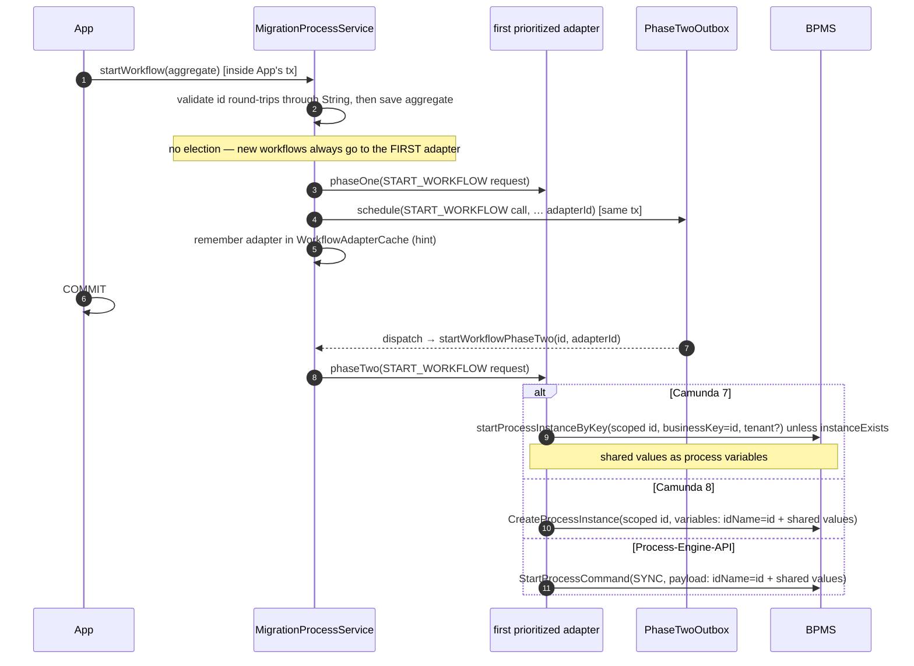

What stays untouched by this is the INBOUND direction: a BPMS which delivers a task
inside its own transaction still does, which `TaskInvocationContext.runInCurrentTransaction()`
reports. Inbound work may share the caller's transaction, outbound work never does.

The split itself is held by `AddingAnOperationTest#phaseOneRunsAndIsPlanned` and
`#phaseTwoIsDispatchedThroughTheRouter`, the resolution of the outbox per aggregate by
`StoreAttributionTest` respectively `QuarkusStoreAttributionTest`, and the boot which ends
without one by `OutboxStartupValidationTest`.

**What phase two may expect:** the dispatch calls back into the
application - a remote BPMS adapter loads the workflow aggregate to build what it
sends to the BPMS - and it does so on the outbox dispatcher's own thread, where
nothing the application relies on is active by itself. VanillaBP therefore provides
it: the `PhaseTwoRouter` runs every dispatch through
`TransactionRunner.requireTransaction`, which joins a transaction the store already
opened and starts one otherwise. On Quarkus that runner additionally activates the
CDI request context, without which an entity manager cannot be touched at all. Since
the guarantee sits in the router, an outbox contributed by an application gets it as
well, and stores which dispatch inside their own transaction (gruelbox, where an
application still asks for it) keep theirs. Which runner it is belongs to the aggregate
of the call: the router takes it from the process service the call routes to, on both
platforms. Only where no process service is registered for the call's workflow module and
BPMN process does the platform's own runner step in, and Spring Boot hands none in. See
the platform's wiki page for what an application may rely on.
`PhaseTwoRouterTest#dispatchRunsInsideTheProvidedTransaction` holds the transaction around a
dispatch, `PhaseTwoJpaContextTest` and `PhaseTwoMongoContextTest` what an application may touch
there.

**What phase two must not do: wait.** One thread dispatches the entries of one workflow
aggregate, so whatever an entry spends there is spent by every other entry of that aggregate.
The case which used to spend the most is a workflow its BPMS has not made searchable
yet: the election waited out the adapter's `workflowVisibilityDelay`, ten seconds on Camunda 8,
and a burst of "start, then correlate" pairs stalled in batches. Such an entry goes back to the
store with that window as its due time (`PhaseTwoRetryLater`) and the thread takes the next one.
The attempt is counted like any other, which is what ends a workflow that never becomes visible:
after `vanillabp.outbox.block-after-attempts` attempts the entry is blocked. The gruelbox store
schedules every failed attempt from the one distance it knows, so the window is
written onto its row afterwards, by the listener which also blocks a permanent failure: the entry is
due there when it is due on the other stores, and the next poll picks it up.
`NotVisibleWorkflowDoesNotStallDispatchTest` holds both halves: the entry of a findable workflow
dispatched while the other one waits, and the bound which finally blocks it.
`ARejectedDispatchIsPlannedAgainTest` holds the same on Spring Boot, where a store used to ask again
on the dispatching thread instead - what that cost is decision 49.

**Several entries leave at the same time, and the workflow aggregate says on which thread.**
Every store VanillaBP writes itself dispatches on `vanillabp.outbox.dispatch-threads` threads,
four of them by default, and `DispatchLanes` picks the one for an entry from the workflow
module, the BPMN process and the aggregate ID. Two operations of one workflow therefore leave in the order they
were written, while operations of different workflows leave at the same time. An entry which
names no aggregate, as a broadcast signal does, is keyed by its BPMN process instead. Handing
the next entry to whichever thread happens to be free would be simpler and would lose that
order, and nothing downstream would notice until a customer did. The number of threads is
bounded because an unbounded one only moves the limit into the connection pool, where it is
harder to see. What this does NOT order is an entry whose dispatch failed: it waits for its
backoff and the next entry of the same aggregate passes it in the meantime, exactly as it did
while one thread dispatched everything. Decision 75 of this repository carries the reasoning,
and `DispatchLanesTest` holds the order of one aggregate (`oneAggregateKeepsItsOrder`) next to
two aggregates which really do run at the same time (`twoAggregatesRunAtTheSameTime`).

The two MongoDB stores dispatch the same way, since decision 76 of this repository, and their
claim sorts by the moment an entry was written. Without that sort the lanes would keep the
order a collection happened to answer in, which is not the order the entries were written in
once an attempt has moved a due time. The two `MongoEntriesOfOneAggregateKeepTheirOrderTest`
classes hold both halves per platform: ten operations of one workflow arriving in the order
they were written, and two operations of different workflows which really are inside the
adapter at the same time.

**A claimed entry which waits for its lane is still held.** The poller claims an entry and
hands it to the lane of its aggregate, and that lane may be busy with an earlier entry of the
same workflow. The renewal of the lease therefore starts with the claim and not where the lane
picks the entry up. A wait longer than one `attempt-frequency` would otherwise let another node
claim it, and both nodes would carry the same operation out. One queue is short, so the wait is
short as well, but nothing promises a queue length to anybody and the case leaves both nodes
looking healthy. `AnEntryWaitingForItsLaneTest#aWaitingEntryKeepsItsLease` reads the lease of a
queued entry moving, and `#anotherNodeLeavesAWaitingEntryAlone` puts a second dispatcher on the
same table to watch it walk past.

The poller borrows its connection per step for the same reason. A lane whose queue is full makes
the poller wait, and a poller which held a connection through that wait would hold the connection
the lane needs to write down how its dispatch ended. With a pool of one that is a deadlock, which
is what `#aFullLaneDoesNotHoldTheConnectionItsDispatchNeeds` measures; with a bigger pool it is a
connection missing where the work is. Every other write of this dispatcher already borrows one for
the moment it needs it, so the poller is now the same shape as the rest.

**A node which lost its entry writes nothing.** A lease can still be lost while its dispatch
runs: the node was away long enough for the claim to run out and another node took the entry
over. The renewal notices it, because its write matches no row, and says so in the log. The
dispatch itself runs to its end and its result is dropped. Every write which says how an attempt
ended carries the holder of the lease in its condition, so only the node holding the entry writes
one: `LEASED_BY` on the JDBC store, `leasedBy` on the two MongoDB stores.
Without that condition the late node could block an entry the other had just finished, and
somebody would be asked to repair an operation which had succeeded.
`ADispatchWhichLostItsLeaseTest` puts two dispatchers on one database and takes the lease of the
slow one away with an `UPDATE`: the second node dispatches the entry, the first says what it lost,
and what the table holds afterwards is what the second node wrote.
`AMongoDispatchWhichLostItsLeaseTest` does the same with two dispatchers on one MongoDB
collection. On Quarkus, `MongoADispatchWhichLostItsLeaseTest` plays the second node itself,
because an application holds one dispatcher and a second real one would need a second
application. What that test writes is what another node's dispatch leaves behind, and the write
which has to be refused is the real dispatcher's.

What the threads bought, measured on 2026-09-21 in the development container of this
repository: 200 entries of 40 workflow aggregates, written in one transaction against H2 in
memory, with a handler which takes 20 milliseconds because that is what a call to a BPMS
costs. One thread needed 4498 ms, two 2144 ms, four 1190 ms and eight 802 ms. The measurement
says what a dispatch stage which is waiting for somebody else does with more threads, and it
says nothing about a handler which is busy rather than waiting or about a database under load.
A load test is where throughput is defended, and a run which is faster than this one proves
nothing about the order.

**What a failed dispatch costs, and why the numbers are what they are.** The distance to the
next attempt grows: `PhaseTwoOutboxProperties#attemptDelay` returns `attempt-frequency` for the
first retry and doubles it per attempt until `max-attempt-frequency` caps it. Thirty seconds,
one minute, two, four, then five minutes for the remaining attempts, fifty of them, which is
close to four hours. The fixed distance it replaced was thirty seconds ten times, so an outage
of six minutes - a cluster upgrade - converted every pending operation of every node into a row
somebody had to repair by hand.
The two ends of the curve answer two different questions: the cap decides how long after a BPMS
comes back the first entry reaches it, the attempt budget decides which outage the store
survives alone, and blocking then means "this entry is broken" rather than "the BPMS was away
for a while". The stores VanillaBP owns compute the distance with that one method, so the curve
does not drift apart between platforms; gruelbox knows a single fixed distance and keeps it,
so an application which opted into that store keeps the behaviour it always had, which the
per-store table of the wiki pages owns.
The distance is written where a dispatch FAILED, not when the entry is claimed: the claim leases
the entry for one `attempt-frequency` so other pollers skip it, and a poller which dies
mid-dispatch therefore does not leave the long distance of an attempt nobody made behind.
`PhaseTwoOutboxPropertiesTest#theBackoffGrowsAndIsCapped` pins the sequence and
`#theAttemptBudgetSpansHours` the four hours.

**What a quiet application costs, and why the poller sleeps.** A workflow application spends
most of its life waiting in a timer, and the pollers used to ask anyway: one select plus one
delete per store every ten seconds, 8640 turns a day whose answer was known. So the rhythm is
gone. `DueEntryPoller` runs a store's poll, asks that store when the earliest entry it still
owes something to is due, and sleeps until exactly that moment. An entry due in four minutes is
dispatched in four minutes rather than on the next tick, and a store which owes nothing is left
alone. The question each store answers is its own due-entry select with the time bound dropped,
plus the moment the oldest dispatched entry may be deleted, so one wake-up covers the dispatch
and the retention. A BLOCKED entry is in neither set - it waits for a person rather than for a
clock.

Both stores VanillaBP owns ship an index per question, over the status and that question's
timestamp, because an aggregate over an unindexed column is a scan growing with everything the
table ever held - which is what decision 19 forbids a repeated question to do, and what decision
41 measures. gruelbox indexes `(processed, blocked, nextAttemptTime)` for its own flush, so that
store adds nothing and shapes its question to fit: two reads naming both flags rather than one
naming `blocked` alone. Where a table was created by an earlier version the startup names the
index which is missing and the statement which adds it, because creating an index on a large
table is a decision with a lock on it.

`vanillabp.outbox.poll-interval` is the cap on that sleep, ten seconds by default, which is the
rhythm every application had before. It exists for work a node wrote down before it went away,
because nothing tells a sleeping node about another node's row; raising it is what buys the
saving, and lowering it back to seconds gives the saving away without buying anything else.
Decision 41 carries the reasoning, including why no notification travels between the nodes and
why a database notification was rejected. An application which moves the cap is told at startup
what else still keeps its database awake, which `WhatStaysAwakeTest` pins, and what a quiet
application costs is MEASURED per store by the `OutboxSleepsWhileNothingIsDue` tests rather
than guessed from a clock: connections taken out of the pool on the two JDBC stores, commands
sent by the driver on the two MongoDB ones.

The retention cleanup of the task-delivery records answers the same question differently, and
decision 43 says why: it keeps its hourly thread and runs only where a delivery was recorded
since the last run, because an application which records nothing grows nothing to delete.

**Blocking releases the deduplication key.** An entry which is blocked keeps everything else it
has, but its `DEDUP_KEY` (MongoDB: `dedupKey`) is replaced by the entry's own id, exactly as a
dispatched entry replaces it. Without that, a blocked entry silenced the repetition of the very
operation it failed at: the key is what refuses a second schedule, so the application asked, the
store said no, and that answer is indistinguishable from a correct deduplication - one failed
operation muted itself until somebody deleted the row, and only the counter
`vanillabp.outbox.discarded` made it visible at all. The blocked row stays for whoever repairs
it, so a repair now has to expect a second row for the same operation. Gruelbox holds its
`uniqueRequestId` until the row goes, so there the dead end remains.

A scheduled call is described by the immutable value type `PhaseTwoCall`
(operation, workflow module, BPMN process, workflow-aggregate ID in serialized
String form, elected adapter ID, operation-specific args). The dispatch chain is as
short as possible:

```
schedule(call)                dispatch(call)         handler.phaseTwo(request)
ProcessService ──► PhaseTwoOutbox (store) ──► PhaseTwoRouter ──► MigrationProcessService ──► adapter
      within local TX             after commit        (core-owned)     (adapter election)
```

The core-owned `PhaseTwoRouter` holds a registry `(workflowModuleId, bpmnProcessId)
→ MigrationProcessService`, filled by the platform integration at bean-creation
time. The serialized aggregate ID is converted back into the aggregate's ID type by
the process service itself (`convertAggregateId`, backed by
`AggregatePersistenceAware.getAggregateIdType()` and the core's
`AggregateIdRoundTrip` - the type is validated at startup to round-trip losslessly;
a `null` type means the custom persistence layer owns the serialized form and the
String is passed through). For `START_WORKFLOW` the adapter elected in phase one
**is persisted with the outbox entry** and used in phase two — no re-election from
the then-current priorities. If the adapter was removed from the configuration
while the entry was still open (stale entry), dispatching fails with a guiding
message naming that case. The other operations (message correlation, completing or cancelling a task, the
user-task pair, pushing a changed aggregate) probe the prioritized adapters at
dispatch time instead, so their calls carry no adapter ID; the exception is
`SEND_SIGNAL`, which names the broadcasting adapter because a broadcast reaches every
adapter of the module. Which of the two it is, is not written anywhere in the core: it
follows from the operation's `Election`, and so do the probe the core asks and the
patience it asks with.

#### An operation is defined once

An operation is a `PhaseOperation` (integration SPI) and nothing else. The record carries
everything about it which is not one BPMS' business:

- its **name**, which the store persists and which is therefore a contract: never
  rename an operation, never change what an existing name means,
- its **idempotency-key derivation** (`PhaseOperation.IdempotencyKey`, a function
  of the `PhaseTwoCall`), which is just as persisted as the name,
- its **election** (`Election`), which says which BPMS serves it: the first
  prioritized adapter for a start, whichever adapter holds the task, the user task or
  the workflow for the operations addressed to a running one, every deployed BPMS for a
  broadcast, and "the extension dispatches it itself" for an operation which never
  reaches an adapter. The core reads the probe, the patience and the shape of the
  "nobody knows this" failure off this one value,
- whether **every adapter has to serve it**, which decides whether a missing handler
  fails the boot or is an honest "this BPMS has nothing like it",
- whether the **activation** the call was planned in travels with it, and
- its **wording**: how the operation names itself in a log line or an exception
  ("correlating message 'approved'"), what to add where no BPMS knows the workflow, and
  what to do instead where an adapter cannot serve it.

What an operation DOES is the other place, and it belongs to the adapter: a
`PhaseOperationHandler` with `phaseOne(PhaseOneRequest)` and
`phaseTwo(PhaseTwoRequest)`, contributed per operation in
`MigratableProcessService#phaseOperations()`. That map is the only way an adapter
describes outbound work; there is no method per operation and phase any more.

**Adding an operation therefore costs one constant in `PhaseOperation` and one entry in
each adapter's map.** Nothing else: the outbox stores name, args and key without
knowing them, the router dispatches by name, and `MigrationProcessService` runs every
operation through `execute` and `executePhaseTwo`. `AddingAnOperationTest` adds one and
runs it through both phases to keep that true.

VanillaBP's own operations (`START_WORKFLOW`, `COMPLETE_TASK`, `CANCEL_TASK`,
`COMPLETE_USER_TASK`, `CANCEL_USER_TASK`, `CORRELATE_MESSAGE`,
`START_WORKFLOW_BY_MESSAGE`, `SEND_SIGNAL`, `AGGREGATE_CHANGED`) are constants of
`PhaseOperation`, registered by the `PhaseTwoRouter` while it is built. Their names and
key rules are pinned by `PhaseOperationContractTest`, because since they stopped being
enum constants nothing else guarantees them.

An adapter which cannot serve an operation every adapter has to serve is refused while
the application boots (`MigrationProcessService#validateAdapterOperationsAtStartup()`,
held by `AdapterOperationsAtStartupTest`). The map is the adapter's statement about what
it serves, so a forgotten operation is caught before a workflow waits for it — and it is
the whole question, because asking the adapter's class anything would mean reflection,
which is a lie in a native image: a method nobody registered looks like a method nobody
wrote, and every adapter of a native application would be refused.

`MigratableProcessService` is what an adapter implements, and its shape is the statement: a few
switches about what its BPMS can do, the probes the election walks, the map of handlers per
operation and the read-only methods the viewer reads through.

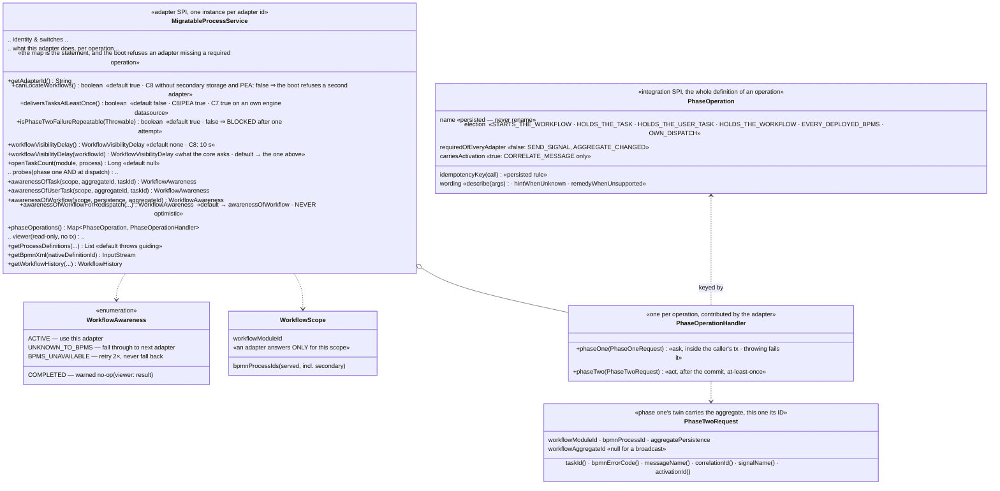

#### Operations of extensions

An **extension** contributes operations of its own, which is why the registry
(`PhaseOperationRegistry`) exists. It builds them with
`PhaseOperation.extensionOperation(name)`, which enforces a namespace
(`my-extension:MY_OPERATION`), and registers them together with its own dispatch:

```java
registry.register(
    PhaseOperation
        .extensionOperation("my-extension:NOTIFY")
        .idempotencyKey(call -> Optional.of(call.workflowAggregateId() + "|" + call.args().get("event")))
        .describedAs(args -> "notifying about '%s'".formatted(args.get("event")))
        .build(),
    (call, previouslyAttempted) -> notify(call));
```

The registry is offered as a bean by both platform integrations (Spring Boot:
`vanillaBpPhaseOperationRegistry`; Quarkus: a `@Singleton` producer). Scheduling
works as for core operations: build the call with
`PhaseTwoCall.of(operation, ...)` and hand it to the `PhaseTwoOutbox`, inside the
business transaction. Dispatch then goes straight to the extension's handler: the
aggregate-ID-to-adapter election of the core operations does not apply, and no
process service has to be registered for the call's BPMN process.

An extension whose operation addresses a workflow the way a core operation does says so
through its `Election` and hands it to `PhaseTwoRouter#registerOperation` instead. It is
then routed to the process services like a core operation, and every adapter which is to
serve it contributes a handler for it - which is what `AddingAnOperationTest` does.

Rules the registry enforces at registration time, each with a guiding message: an
operation is registered exactly once, an extension name is namespaced, and the core's
names are reserved. At dispatch time an unregistered name is an error naming the
operation and listing the registered ones. The entry stays in the store (like a
stale adapter ID of a START entry), so an extension temporarily missing from the
application does not silently lose its scheduled work.

Stores never look into the registry: they persist name, args and key and stay
operation-agnostic. `PhaseOperationRegistryTest` holds the rules the registry enforces, and
`ExtensionOperationDispatchTest` runs an extension operation through both platforms.

The core defines the `PhaseTwoOutbox` contract, and since decision 75 of this repository it
writes one store against it as well: the JDBC store both platforms run, which lives here and
takes only its connection and its transaction from the platform. The contract holds for that
store, for the MongoDB ones and for a store an application brings itself:

- **Scheduling:** `schedule(call)` MUST be invoked within the still-running local
  transaction that persists the workflow aggregate and MUST enlist the outbox entry
  in exactly that transaction: the entry becomes visible if and only if the
  transaction commits.
- **Idempotency key:** implementations MUST enforce uniqueness of
  `PhaseTwoCall.idempotencyKey()` (where present) via the store's unique-constraint
  mechanism; a duplicate `schedule` is a no-op returning `false`. For
  `START_WORKFLOW` the key is
  `START_WORKFLOW|workflowModuleId|bpmnProcessId|workflowAggregateId` — the
  storage-level enforcement of "a workflow is started at most once per aggregate".
  Every key names its operation, so completing and cancelling one task no longer
  share one; `START_WORKFLOW_BY_MESSAGE` deliberately derives the plain start's key.
  What a key deduplicates is the entries STILL WAITING for their dispatch, which is
  decision 22 of this repository: a repetition after the dispatch is a new operation.
  A store which discards a schedule returns `false`, and
  `MigrationProcessService#reportDiscardedSchedule` turns that into a WARN naming
  what was dropped, because a discard against a pending entry is as likely to be a
  lost operation as a redelivery. The same place counts it as
  `vanillabp.outbox.discarded`, tagged by operation, so the case can be alarmed on
  instead of being read: the count is taken in the core rather than in each store, which
  is why gruelbox and the VanillaBP stores report the same number. The key is bounded to 250 characters and hashed
  beyond that (`StoredKey`, shared with the inbound delivery key) — gruelbox refuses a
  longer unique request ID, and an aggregate ID longer than the 1024 characters of the
  `AGGREGATE_ID` column is refused where the call is built, with a message naming the
  column. The derivation rules per operation are documented on `PhaseOperation` and
  are a persisted contract.
- **The youngest call may replace the one still waiting** (decision 68 of this
  repository). A call which carries the state its caller saw - the payload of decision
  62 - loses that state where the older entry wins, and under a backlog the surviving
  report is the furthest behind. Such a call says
  `PhaseTwoCall.replacingWhatIsStillWaiting()` and goes to
  `PhaseTwoOutbox.scheduleReplacingWhatIsStillWaiting`; the store then puts it into the
  waiting entry, payload included, in the transaction it was planned in, and removes the
  payload the replaced entry named. Without the word nothing changes, and only an
  operation an extension registered may say it: what VanillaBP plans itself reads the
  state it needs at dispatch time, so `PhaseTwoCall` refuses the word for its own
  operations. An entry a dispatch has already taken is NOT replaced - it runs to its end
  and the younger call becomes an entry of its own, which holds no key, because the key
  belongs to the entry on its way. The stores VanillaBP wrote itself read that off
  `ATTEMPTS` plus the lease of the entry - no attempt of it has ended and nobody holds it
  right now, which is needed as a pair because the attempts are written when an attempt
  ends - and gruelbox off
  its `version` column plus the register of `GruelboxRedispatchAwareSubmitter`, because a
  gruelbox entry submitted right after a commit was never pushed back and its row is
  locked by the dispatch. A store which never learned replacing inherits the default of
  `scheduleReplacingWhatIsStillWaiting`, which discards as before and writes a WARN naming
  the store. Held by `AYoungerCallReplacesTheWaitingOneTest` (JDBC on Spring Boot),
  `ExtensionOperationDispatchTest` (JDBC on Quarkus) and `MongoPhaseTwoPayloadTest` on
  both platforms.
- **The activation which planned a correlation is part of its key**, and of no other key
  (decision 23 of this repository). A called process is a secondary workflow of the SAME
  aggregate, so three elements of a multi-instance call activity used to derive one key
  and two of the three were discarded. `RunningActivation` is the thread-bound scope the
  core opens around a task delivery and around a workflow the BPMS started, filled from
  `TaskInvocationContext#getActivationId()` respectively
  `BpmsInitiatedStartContext#getNativeInstanceId()`.
  `CORRELATE_MESSAGE` is the one operation which says it `carriesActivation()`, so the
  core reads the scope into `ARG_ACTIVATION_ID` while it plans the call - the one path a
  correlation is planned on, and the one which runs on the handler's thread - and
  `PhaseOperation.CORRELATE_MESSAGE` derives from that argument, which keeps the
  derivation a pure function of what a store persists. Outside any invocation there is
  none and the key is what it always was, which is the fallback a REST endpoint and a
  thread the handler started themselves get. `START_WORKFLOW` and the task operations must
  NOT carry it: they deduplicate across activations on purpose.
- **The same argument reaches the adapter at dispatch time**, as
  `PhaseTwoRequest#activationId()`. Phase two runs on the dispatcher's thread,
  long after the thread which knew the activation has moved on, so the value travels with
  the entry rather than being read again. A BPMS which deduplicates messages in a net of
  its own needs the same distinction there: Camunda 8 derives a message id from the same
  values, and without the activation three multi-instance siblings reach the outbox as
  three operations and that cluster as one message.
- **Recovery:** every committed-but-unprocessed entry has to be dispatched through
  the `PhaseTwoRouter` right after the commit *and* after an application restart
  (crash recovery), retrying failed dispatches with a backoff.
- **DONE instead of delete:** a successful dispatch marks the entry DONE; physical
  deletion happens asynchronously after a configurable retention
  (`vanillabp.outbox.retention`, default 7 days) — which keeps a dispatched entry
  readable for support and does NOT extend the deduplication window: the store takes
  the key out of what enforces uniqueness when it marks the entry DONE. Entries
  failing repeatedly are blocked (ERROR log naming
  module/process/aggregate/operation) and left as a monitorable trail.
- **At-least-once residual window:** a crash between the remote BPMS call and
  marking the entry DONE re-dispatches the entry on recovery. This is accepted
  (eventual consistency); an adapter's handler MUST therefore tolerate a repeated
  phase two — a second `START_WORKFLOW` for an already-started workflow has to return
  without starting another workflow instance.
- **START re-dispatch mitigation (minimizes, does not close, the window):** stores
  pass "this entry was dispatched before" to
  `PhaseTwoRouter.dispatch(call, previouslyAttempted)` (the JDBC/MongoDB defaults
  read it off two places: an attempt which ENDED is counted in the attempts, and an
  attempt whose node died in the middle left that node's name in the lease, so a
  recovered/retried entry is recognized either way; the gruelbox store bridges its entry
  state via a `Submitter` wrapper — there the counter is only incremented on
  FAILED attempts, so a hard crash still re-dispatches without the probe). A
  previously attempted START entry probes the recorded adapter's
  `awarenessOfWorkflowForRedispatch` first: a workflow already known there means
  the previous dispatch succeeded — the entry is consumed without a second start.
  The probe's contract is stricter than the election's: NEVER optimistic (a wrong
  "known" loses a workflow; a wrong "unknown" merely yields the duplicate the
  residual permits anyway) — adapters that cannot query reliably answer
  `UNKNOWN_TO_BPMS`.

The picture puts the same start on a time line which crosses a crash: what the caller's
transaction commits, what the dispatcher picks up afterwards, and where the redispatch probe sits
between a repeated entry and a second workflow.

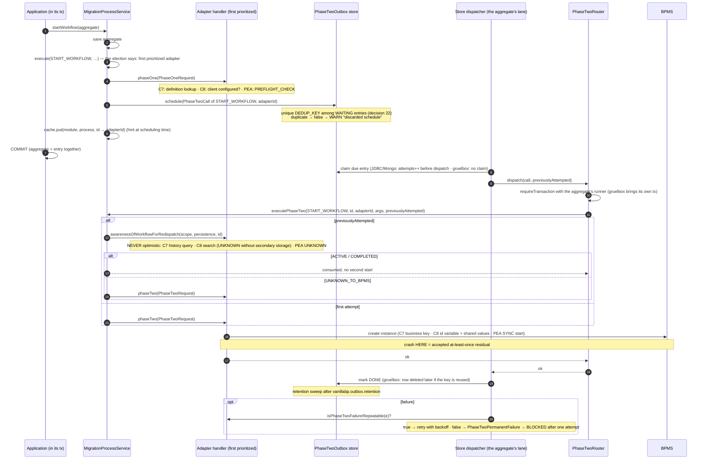

Every rule of that list has a test. Scheduling inside the transaction and dispatching after
the commit are `OutboxDispatchTest#entryWrittenInSameTransactionAndPhaseTwoDispatchedAfterCommit`
and `#rollbackLeavesNoEntryAndNoPhaseTwo`; the idempotency key is
`OutboxDispatchTest#duplicateScheduleAgainstAPendingEntryIsNoOp` next to
`RepeatedOperationTest#aSecondStartAfterTheDispatchIsPlanned`; the key released with the
dispatch is `GruelboxDeduplicationWindowTest#aDispatchedEntryIsReleased`; recovery after a
restart is `OutboxRecoveryTest`; the redispatch probe is
`OutboxRedispatchMitigationTest#retriedStartEntryDoesNotStartASecondWorkflow`; the
discarded schedule is `DiscardedScheduleTest`; and the activation carried by a
correlation's key is `ActivationIdentityTest` together with
`PhaseOperationContractTest#noOtherKeyCarriesAnActivation`. That a missing outbox ends the
boot is `OutboxStartupValidationTest`.

Default implementations are provided by the platform integrations (configured via
`vanillabp.outbox.*` — keys, defaults and documentation are modeled ONCE in the
core class `PhaseTwoOutboxProperties`, bound as part of the `vanillabp.*` tree;
applications may define their own `PhaseTwoOutbox` bean instead):

|  Platform   |       Persistence        |                                               Implementation                                               |
|-------------|--------------------------|------------------------------------------------------------------------------------------------------------|
| Spring Boot | JPA                      | the core's `JdbcPhaseTwoOutboxStore`, with the connection and the transaction of `spring-boot-integration` |
| Spring Boot | MongoDB                  | own implementation using `MongoTemplate` (`spring-boot-integration`)                                       |
| Quarkus     | JDBC datasource (Agroal) | the same core store, on an Agroal connection enlisted in the running JTA transaction                       |
| Spring Boot | JPA, opt-in              | based on `com.gruelbox:transactionoutbox`, switched on by `vanillabp.outbox.gruelbox.enabled`              |

### Telling the application that a workflow ended (`WorkflowEndedInvoker`)

The counterpart of the BPMS-initiated start, and the one handler kind whose whole
point is that nothing depends on it:

- Adapters ask `workflowEndedHandlerExists(module, process)` while wiring and attach
  their listener only where the answer is yes. A model must not pay for a
  notification the application did not ask for, which is why the question exists at
  all instead of a plain "always attach".
- `workflowEnded(module, process, context)` loads the aggregate, calls the method and
  saves it, in the caller's transaction (embedded BPMS) or a new one (remote BPMS).
- A missing aggregate is NOT an error: an application may delete the aggregate of a
  workflow which ended, and a redelivered notification would find nothing either.
  Both cases are logged and skipped.
- What the context reports about the KIND of end is the adapter's honest answer, not
  a normalized fiction: Camunda 7 tells a cancellation from a regular end by the
  execution's delete reason, Camunda 8 never sees a cancelled instance's end.

`WorkflowEndedTest` holds all four bullets, `withoutAMethodNothingHappens` for the question
asked while wiring and `aDeletedAggregateIsNoError` for the aggregate which is gone.

#### A workflow which is gone cancels what it was waiting for

Where the notification NAMES the workflow (`WorkflowEndedContext.getWorkflowId()`), the core
reads the tasks it still believes are open in that workflow and reports every one of them to the
application as `TaskEvent.Event.CANCELED`. Then `@WorkflowEnded` runs. A workflow which ended has
nothing open any more, so this is knowledge rather than a guess.

- The read is `TaskDeliveryLog.openTasksOfWorkflow`, which costs 0.01 ms with the index over
  `WORKFLOW_ID`.
- A record naming ANOTHER adapter is left alone. `TaskDelivery.adapterId()` says who delivered
  the task, so nothing has to be asked: during a migration one aggregate may carry work of two
  BPMS, and this end says nothing about the other one.
- Each record is handled in a transaction of its own, and in that order: the record is CLAIMED
  with `markTaskClosed`, and the delivery follows only where the claim took. That is what makes
  two application instances safe, and it is decision 72. A handler which throws rolls its
  transaction back, the claim goes with it, and the task is derived again the next time somebody
  looks - at-least-once, like everything else here. The failure stays with that one record: the
  end of the workflow is reported either way.
- The KIND of the end does not decide it, which is decision 73. A terminate end event and an
  interrupting event subprocess end a Camunda 8 instance as COMPLETED while taking an open task
  with them, so reading the kind first would skip exactly those.
- An adapter whose BPMS cancels each element by itself names no workflow here and nothing is
  derived. Camunda 7 fires an END execution listener per element, process termination included,
  so a derivation on top would report the same task twice.
- A derived delivery carries no job of the element, so a `@TaskParam` and a multi-instance value
  reach the method as `null`. The boot names the methods which really declare one
  (`WorkflowTaskRegistry.reportWhatACancelationCannotCarry`) and says nothing about the rest.

The race this accepts: a task the application completed a few milliseconds ago is gone as well,
so an end arriving between the dispatch of that completion and the mark on its record reads a
completed task as canceled. The compare and set shrinks that window and does not close it.

`DerivedCancelationTest` holds it on both platforms: two open tasks reported oldest first with the
end after them, an end naming no workflow deriving nothing, a record of another adapter left
alone, a handler which throws leaving its record open, and the boot naming the method a derived
cancellation cannot fill.

### The core probes what it still believes is open

An application on a remote BPMS learns nothing on its own. `WorkflowTaskInvoker`
`.reportTasksTheBpmsNoLongerHas(module, process, wakeUp, probe)` is what an adapter calls after
it handed a delivery over: the core looks at the other tasks it believes are open in the SAME
workflow, asks the probe whether they still exist, and reports the ones which are gone as
`TaskEvent.Event.CANCELED`. The scope is the one workflow the wake-up belongs to, never the tree
of workflows an aggregate owns.

The blindness is not one BPMS' trait, which is why the loop is here and not in an adapter. The
Process-Engine-API has it as well, and an embedded engine does not, because it says per element
what it took away. So the core runs the loop and the adapter answers one question.

What one call does, in the order which makes it cheap:

1. a BPMN process without an asynchronous task returns at once. The core knows that from the
   deployment, and most applications are that case, so most applications pay nothing.
2. a scope whose `vanillabp.delivery.check-open-tasks-on-delivery` is `false`, or whose
   `vanillabp.delivery.max-open-tasks-checked` is zero, returns as well. Both are resolvable per
   workflow module, per workflow and per task.
3. the open records of that workflow are read with `TaskDeliveryLog.openTasksOfWorkflow`, which
   is 0.01 ms with the index over `WORKFLOW_ID`.
4. the record of the task which woke us up is dropped by its own task id, and so is every record
   another adapter wrote.
5. the rest is probed, oldest record first, up to ten per wake-up. What is not reached this time
   is reached at the next one.
6. every task the probe calls gone goes through the derivation of the ended workflow: a
   transaction of its own, the claim with `markTaskClosed`, the delivery in the same transaction.
   That code is written once (`DerivedCancelations`).

The probe has three answers and only `GONE` cancels, which is decision 74. A probe which cannot
say is not a probe which said no, and a probe which throws is read as "cannot say" and reported
once - the delivery which led there is done and must not be lost over it.

Every question names the task definition of the record, `stillExists(workflowId, taskId,
taskDefinition)`. Some BPMS answer about some kinds of task and not about others, and the two ids
alone do not say which kind is being asked about: on Camunda 8 a user task the engine manages
lives in a namespace of its own, so an adapter without the definition has to refuse for every
record of a process which holds one, and the plain service tasks of that process lose their
derived cancellation with it. With the definition the refusal is per record. A probe which
implements `stillExists(workflowId, taskId)` alone is asked through the default and decides as it
always did.

What this does not promise: a workflow which walks into a timer or a message wait after the
boundary event produces no job, so nothing wakes the application up and the cancellation waits.
Three things catch it later - the next job of that workflow, the end of the workflow, and the next
operation which names the task.

`OtherOpenTasksOfAWakeUpTest` holds the six steps, the three answers and the probe which throws;
`DerivedCancelationTest` holds the booted path on both platforms.

### Broadcasting signals

A signal is the one BPMS operation which is not about a workflow, so it is the one
place where neither election nor aggregate applies:

- The scope is the WORKFLOW MODULE of the calling process service: each adapter
  broadcasts through ITS own client with ITS tenant, and the signal name is scoped
  like every other identifier of the module (prefixed in `use-prefix`). Crossing
  module boundaries is deliberately left to the application - a module is a scope,
  and which modules a signal is meant for is a business question.
- `MigrationProcessService.sendSignal(name)` fans out over the DEPLOYMENT UNION of the
  workflow module (`getDeploymentAdaptersFor`), not over the prioritized
  adapters of the calling process service. During a migration the subscriptions are
  spread across the BPMS, and a partial broadcast is worse than none.
- Every adapter is asked before the first failure is reported: a broadcast which
  stopped at the first unreachable BPMS would leave the others waiting.
- Every adapter gets one `SEND_SIGNAL` outbox entry, carrying its adapter id -
  dispatch goes to exactly that adapter, without probing. There is no idempotency key:
  nothing about a signal can be deduplicated.
- The call carries no aggregate ID, which is why `PhaseTwoCall` allows it to be
  absent. The router converts none where the call carries none.
- An adapter whose BPMS has no signals contributes no handler for `SEND_SIGNAL`, which
  is allowed because the operation is not required of every adapter: the application
  asking for one gets a `PhaseOperationNotSupported` naming the adapter and what to do
  instead.

`SendSignalTest` holds the fan-out over the deployment union (`everyDeployedBpmsIsReached`,
`oneFailingBpmsDoesNotStopTheOthers`), the adapter recorded per entry
(`phaseTwoUsesTheRecordedAdapter`) and the refusal (`anAdapterWithoutSignalsSaysSo`), in the
core and on both platforms.

### Pushing a changed aggregate (`aggregateChanged`)

`MigrationProcessService.aggregateChanged(aggregate, taskId)` is `correlateMessage` with
another verb: save the aggregate, locate the BPMS and schedule an `AGGREGATE_CHANGED` outbox
entry. A completed workflow is a warned no-op, an unknown one a `WorkflowNotFoundException`
naming that the aggregate WAS saved. Locating means probing `awarenessOfWorkflow`, except where
the call names a task and the delivery record of that task is still open - then the record
answers, see [the record answers which BPMS holds a task](#the-record-answers-which-bpms-holds-a-task).

Two decisions are worth knowing:

- **No idempotency key.** The values are read from the aggregate when the entry is
  DISPATCHED, so a redelivered entry writes the then-current state. A key could only ever
  drop a push, never save one.
- **The task id decides the scope and nothing else.** Without one the values belong to the
  workflow's global scope, with one to the scope that task RUNS in (process, embedded
  subprocess, or one iteration of a multi-instance embedded subprocess) - never the task's
  own scope, and never additionally the global one, or the other iterations would see what
  one of them pushed. Which execution or element instance that is, is the adapter's
  business; the core only transports the id (in `ARG_TASK_ID`).

There is no ordering guarantee between outbox entries: the dispatchers select by due time
(`NEXT_ATTEMPT_AT <= now`) without an `ORDER BY`, so a push and a task completion scheduled
in the same transaction may reach a remote BPMS in the other order. That is documented
rather than fixed - inventing an order here would promise something the stores do not
implement, and an application which needs one can keep the calls in separate transactions.

`AggregateChangedTest` holds the shape and both decisions (`theTaskIdDecidesTheScope`,
`phaseTwoElectsByProbing`, `aCompletedWorkflowIsNoFailure`, `anUnknownWorkflowFailsGuiding`).
The missing ordering has no test because there is nothing to hold: the sentence says what
the stores do not promise.

WHAT is pushed stays the sync model's business. This operation adds no second
way of choosing values, which is what keeps the aggregate the single source of truth.

Which values a BPMS gets to see is computed in one place and written at several, and that is what
the picture shows: the aggregate's annotations decide the map, the core computes it, every
outbound operation carries it to the BPMS, and nothing in VanillaBP ever reads it back.

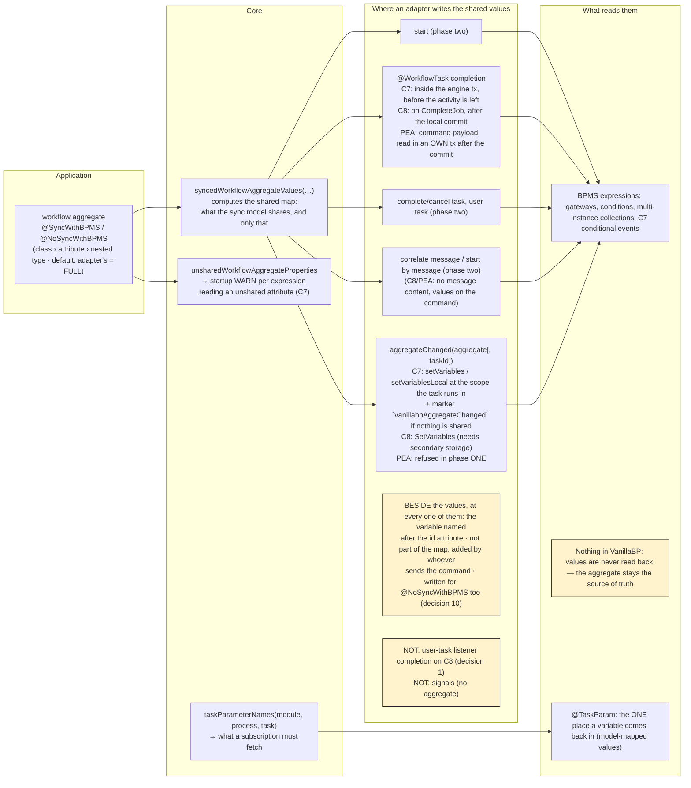

### Workflows the BPMS starts itself (`BpmsInitiatedStartInvoker`)

A timer, signal or conditional start event produces a workflow nobody asked for - and
therefore a workflow without a workflow aggregate, which is the one thing every other
mechanism needs: tasks are routed by the aggregate's ID, expressions read its
attributes. The core builds it, adapters only report and write back.

Adapters use the SPI (`io.vanillabp.integration.adapter.spi.workflowstart`) twice:

- `validateBpmsInitiatedStarts(module, process, specs)` during `wireBpmn`, with the
  start events of the deployed process the BPMS fires on its own. The core registers
  them and reports an application method serving a process (or a start event) which
  has none. Signal names are reported PLAIN - scoping stays invisible above the BPMS
  boundary. Throwing honors the `deployment-failure` policy.
- `startWorkflowByBpms(module, process, context)` when the BPMS reports such a start.
  The context carries values only: start event id, kind, trigger time, the BPMS' own
  identity of the start, the variables the model set, and whether the aggregate has to
  be built in the CALLER's transaction (embedded BPMS) or in a new one (remote BPMS).

What the core does, in one transaction: derive the ID, reuse an aggregate already
carrying it (a repeated notification builds nothing twice), otherwise instantiate the
class, write the ID and the variables into it, run the optional
`@WorkflowStartedByBpms` method and save. The result carries the aggregate's ID, the
name of its ID attribute and the variables the adapter writes back - the ID variable
plus the values shared per `@SyncWithBPMS` where the adapter asks for them
(`AggregateSyncMode`).

The ID rules live in `BpmsInitiatedStartId`: what the BPMS identifies the start by
wins (a remote BPMS' instance key, stable across redeliveries), then a timer's trigger
time, then a generated ID - and where none of them fits the ID attribute's type,
nothing is assigned and the persistence layer generates one while saving.

The `@WorkflowStartedByBpms` methods are scanned by `BpmsInitiatedStartScanner` and
held by `BpmsInitiatedStarts`, to which `WorkflowTaskRegistry` delegates the second
adapter-facing interface. The scanner builds its parameters from `CoreParameterBinders`,
the one place the workflow aggregate and `@TaskParam` are bound - shared with the scanners
of `@WorkflowTask` and `@WorkflowEnded` and with the [handler contracts of an
extension](#the-extensions-own-annotation-handler-contracts). What stays its own is
everything a start has and a task does not: which start event a method serves, the ID
rules, and the aggregate which does not exist yet.

An adapter whose BPMS cannot report such a start implements none of this and fails the
deployment of such a process with a guiding message instead - a workflow which could
never obtain an aggregate is better refused than deployed.

The other direction is drawn below, a start the BPMS decided on: the adapter reports it, the core
derives the ID and builds the aggregate, and the adapter writes the ID back into the running
instance.

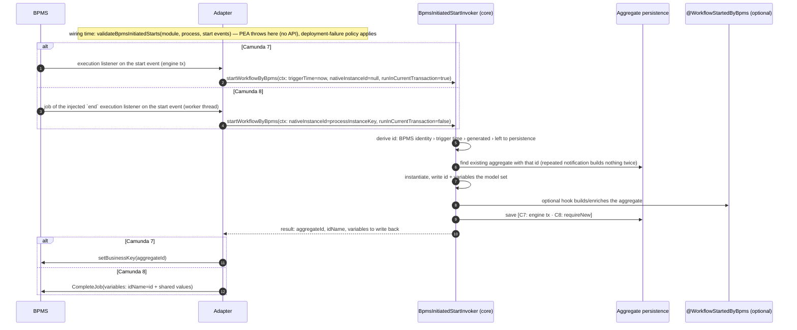

Building and validating are `BpmsInitiatedStartTest` (`aggregateIsBuiltFromTheTrigger`,
`repeatedNotificationCreatesNothingTwice`, `methodNamingAnUnknownStartEventFailsTheBoot`), the
ID rules are `BpmsInitiatedStartIdTest`.

### Viewer/history API (read path)

`ProcessService#getProcessDefinitions`, `#getBpmnXml` and `#getWorkflowHistory` are
read-only: no aggregate is saved, no transaction is required and no workflow is
advanced. All three live in `WorkflowViewer`, which the process service holds and
delegates to - the reading half has an election of its own and shares nothing with the
writing half but the walk. The BPMS answering is elected by the same probing/caching
`WorkflowLocator` walk as every other operation on an existing workflow — with one
difference: `COMPLETED` is a REGULAR result (viewers show ended workflows), only a
workflow unknown to EVERY adapter raises the SPI's `WorkflowNotFoundException`.

**Composite process definition ids.** `getBpmnXml(processDefinitionId)` addresses a
process DEFINITION, not a workflow — there is no aggregate to elect a BPMS by. The
core therefore namespaces every adapter-native definition id it hands out (also the
one inside `WorkflowHistory#processDefinitionId()`):

```
<adapter id>#<adapter-native definition id>
```

Split at the FIRST `#` (adapter ids are configuration keys and never contain one;
native ids may, e.g. Camunda 7's `MyProcess:1:8a9c…`). The scheme is modeled in
`ProcessDefinitionIds` and is a stable contract: applications may store such ids
(e.g. in a viewer's URL). Adapters only ever see their native ids — the core strips
the namespace before calling `MigratableProcessService#getBpmnXml` and routes to the
adapter named by it (unknown adapter, malformed id or unknown definition →
`ProcessDefinitionNotFoundException`, each with a guiding message).

Adapters answer "I do not know this workflow" with an empty list / `null`; a BPMS
without an element history reports `elementsHistory()` as `null` (the SPI's
"not supported by the underlying BPMS"), and an eventually consistent BPMS reports
what is visible instead of raising an error.

The composite id and the read path are `ViewerApiTest` (`compositeIdSchemeRoundTrips`,
`bpmnXmlIsRoutedByTheCompositeId`, `completedWorkflowsAreViewable`,
`malformedProcessDefinitionIdRaisesGuidingError`).

### Aggregate persistence

The core does not know any persistence technology.
`io.vanillabp.integration.spi.AggregatePersistenceAware` (module `integration-spi`)
abstracts saving an aggregate and determining its ID. Implementations are provided by
the platform integration (e.g. based on Spring Data) or by the business application
itself; the implementation with the most specific generic type for the aggregate wins.
It is the single canonical interface used on all platforms — business code implements
it regardless of running on Spring Boot or Quarkus.

### What the platform hands a process service (`MigrationProcessService.Builder`)

One process service exists per workflow module and BPMN process, and it is built rather
than constructed: `MigrationProcessService.forBpmnProcess(module, process, aggregateClass)`
opens a builder, and what follows names what it is given. Three of those are mandatory -
the bound configuration, the persistence of the workflow aggregate, and the process
services of the adapters - and `build()` refuses a set without one, naming the BPMN process
and every missing name. The rest are what a platform integration always hands over and a
test leaves out where it does not need it: `workflowAdapterCache` (without it every
election probes), `taskDeliveryLogResolver` (without it deliveries are not deduplicated),
`transactionRunnerResolver` (without it the runner the caller passes is used) and
`phaseTwoOutboxResolver`, whose absence `validatePhaseTwoOutboxAtStartup` reports at
startup. Before this there were four constructors of seven to ten parameters, and a call
site said `null, null` where a reader had to count positions to learn what was left out.

### What the platform hands an adapter (`AdapterCollaborators`)

An adapter takes ONE object in its constructor, built by the platform integration it runs
on (`AdapterBeanRegistrarSupport.collaborators` on Spring Boot,
`AdapterCollaboratorsSupport.collaborators` on Quarkus). Five collaborators are mandatory,
because both integrations provide them for every application:

|        collaborator         |                                               what the adapter does with it                                               |
|-----------------------------|---------------------------------------------------------------------------------------------------------------------------|
| `WorkflowTaskWiring`        | asks while it reads a BPMN file: is this task wired, what is the aggregate-ID name, which parameters does the method read |
| `WorkflowTaskInvoker`       | hands a delivered task to the application                                                                                 |
| `NameClashAvoidanceSupport` | scopes what it deploys, so two workflow modules on one BPMS do not collide                                                |
| `WorkflowAggregateSync`     | which values of a workflow aggregate the BPMS may see                                                                     |
| `PreCommitRegistrar`        | hangs work which has to run before the caller's transaction commits                                                       |

A set built without one of them throws, naming the adapter id and what is missing. Two more
are handed over as `Optional`, because an adapter has to work without them - an application
which asks for neither has nothing to report to:

|        collaborator         |                                          what the adapter does with it                                          |
|-----------------------------|-----------------------------------------------------------------------------------------------------------------|
| `WorkflowEndedInvoker`      | reports that a workflow ended, and asks whether a process even needs the listener                               |
| `BpmsInitiatedStartInvoker` | reports a workflow the BPMS started by itself, and validates the start events against the application's methods |

Both platforms do provide those two today, out of the same core bean as the mandatory ones,
so an adapter built without one is nearly always a registration which left it out - and the
build writes a WARN naming the adapter id and the collaborator. Decision 28 says why the
object exists at all: the collaborators used to arrive by setter, and a registrar which
forgot one produced an adapter that deployed, ran tasks and never reported a workflow end,
with nothing failing anywhere. `AdapterCollaboratorsTest` holds both halves, the refusal of
a missing mandatory collaborator and the WARN about an absent optional one.

What is NOT in the object stays the adapter's own constructor argument: what it resolves
from its configuration (a job timeout, a retry backoff, the variables a worker fetches) and
what its own extension contributes (its metrics).

Where the collaborators come from differs per platform, which the picture puts side by side: the
adapter's Spring Boot module registers one bean per configured id, its Quarkus modules produce the
same per id through a build step and a producer, and both hand the adapter the one object. The
integration SPI at the bottom is the part an adapter never implements itself.

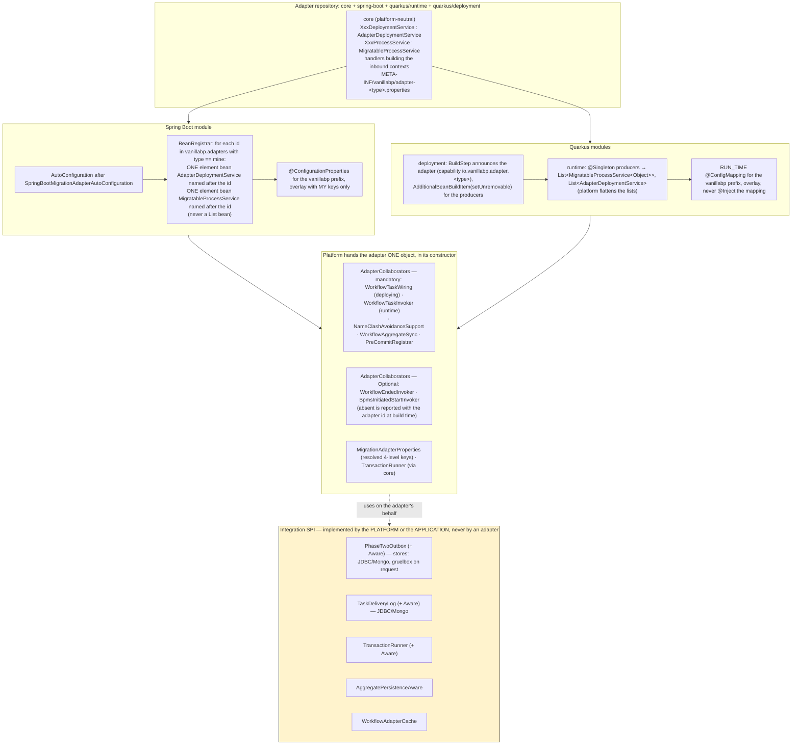

### The transaction the work runs in

VanillaBP wraps everything it does around one workflow aggregate in ONE transaction: the
lookup of a processed delivery, loading the aggregate, invoking the `@WorkflowTask` method,
saving the aggregate, writing the delivery record and scheduling a phase-two outbox entry
either all commit or none of them do. Which runner is chosen for an aggregate is held by
`TransactionRunnerResolutionTest`, plus `SpringTransactionRunnerResolverTest` and
`QuarkusTransactionRunnerResolverTest` per platform; that the six steps really share one
transaction is proved per platform by the outbox and delivery integration tests rather than
by a unit test. The core's abstraction for it is
`io.vanillabp.integration.spi.TransactionRunner` (module `integration-spi`, with `requireNew`,
`inCurrent` and `requireTransaction`), and every platform provides an implementation of it.

Three transaction boundaries meet in the core, and the picture is about which work belongs to
which of them: the transaction the application opened, the one the dispatcher runs phase two in
after that commit, and the inbound one an adapter's worker or engine thread brings along.

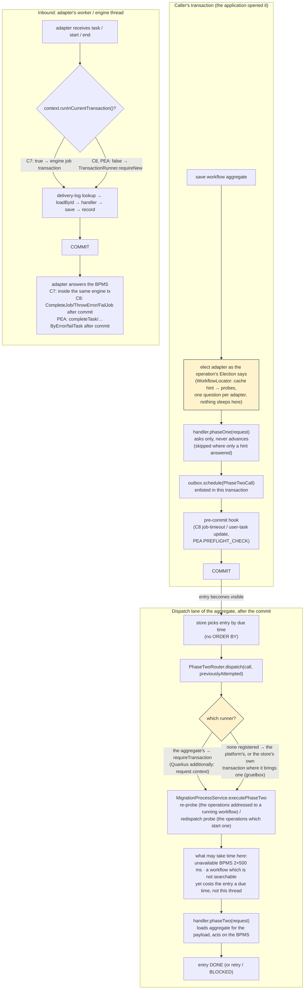

An application whose aggregates live in a system the platform does not manage implements the
runner itself, and `TransactionRunnerResolver` (implemented per platform) picks it in four
steps:

1. the most specific `io.vanillabp.integration.spi.TransactionRunnerAware` bean covering the
   aggregate class (`AwareSelection`, so interfaces count and a bean naming the aggregate
   beats one naming an interface it implements; a tie ends the boot naming both beans),
2. a plain `TransactionRunner` bean of the application, serving every aggregate no aware bean
   covers,
3. the platform's own runner, if it can work at all - on Spring Boot that means a unique
   `PlatformTransactionManager` exists,
4. nothing, which ends the boot with a guiding message: the aggregate and the outbox entry
   have to be written in one transaction, so such an application cannot start a single
   workflow.

The resolver also reports what the transaction COVERS (`TransactionCoverage`): a store the
platform can tell is not covered gets a WARN, a combination it can name a fix for ends the
boot unless the application accepts it with
`vanillabp.transactions.unguarded-aggregate-writes`, and a store the platform cannot judge -
an `AggregatePersistenceAware` implementation writing wherever it wants - is not commented
on. `MigrationProcessService.validateTransactionRunnerAtStartup()` turns those verdicts into
messages and logs one line per aggregate naming the runner serving it.

### Extensions

This section explains extensions to whoever changes the core. What an extension AUTHOR has to know,
collected into one document written from outside this repository, is
[`EXTENSION-AUTHORS.md`](./EXTENSION-AUTHORS.md).

An extension participates in two steps of the [deployment pipeline](#deployment-pipeline)
through `ExtensionWiringService<BPMN, PC>`:

|                           Method                            |                 Called                  |                                       Purpose                                        |
|-------------------------------------------------------------|-----------------------------------------|--------------------------------------------------------------------------------------|
| `getModelType()`                                            | at wiring time                          | the BPMN model type this extension understands, e.g. Camunda 7's `BpmnModelInstance` |
| `getProcessContextType()`                                   | at wiring time                          | the adapter's processing-context type this extension expects                         |
| `getOrder()`                                                | once, at startup                        | ordering among all wiring services of the same model type (default `0`)              |
| `wireBpmn(module, filename, bpmnProcessId, model, context)` | per executable BPMN process             | inspect the model and wire the extension's own concerns against it                   |
| `startWorkflowProcessing(module, context)`                  | after the module was deployed           | start whatever consumes that wiring (listeners, workers, …)                          |
| `stopWorkflowProcessing(module, context)`                   | on graceful shutdown (default: nothing) | stop it again                                                                        |

**Matching — an extension is either asked, or it is not.** An extension takes part in a
module's deployment only if BOTH declared types are assignable from the adapter's types:
the model type AND the processing-context type. A Camunda 7 extension therefore stays
untouched while a Camunda 8 module is deployed, and an extension declared against
`Object`/`Object` sees every BPMS. This is also the trade-off to be aware of: an extension
that wants to CONTRIBUTE to the adapter's processing context has to declare that adapter's
context type and thereby becomes BPMS-specific, whereas an extension that only reads the
model can stay generic.

**Ordering.** The adapter of the BPMS runs before every extension: it has wired a BPMN process
before any extension sees that process, and it is processing workflows before any extension is
started. Shutdown is the mirror image, extensions first and adapters last, so nothing is stopped
while something else still feeds it. That promise is what lets an extension hook what it adds to a
model in relative to what the adapter put there, for example behind the last listener of a kind,
and it is written for extension authors on the wiki page
[Extensions](https://github.com/vanillabp/adapter-platform-integration/wiki/Extensions) rather
than only in a javadoc.

The extensions among themselves are sorted by `getOrder()` ascending, once at startup, and that
order is NOT promised: two extensions which do not know each other cannot agree on a number, and two
of the same order run in the order the platform collected their beans in.
`DeploymentServiceTest#theAdapterIsFirstOnTheWayUp` holds the promise for the way up and
`#extensionWiringServicesAreStoppedBeforeAdapters` for the way down.

**An extension may define its own SPI.** `wireBpmn` is where an extension's own
annotations become alive — the Business Cockpit finds `@UserTaskDetailsProvider` methods
there, just as VanillaBP finds `@WorkflowTask` methods. Such an SPI belongs to the
extension, **never to the VanillaBP core**: the core knows nothing about user-task details,
and an application not using that extension must not see its annotations.

**Registration** is platform-specific and the dummy extensions of both platform
integrations' test modules are the templates:

- *Spring Boot* — contribute a bean of type `ExtensionWiringService`, usually from an
  auto-configuration ordered after `SpringBootMigrationAdapterAutoConfiguration`. All
  beans of that type are collected; since the adapters' deployment services are wiring
  services too, they appear in the same collection and the platform filters them where
  only extensions are meant.
- *Quarkus* — the extension is a Quarkus extension: its runtime module `@Produces` the
  wiring service (`@Singleton`, because such services usually have no no-arg constructor
  and are therefore not client-proxyable), its deployment module registers that producer
  via `AdditionalBeanBuildItem` with `setUnremovable()` — the platform looks the beans up
  through `Instance`, so ArC would otherwise remove them. Unlike adapters, extensions
  announce no build item.

**Configuration** is the extension's own: on Quarkus as an overlay
`@ConfigMapping(prefix = "vanillabp")` if it wants to live under the `vanillabp.*` tree, on
Spring Boot as a second `@ConfigurationProperties("vanillabp")` class. VanillaBP's own
configuration is available as the injectable core object `MigrationAdapterProperties`
(adapter ids, workflow modules, prioritized adapters), which is usually all an extension
needs to know about the setup.

An extension bridging to a BPMS needs one more answer from it: which adapter ids one adapter TYPE
serves, since it registers one bridge per configured engine the way an adapter registers one set of
beans per engine. `#adapterIdsOfType(adapterType)` is that answer, and filtering `adapterTypes()`
is not: an id named in `prioritized-adapters` needs no section of its own, and an application
configuring nothing at all has the id the classpath derives. A migration setup relies on the first
rule and a single-dependency application on the second, and decision 39 in `DECISIONS.md` says why
they live in one place.

**What holds the matching and the ordering.**
`DeploymentServiceTest#extensionWiringServicesAreFilteredAndCalled`,
`#subtypeExtensionIsNeitherWiredNorStarted` and `#wiringServicesAreSortedByOrder` in the
core, `DeploymentPipelineTest#extensionsWiredInOrder` and `#nonMatchingExtensionUntouched`
against a booted application.

#### The extension's own annotation: handler contracts

An extension brings annotations of its own — the Business Cockpit's details providers are
the case this was written for — and the mechanics behind `@WorkflowTask` serve them too.
The extension describes what its annotation means and registers that description
(`ExtensionHandlers#register`, a bean of both platforms); VanillaBP finds the methods on
the `@WorkflowService` classes, binds their parameters, loads the workflow aggregate,
invokes and saves, in one transaction.

```java
HandlerContract
    .of("business-cockpit", UserTaskDetailsProvider.class)
    .lookupKeys(annotation -> keysOf((UserTaskDetailsProvider) annotation))
    .coreParameters(WORKFLOW_AGGREGATE, TASK_PARAM, MULTI_INSTANCE)
    .parameterBinder(parameter -> parameter.getType().equals(PrefilledUserTaskDetails.class)
        ? Optional.of(HandlerContext::getPayload)
        : Optional.empty())
    .deliversReturnValue()
    .build();
```

|        Part of the contract        |                                                          What it decides                                                           |
|------------------------------------|------------------------------------------------------------------------------------------------------------------------------------|
| annotation type                    | which methods belong to the extension; repeatable annotations are supported                                                        |
| `lookupKeys(…)`                    | the keys one occurrence names — an EMPTY list means the method's own name, `EVERY_KEY` means every element of the process          |
| `versions(…)`                      | the process versions one occurrence names, written as `@WorkflowTask(version = …)` writes them — an EMPTY list means every version |
| `callsCarryTheProcessVersion()`    | that the calls of this contract name the version of their BPMN process wherever the BPMS reports one                               |
| `coreParameters(…)`                | which of the parameters VanillaBP binds itself may stand there (`@TaskId`/`@TaskEvent` are deliberately not among them)            |
| `parameterBinder(…)`               | the parameters of the extension's own SPI, recognized by type or by annotation                                                     |
| `deliversReturnValue()`            | whether what a method returns reaches the caller; without it a method has to be `void`                                             |
| `validatingAnnotation(…)`          | what the extension checks about one occurrence of its annotation, while the scan holds the method carrying it                      |
| `neverSavesTheWorkflowAggregate()` | that no method of this annotation ever writes the aggregate, so nothing is saved and nothing is warned about                       |

An invocation (`ExtensionHandlers#invoke`) names the keys it accepts — an element id and
a task definition, say — and the method NAMING any of them runs; where none does, the
method serving `EVERY_KEY` does, so a catch-all may stand next to methods for single
elements (the rule `@WorkflowStartedByBpms` follows for its start events too). **Zero matches are
legal** and answered with an empty result: what to do instead is the extension's business
(the Business Cockpit passes its prefilled details through unchanged). Two methods serving
one key of one BPMN process end the boot naming both, unless the versions they serve keep them
apart. A call may hand IN an aggregate
instead of naming its ID, may say that the aggregate is not to be saved, and may say that
it runs in the transaction the caller is already in — which is what an embedded BPMS needs,
since Camunda 7 delivers its task events inside the engine's own transaction.

**The version of an event picks the method, with VanillaBP's own selection.** Where an extension's
annotation carries a version attribute, `versions(…)` reads it and the method runs for the versions
it names, the way a `@WorkflowTask` method does. The specifications are the same ones, version tags
included, and a tag is resolved through the `ProcessVersionCatalog` of the adapters here as well. Two methods for one key end the boot only where their versions OVERLAP, so one
method per generation of a model is a legitimate way to write them, and the message names both
methods with their ranges. A method naming no version serves every version, which is what every
extension written before this gets.

The call names the version (`HandlerCall.Builder#processVersion`), and it is the version identifier
the BPMS reports rather than one dressed up for a screen. A contract whose calls carry one wherever the
BPMS reports one says so once (`callsCarryTheProcessVersion()`), and where it does not, a method
naming a version can never run and the start says so for each of them. A method under such a contract which names a version the
BPMS does not hold is reported by the same startup check VanillaBP's own methods go through. One
class answers all of this for the core and for an extension (`ServedVersions`, decision 56 in the
repository's `DECISIONS.md`), which is why the tests of the three registries did not change when the
extensions were let in.

**An extension whose handlers only read says so while it is wired.** A call can already ask for a
handler to run without the aggregate being saved afterwards, but a call says it too late for the
warning about a second writer: that warning is written while the methods are found, and at that
moment nobody has called anything. `neverSavesTheWorkflowAggregate()` is the same statement made on
the contract, once, and a contract carrying it is not warned about at all. It outranks the call,
so a call of such a contract saves nothing whatever it asks for, and asking is not refused, because
saving is what a call does unless it says otherwise. The statement sits on the contract rather than
on the extension because one extension can have both kinds, a provider which reads and a
notification which writes, and those are two annotations and therefore two contracts anyway
(decision 50 in the repository's `DECISIONS.md`).

**Which key wins is the order of the offered list.** The keys are walked in the order the caller
offered them and every method is asked about one key before the next is tried, so the first key some
method serves wins and the rank is the caller's list. The platform asks every extension for the same
order, the BPMN element id first and the task definition after it, because the element id is the
identity everything moves to and an extension built on that order survives the removal of
`taskDefinition` unchanged. `hasHandler` therefore takes a `List` rather than a `Collection`: an
order the caller does not have to promise is none. The keys a METHOD declares have no rank, the
method serving `EVERY_KEY` stays the fallback where no offered key is served at all, and nothing
checks that the element id really comes first, since a string does not say what it is (decision 51 in
the repository's `DECISIONS.md`).

**The start says what was wired.** Once a workflow module is deployed, the registry writes one line
per extension, workflow module and BPMN process naming the methods and the keys each of them serves,
with the catch-all marked as the one serving every element. It is what a developer reads whose method
is never called, and everything it names sits in the registry already, so the handler contract needed
no hook for it. A contract registered after the module was deployed writes its own line when it
arrives, and a BPMN process an extension has no method for is not named at all.
`ExtensionHandlerRegistryTest#theBootSaysWhatWasWired` holds the line in the core, and each platform
reads it out of a booted application (`ExtensionHandlerWiringReportTest`).

**Registration order does not matter.** Whether the extension's bean or the scan of the
workflow services comes first depends on what else the application does, so a contract
registered later is applied to the classes registered so far (decision 36 in the
repository's `DECISIONS.md`).

Behind it, `CoreParameterBinders` is the one place the workflow aggregate, `@TaskParam` and
the multi-instance context are bound — shared with the scanners of `@WorkflowTask`,
`@WorkflowStartedByBpms` and `@WorkflowEnded`, which is why a parameter behaves the same
wherever it stands.

**What the contract cannot describe, the extension checks itself.** An annotation carries
attributes only the extension understands: one whose value has to name something the extension
knows, or one a version of the extension does not serve yet.
`validatingAnnotation(check)` runs such a check once per occurrence, while the scan holds the
method, and a check refusing by throwing ends the boot with the annotation, the class, the method
and the extension in front of what it said. Without it an extension walks the classes of the
application a second time to find the method, and that walk never sees the same methods: both
scans read the PUBLIC methods of a workflow service class, and everything else about the second
walk is the extension's own guess about how a bean got there.

**A method the scan cannot reach is named, for an extension's annotation too.** A handler which is
not public, and an override which repeated no annotation, are lost the same way whether the
annotation is `@WorkflowTask` or an extension's own, and both leave a developer looking at a method
they can read in their own source. The startup report therefore runs over the registered handler
contracts as well as over VanillaBP's own three annotations, once per class and annotation
(`HandlerMethodsNobodySees`). For an extension the consequence is quieter than an unserved task and
worse than one: it simply behaves as if the application had never written the method.

**What the registry already knows about the application.** `workflowAggregateOf(module, process)`
answers the workflow-aggregate class a BPMN process works on, primary and secondary processes
alike, `bpmnProcessesOf(module)` names every process a `@WorkflowService` declares in a workflow
module, and `bpmnTaskNameOf(module, process, activityId)` answers the `name` a modeller wrote on an
element, kept from what the adapter handed to `validateTaskWiring`. Both are what the scan read off the annotations, which is why an extension asks
instead of scanning the beans again: a second scan has to unwrap the proxies of a platform the
extension should not have to know about, and it reads a different set of methods than VanillaBP
does.

#### A service of the extension per workflow aggregate

`ProcessService<A>` is injected with the aggregate as its type argument, and the Business
Cockpit's `BusinessCockpitService<A>` wants to be injected the same way. An extension
contributes an `AggregateServiceFactory` — the interface it offers plus how to build one
for an aggregate — and gets one bean per workflow aggregate of the application, from the
same universe the process services are built for.

Injecting it is **optional**, unlike `ProcessService`: the bean is built on first use, so
an application never asking for the service never runs the factory. What the factory is
handed (`AggregateServiceContext`) is the aggregate and its persistence, the workflow it
belongs to, the handler methods of the application and the election.

The service interface has to take exactly one type parameter, the workflow aggregate. On
Spring Boot the interface is read off the factory's bean definition; on Quarkus off the
Jandex index, which means a factory has to be indexed (a runtime module with a Jandex index
brings it along, one without says so with an `AdditionalIndexedClassesBuildItem`).

#### Which BPMS holds this workflow

`WorkflowElection#adapterIdOfWorkflow` answers what an extension has to ask before it talks
to a BPMS about a running workflow: during a migration the answer changes per workflow, and
addressing the first-priority adapter would be wrong for every workflow already moved.

It is the election every operation uses, in its READING shape: a workflow which ended is a
regular answer, the way the viewer API reads its history, and a hint pointing at an adapter
whose read model has not caught up is waited out, because nobody repeats the question for an
extension either. A workflow no BPMS knows, and a BPMN process this application does not
serve, are guiding errors naming what was asked.

The waiting is what an extension has to know about before it calls this. A read of the
viewer API waits on a thread which is doing nothing else, while an extension often asks
this from inside a transaction of the application: the Business Cockpit reports a change
out of a service task, and the entry it writes belongs to the transaction which wrote the
change. The wait then holds that transaction open, with the connection and the locks that
come with it. The section "What an election costs a caller which holds a transaction"
above has the numbers.

`WorkflowElection#locationOfWorkflow` is the same election answering both halves of what
VanillaBP knows: the adapter id AND the BPMS' own id of the workflow, as a `WorkflowLocation`.
Both stand in the same row - the record of a task delivery keeps `WORKFLOW_ID` next to
`ADAPTER_ID` - so handing back the adapter id alone and making an extension ask again would be
the odd design.

- It runs exactly the election the older call runs and costs exactly the same. The workflow id
  rides along, it does not replace the question. A variant answering from the record without
  asking anybody would be fast and sometimes wrong, and it is deliberately not here.
- Where the id comes from, in this order and without asking any BPMS: the open delivery records
  of that aggregate, then the election cache. A `null` id is a regular answer and means nobody
  knew one.
- What an extension may do with it: write it into its own records, print it beside ours, and
  hand it back to VanillaBP later. What it may not do: address the BPMS with it - the shape of
  that id belongs to the adapter - and read a non-null id as "this workflow still runs". The
  record is history, the election is the answer about now.
- The older call stays and keeps its meaning, so an extension written against 2.0 keeps
  compiling. Its default implementation delegates and leaves the id empty.

#### The extension's own configuration

An extension setting is written at four levels, each of which has two positions: what the
level says, and what it says for one adapter. That makes eight, and the most specific
position which writes a key wins:

```
vanillabp.workflow-modules.<module>.workflows.<workflow>.tasks.<task>.adapters.<adapter>.extensions.<extension>.<key>  (most specific)
vanillabp.workflow-modules.<module>.workflows.<workflow>.tasks.<task>.extensions.<extension>.<key>
vanillabp.workflow-modules.<module>.workflows.<workflow>.adapters.<adapter>.extensions.<extension>.<key>
vanillabp.workflow-modules.<module>.workflows.<workflow>.extensions.<extension>.<key>
vanillabp.workflow-modules.<module>.adapters.<adapter>.extensions.<extension>.<key>
vanillabp.workflow-modules.<module>.extensions.<extension>.<key>
vanillabp.adapters.<adapter>.extensions.<extension>.<key>
vanillabp.extensions.<extension>.<key>                                                                                 (least specific)
```

The adapter positions are there because an extension hangs on every configured adapter
separately. An application migrating from one BPMS to another runs two adapters of one type,
and a value which has to differ between them has a place now.

The positions are merged KEY BY KEY, so a workflow may change one value and keep what the
application said about the rest. `MigrationAdapterProperties#resolveForExtension` reads one
value, `#extensionProperties` reads the whole section; both take the extension id as a
parameter, because the properties are one bean of the platform while an extension is not a
bean of the platform at all. Both come in a shape without the adapter id, which reads the four
general positions alone. The two-argument `#extensionProperties(module, extension)` and
`#extensionProperty` are the same resolution asked about the module alone.

This is the rule and the implementation an adapter setting uses (see
`#resolveForAdapter` and decision 7), so a change to "most specific wins" reaches both or
neither. What the keys MEAN stays the extension's business — the core keeps them as they were
written, the extension binds and validates its own, typed, the way an adapter binds the keys
below its adapter id. Why an extension does not parse these keys itself is decision 48 in this
repository's `DECISIONS.md`.

`vanillabp.extensions.<extension>` is the section VanillaBP binds itself, as flat text. An
extension may have a section of its own instead — the Business Cockpit is configured below
`vanillabp.cockpit`, where version 1 configured it — and then it binds its own typed tree and
hands one `SettingsLevel` per level to `SettingsResolution` of the extension SPI. That is the
same walk `#resolveForExtension` uses; the order of the eight positions lives there and
nowhere else. Who owns the name of the section is decision 53.

#### Operations of its own in the outbox

An extension registers namespaced phase-two operations with its own dispatch — see
[Operations of extensions](#operations-of-extensions).

Which store such an entry belongs into is not the extension's decision. `PhaseTwoOutboxResolver`
is a bean on both platforms, and `#resolveFor(workflowAggregateClass)` answers the same store the
workflow's own phase-two entries go into — which is the whole point, since only an entry in the
transaction of the aggregate is committed with it. What that store is depends on the persistence
VanillaBP resolved for the aggregate, on `PhaseTwoOutboxAware` beans of the application and on
whether a platform default is switched on and usable at all, so an extension picking a
`PhaseTwoOutbox` bean itself would be right until the first application with two persistences.
An aggregate nothing can serve is an `IllegalStateException` naming the beans found and the
remedy, and `null` means the application has no outbox at all — `#remediesDescription()` says
what to add for the platform in use, so the extension ends its own boot with a message a
developer can act on.

`#allStores()` answers every store the application holds, the ones a `PhaseTwoOutboxAware` bean
names for a single aggregate included. An extension which has to know whether all of its
workflow aggregates share one store asks that instead of enumerating the beans itself, which
would miss an application whose stores are all contributed through aware beans. The collection
is read-only, holds each store once, and its order is the platform's bean order and nothing a
caller may build on; a store the resolver would never hand out — a Quarkus platform default
switched off or without a datasource — is not in it.

The same holds for the transaction such an entry is written in. `TransactionRunnerResolver` is a
bean on both platforms, and `#resolveFor(workflowAggregateClass)` answers the runner the workflow's
own writes go through, which may well be one the APPLICATION contributed: a `TransactionRunnerAware`
bean for that aggregate, or a runner serving every aggregate no aware bean covers. Where the
application contributed nothing, the answer is the platform's own runner, so the resolver is the
entry point in every case and the bare `TransactionRunner` is not: an extension injecting that type
would be ambiguous the moment an application brings a runner, and it would lose the attribution per
aggregate it needed in the first place. An extension opening a transaction of its own loses more
still, namely `beforeCommit`, the rollback-only verdict and the optimistic-locking recognition of
the platform's own runner. `#describeResolutionFor` says in words which transaction was resolved,
which is what a startup message of the extension can quote.

**What holds all of this.** `ExtensionHandlerTest` and
`ExtensionElectionAndConfigurationTest` (Spring Boot, module
`extension-integration-test`) and `ExtensionEnablementTest` (Quarkus, module
`deployment-integration-tests`), all against the sample extension of the respective
platform — an extension built like the Business Cockpit, in miniature, whose dependencies
are half the point: the two SPI artifacts and the platform-neutral core, and no platform
integration.

### Parts which do not belong together (`VanillaBpParts`)

An application puts together artifacts of several release cycles: the platform integration,
the BPMS adapters, and the extensions it uses. Each is released at its own pace, so an
update can easily leave a pair behind which was never built and never tested together.
Neither Maven nor Gradle reports it: a version the application manages wins over the version
a dependency asks for, silently and even if that means a downgrade. The build stays green
and the mismatch shows up while the application runs, as a `NoSuchMethodError` or a
`NoClassDefFoundError` in a place which seems to have nothing to do with the update.

Such an application does not start. What the rule is and why is decision 71, the mechanism
is `VanillaBpParts` in `integration-spi`, which is the module both adapters and extensions
have.

The numbers travel in the JARs. `vanillabp-integration-spi` carries
`META-INF/vanillabp/platform-version.properties` with its own version and with the oldest
part it still serves. Every part carries `META-INF/vanillabp/adapter-<type>.properties`
respectively `META-INF/vanillabp/extension-<name>.properties` with `part.version`,
`part.artifact` and the `platform.version` it was built against. All of them are filled by
resource filtering. The name of the part is in the file name, which keeps the descriptors
apart when several adapters are on the classpath, the normal case during a BPMS migration.

The core asks, and the adapter asks too. The core judges every adapter and every extension
it knows at the start of `DeploymentService#deployResources`, before anything is deployed,
and reports everything it found in one boot. An adapter asks for itself as well, in the
constructor of its deployment service. That is not a repetition: a platform integration
older than the check cannot contain the check, so an adapter is the only part able to
report a platform which is too old.

Quarkus asks while it builds. `PartVersionsBuildStepProcessor` walks the archives of the
application, judges every descriptor it finds and ends the build. It also registers the
descriptors as native-image resources, without which a native image would find no
descriptor at all and turn every pair into an unknown one.

A part built against a newer platform integration ends the boot, and so does a part older
than the oldest one the platform serves. A part which ships no descriptor, ships an
incomplete one or names a version this check cannot compare only warns, once, and says that
the pair is unknown. Versions are compared by their numeric parts with the qualifier
ignored, so `2.0.0-SNAPSHOT` satisfies a required `2.0.0`.

The oldest part served is one number, `vanillabp.oldest-part.version` in the root
`pom.xml`, set deliberately with every release. A list of known pairs would have to name
versions which do not exist yet.

The messages are what the tests pin, not just the failure: `VanillaBpPartsTest` walks every
case, and `PartsWhichDoNotBelongTogetherTest` (Spring Boot, `main-integration-test`) boots an
application with an adapter from the future and holds on to the text it stops with, down to
the artifacts the developer has to raise.

## The older versions a BPMS still holds

A BPMS keeps every version of a process it was ever given while the application brings only
its newest model, so "does this application still serve version 1" is a question only the
BPMS and the registry together can answer. The check runs once per BPMN process after the
module was deployed, next to the version-tag resolution in
`WorkflowTaskRegistry#resolveProcessVersions`.

The split follows the rule of this project: reading a model is BPMS-specific, deciding what
it means is not.

- The adapter answers the optional questions of `ProcessVersionCatalog`:
  `tasksOfVersion` reads the model the BPMS still holds and builds the same `BpmnTaskSpec`
  list `wireBpmn` builds (both adapters extract it once and use it for both directions, so
  the two cannot drift), `activeInstanceCountOf` counts the workflows of that version, and
  `concurrentTokenElementsOfVersion` names the elements of that model which can put a second
  token into one of them - the same walk `reportConcurrentTokenElements` reports for the
  model of this boot. A BPMS which cannot answer returns `null`, which switches the
  respective half off instead of inventing an answer.
- The adapter also reports what it deployed, through
  `WorkflowTaskInvoker#registerDeployedVersion`. That is the border between "the model this
  boot brought" and the older ones, and it is what makes fading out the deployed version a
  boot failure. Watch out for the case where the BPMS deploys NOTHING because the resources
  did not change - the version has to be reported anyway, otherwise the check would only
  ever run on a boot which changed a model (Camunda 7 queries the latest version for that).
- The adapter answers one more question, and not while it deploys:
  `AdapterDeploymentService#processVersionCatalogOf` says what its BPMS holds for a BPMN process
  the application declares without deploying a model under it. See below, "A BPMN process nothing
  was deployed under".
- `DeployedProcessVersionsCheck` owns the decisions and every message: which versions are
  older, which are faded out (`OutfadedProcessVersions`, the `outfaded-versions` property in
  the grammar of `VersionRange`), which task definitions of a version nobody serves
  (`WorkflowTaskRegistry#tasksNotServedInVersion`, version-aware and marking nothing as
  wired), and which methods serve no version worth serving at all
  (`handlersNotServingAnyVersion`, for all three annotations carrying a `version`).

Two rules govern the reverse direction. A method whose version range
excludes the deployed version needs no task in the deployed model - without that exemption
an application could only serve an old version by keeping a dead task in its current BPMN -
and the same exemption applies to a `@WorkflowStartedByBpms` method naming a start event the
new model dropped. What used to be caught by those checks is caught by the dead-method
warning instead, which reports rather than fails: a version which does not exist YET is
normal during a rolling deployment.

`DeployedProcessVersion#displayVersion()` is how such a version is written down for a person:
the version tag, a colon and the version the BPMS counted (`release-7:4`), or the counted
version alone where there is no tag (`4`). One spelling for every caller, so a cockpit, a log
line and a support tool name the same deployment the same way. `DeployedProcessVersionTest`
holds both forms.

Every verdict the check can reach is a case of `OldProcessVersionsTest`, from
`anUnservedVersionWithInstancesIsAnError` and `anUnservedVersionWithoutInstancesWarns` to
`outfadingTheDeployedVersionFailsTheBoot` and `aMethodServingNoHeldVersionIsReported`.

### A BPMN process nothing was deployed under

Renaming a BPMN process is the one refactoring which reaches into the BPMS: the old
`bpmnProcessId` stays there with every version ever deployed under it and with the workflows
still running on them, while the application brings only the new name.
`@WorkflowService(secondaryBpmnProcesses = @BpmnProcess(bpmnProcessId = "<old id>", version =
"<the old versions>"))` is where the application says that it answers for both, and the registry
follows the DECLARED ids, so a task of an old workflow finds its handler.

What the declaration could not do by itself was reach the check. An adapter registers the versions
of the processes it just deployed, and nothing was deployed under the old id - so the versions the
running workflows are on were the only ones nobody ever looked at, and the first news of a method
somebody dropped was an incident. The core closes that gap because it is the only side which knows
the declarations: once every adapter of a workflow module deployed, `DeploymentService` asks each
of them `processVersionCatalogOf(module, process)` for every declared id `wiringValidated` is
false for, and registers the answer like any other catalog. An adapter answering `null` - the
default - keeps working exactly as before.

Three consequences run through the check from there:

- `deployedVersion` is `null` for such an id, and that now has two readings: a BPMS which counts
  no versions (nothing to check, as before) and an id nothing was deployed under, where EVERY
  version the BPMS holds is an older one. `DeclaredBpmnProcesses` is what tells the two apart.
- the verdict "this method never runs" became a statement about the whole workflow module.
  Each method is registered once per declared BPMN process, with the range of that declaration,
  so a method kept for the old id serves none of the new id's versions on purpose. The check
  collects what every process of the module can be served with and draws the verdict once, in
  `reportDeadHandlers(module)`; `HandlerVersions` is the per-registration answer the three handler
  kinds give it.
- the reverse wiring check exempts a method registered for a declared-only id the same way it
  exempts one serving only older versions: no model of this boot carries the task it is wired to.
  This is why the core asks the adapters BEFORE `validateNoUnwiredWorkflowTaskMethods`.

The exemption leaves the `@WorkflowStartedByBpms` methods of such an id judged by nothing, which
is a hole of its own: an adapter validates those methods against the start events it read while
wiring THIS boot's model, and there is no such model here, while the BPMS may fire the old model's
timer every day. `ProcessVersionCatalog#startEventsOfVersion` is the question which closes it, and
`BpmsInitiatedStarts#validateAgainstVersionsTheBpmsHolds` compares the union over every version
the BPMS holds under the id against what the methods name. A method naming a start event no held
version has, and a declaration whose held versions start on their own nowhere at all, are both
said out loud. Both are warnings naming the versions they were drawn from rather than the end of a
boot, because what was read are models nobody can change any more (decision 38 of `DECISIONS.md`),
and where one version cannot be read the check says nothing about that BPMS at all - the start
event might be sitting in exactly that model. `StartEventsOfARenamedProcessTest` holds it.

What a declared-only id also gets is the startup validations of the process service. Everything
configurable per workflow is configurable for it - its prioritized adapters, its outbox, its
transaction runner, what its leftovers were persisted under - and each of those questions has its
own answer per BPMN process id. So both platforms build one `MigrationProcessService` per DECLARED
id and run the validations over all of them, once per id, so a message names the id it is about.
For a rename that is the whole point: the persisted adapter id of an aggregate whose adapter the
configuration dropped sits under the OLD id, and asking only the primary one would find it at the
first operation instead of at boot. `SecondaryProcessValidationTest` holds it, once per platform.

The check is one half of what such an id needs; the other is that its workflows keep being served,
and that half belongs to the adapters. `WorkflowTaskWiring#taskWiringOfProcessesNobodyDeployed`
is where they read the declared ids together with what the application serves for each of them,
which the registry answers from the same entries the version question uses
(`entriesNobodyDeployed`), so both speak about exactly the same ids. Why that method is named
after the question and not after today's answer, which is the `taskDefinition` of a method, is
decision 34 of `DECISIONS.md`. What an adapter does with them
is its own decision, because the need differs per BPMS: an identifier which does not carry the
process id reaches the old id by itself, while a Camunda 8 job type under `use-prefix` does carry it
and the jobs of those workflows then wait for a worker nobody opened. A method wired to a BPMN
element id contributes nothing there, since reading an element's task definition needs the model
which is exactly what is missing, so an id can be named with an empty answer.

Watch the numbering when you configure anything for such an id: each BPMN process id is counted
from 1 by its BPMS, so the versions of the old id and of the new one are different things with the
same names. `outfaded-versions` therefore belongs at the workflow level
(`vanillabp.workflow-modules.<module>.workflows.<old id>.adapters.<adapter>.outfaded-versions`);
the same specification at adapter level would cover the version the application just deployed
under the new id and end the boot for that reason. `RenamedBpmnProcessTest` holds all of it, and
the recipe for a rename is the wiki page
[Renaming a BPMN process](https://github.com/vanillabp/adapter-platform-integration/wiki/Renaming-a-BPMN-process).

### What the check costs, and what it may cost in two years

One question for the versions the BPMS holds, then two per version older than the one this boot
deployed. Every one of them is a query, so the check is where a start would most easily start
growing, and decision 19 of `DECISIONS.md` is the rule it has to keep: a start asks for numbers,
never for the rows themselves, and how many questions it asks belongs to the shape of the
application rather than to its history.

Two places make that true, both of them easy to undo by accident. `InstanceCounts` inside the
check asks the BPMS for the workflows of a version once and answers all three reports which want
that number from the memo; before it existed the same query went out three times per version. And
on the adapter side, the handle of an older version comes out of the list of versions which was
just read rather than out of a query of its own, which is what both adapters do in their
`ProcessVersionCatalog` implementations.

What is allowed to grow is the number of versions, one per deployment which changed a model, and
`outfaded-versions` is the operator's way to cut it off. A BPMN process the application declares
without deploying it counts as one process more, asked about like any other; that number follows
the declarations in the code, which change when somebody edits them. The guards count questions rather than
measure time: `OldProcessVersionsTest#theQuestionsDoNotDependOnHowManyWorkflowsRun` here,
`Camunda7StartupQuestionCostTest` and `Camunda8StartupQuestionCostTest` in the adapters.

## Two writers on one workflow aggregate

A workflow aggregate has one workflow, which reads like one writer - until the process holds
a second token. Then one branch writes in the transaction VanillaBP owns for its task and the
other in the transaction the application opens around its API call, and since a persistence
layer writes the whole record, the branch committing second puts back what it read at its
start. It was found while building blueprints, three times over: two branches of a boundary
event, two branches of an escalation, and two branches writing entities of their own which the
aggregate points at.

The core answers the part it owns, and only that part:

- Recognizing the conflict belongs to the platform. The core is plain Java and must not know
  `OptimisticLockingFailureException` or `jakarta.persistence.OptimisticLockException`, so
  `TransactionRunner#isConcurrentModification(Throwable)` asks the platform, through the same
  seam the transaction itself goes through. What is not platform-specific sits in
  `AggregateWrite#causedByOptimisticLocking`: matching the exceptions of a persistence layer
  along the chain of causes, by NAME.
- One helper around the transaction, not one per call site.
  `AggregateWrite#inTransaction` runs the work (`requireNew` or `inCurrent`), logs ONE guiding
  ERROR if the failure is a conflict and rethrows it unchanged. It sits at every place the
  core commits a transaction of its own: `MigrationProcessService#executeWorkflowTask`,
  `BpmsInitiatedStartExecution` and `WorkflowEndedHandlers`. The operations an application
  calls itself (`startWorkflow`, `correlateMessage`, `aggregateChanged`, the task operations)
  save inside the CALLER's transaction, so their conflict surfaces in the application's own
  commit. That one is the application's to catch, which is why the wiki says so instead of the
  core pretending to handle it.
- Nothing is retried. A handler may have called a remote API before the commit failed, so a
  quiet retry would repeat that call and hide the failure at the same time. The adapter gets
  the original exception and maps it to its BPMS' retry semantics.
- The startup hint is split the same way as the old-versions check. The adapter reads its
  model and reports the elements which can produce a second token
  (`WorkflowTaskInvoker#reportConcurrentTokenElements`), the core decides what it means:
  `ConcurrentTokenCheck` asks the aggregate class for a version attribute, by the SIMPLE name
  of the annotation so JPA and Spring Data are covered without a dependency on either, and
  warns once per BPMN process where there is none. An aggregate with a version attribute stays
  quiet, because then the collision is the exception above instead of a lost write.
- The second writer a dependency brings is hinted at the same way. `SavingHandlerCheck` warns once
  per BPMN process where an extension has handler methods VanillaBP may save afterwards and the
  aggregate has no version attribute, naming the extension and its annotation. An extension whose
  contract says that none of its methods ever writes is not reported, because then the save does not
  happen (see [handler contracts](#the-extensions-own-annotation-handler-contracts) and decisions 45
  and 50).
- The hint reads the versions the BPMS still HOLDS as well. An older version with a parallel
  gateway the newest model dropped keeps forking every workflow started before it, and those
  are the workflows which run longest, so a hint drawn from this boot's model alone misses the
  case which lasts. `DeployedProcessVersionsCheck` asks
  `ProcessVersionCatalog#concurrentTokenElementsOfVersion` for every older version workflows
  still run on - a version nobody is on can lose nobody's update and is not even read - and
  hands what it found to the same check, which names the versions carrying the elements. It
  stays ONE warning per BPMN process: the message is about an aggregate which cannot survive
  two writers, and saying it once per version an application ever deployed would bury it. The
  deployed model speaks first where both would speak, because it is the one a developer can
  still change. `ConcurrentTokensOfHeldVersionsTest` holds all of it.

`AggregateWriteConflictTest` holds the classification and the report
(`optimisticLockingIsRecognizedByName`, `conflictIsReportedAndPropagated`,
`otherFailuresArePassedThroughSilently`, `theWarningIsGivenOncePerProcess`), and each
platform runs the same conflict through a booted application.

## What an operator gets to see

Three things about one delivery, built in the core because every BPMS passes through it:
the delivery is counted and measured, the log lines written while it runs name the workflow,
and the adapters answer a health question the platform publishes.

`MigrationProcessService#executeWorkflowTask` is the single place all of it hangs on. It is
where the transaction is opened, so a timer around it measures the handler plus the commit
rather than the handler alone, and it is where a delivery which throws still produces an
outcome to count. Everything the adapters do is upstream of it, everything the application
does is inside it, and nothing had to be repeated per BPMS.

- `VanillaBpMetrics` is plain Java with a no-op `NONE`, and `MicrometerVanillaBpMetrics`
  implements it plus `MeterBinder`. That is the same optional-Micrometer wiring the election
  cache uses (`WorkflowAdapterCacheMeters`), and reusing it is the point: both platforms apply
  `MeterBinder` beans to their registries by themselves, so no code of ours ever asks for a
  registry. Before the binding there is no registry and every record is dropped, which is the
  normal state while beans are being built.
  The meters are cached per tag combination, because a delivery must not pay for its own
  measurement, and the tag values are what a deployment fixes: adapter id, workflow module,
  BPMN process, task definition, operation. Never an aggregate id or a job key - those would grow
  one time series per workflow, and they belong in the log anyway.
  Two of the counters are not about a delivery at all. `vanillabp.outbox.discarded` says how
  often an operation the application asked for was NOT planned, because the outbox found one
  of the same idempotency key still waiting for its dispatch. Which of the two causes it was
  cannot be told here: a redelivered dispatch of a recorded call loses nothing, a second,
  legitimate operation of the same key loses everything and leaves a workflow waiting for a
  message nobody sends again. That is why it is a counter and not a log line alone. Alert on
  it, read the WARN it comes with, and where the cause is a repeating scope, vary the
  correlation id per round or element (see [phase one and phase two](#phase-one-and-phase-two-phasetwooutbox-spi)).
  And `vanillabp.task.elections.from.record` says
  how often a call naming a task was routed without asking any BPMS, which is the number the next
  step of that feature is decided on, see [the record answers which BPMS holds a
  task](#the-record-answers-which-bpms-holds-a-task).
- `DeliveryMdc` is a `try`-with-resources remembering the previous values of its six keys and
  putting them back, so a thread the application uses for other work is handed over unchanged.
  It is used around the task delivery and around the phase-two dispatch in `PhaseTwoRouter`,
  which is where a broken BPMS connection does its logging.
- Health is `AdapterDeploymentService#checkHealth()`, defaulting to `null`. Absent is honest,
  `UP` would be a claim nobody checked, and an adapter written before this existed keeps
  working. `AdapterHealthReport` collects the answers, turns a thrown exception into `DOWN`
  (a health endpoint has to answer even when an adapter misbehaves) and computes the overall
  status, where `UNKNOWN` is not worse than `UP`: an adapter which is not configured yet is
  not an outage.
- `vanillabp.outbox.blocked` counts the entries a store gave up on, tagged `store`,
  `operation` and `permanent`. It has to exist next to the backlog gauge rather than being read
  off it, because a blocked entry stops waiting: `vanillabp.outbox.pending` falls at the very
  moment an operation was lost, so it alone reads as if the backlog had drained. Every store
  counts one where it writes the block, whether the adapter called the failure permanent or
  `vanillabp.outbox.block-after-attempts` ran out, so the number is the same on all four.
- The outbox backlog is `PhaseTwoOutbox#pendingCalls()`, an `OptionalLong` defaulting to empty.
  A store which cannot count publishes no gauge, which is honest where a zero would not be.
  All four stores VanillaBP ships implement it with one indexed count; gruelbox has no API for
  it, so its store reads the table gruelbox created, along the index gruelbox created with it.
  On Quarkus the gauges are registered by a `StartupEvent` observer running AFTER the outbox
  dispatchers, because a store asked before its table exists cannot count.
- A count cannot tell a backlog being worked off from one standing still, so two more meters
  say what happens in the gap between the transaction and the BPMS.
  `vanillabp.outbox.dispatch.lag` is a timer per `store` and `outcome`, measured from the
  moment the entry was written to the end of the attempt - a failed attempt is measured too,
  because the operation is still owed and the next attempt is measured from the same moment
  again. `vanillabp.outbox.oldest.pending.age` is the gauge beside `vanillabp.outbox.pending`,
  in seconds, read from `PhaseTwoOutbox#ageOfOldestPendingCall()`. An empty outbox answers
  zero, which is a measurement, and a store which cannot read its oldest entry answers empty,
  which leaves a gap. Both are the store's to report, because only the store knows when an
  entry was written. Every store VanillaBP owns reads it from a column of its own, the JDBC one
  from `CREATED_AT` on both platforms. Gruelbox, which an application may still opt into,
  publishes no age: it puts the moment of writing into `nextAttemptTime` and overwrites it the
  first time a flush picks the entry up, so the entries most likely to be old are exactly the
  ones which cannot say. Its wait is measured for the entries which were submitted right after
  their commit, where the moment is still there.

`MicrometerVanillaBpMetricsTest` holds the counting, the tags, the two outbox meters above and
the records dropped while no registry is bound; `AdapterHealthReportTest` holds the health verdicts including
`unconfiguredAdapterDoesNotDragTheApplicationDown`; `DeliveryMdcTest` holds the keys put
back afterwards; `ObservabilityTest` and `OutboxMetricsTest` run all of it through a booted
application per platform.

### Reading a metric must not cost anything

A counter is a number we already hold. A gauge is a question asked at the moment somebody
collects, and `outbox.pending` asks a database. Prometheus collects every fifteen seconds by
default, a dashboard collects alongside it, and every instance answers each of them - so a
gauge which queries turns watching a system into load on it. Nobody expects looking to be
expensive, which is exactly why it has to be designed in rather than remembered.

`CachedGaugeValue` (adapter SPI, `io.vanillabp.integration.adapter.spi.observability`) is how
it is kept: it holds one measurement for `vanillabp.metrics.gauge-cache` (`MetricsProperties`,
default ten seconds, `PT0S` switches the holding off for a test which needs the real value).

Three decisions inside it are worth knowing before changing it:

- It sits in the adapter SPI, not in this module's runtime. A BPMS adapter registers gauges of
  its own and owes the same promise, and the adapters depend on the SPI. What does NOT belong
  in it is a value already in memory - a counter, the free permits of a semaphore - because
  holding those would only make them stale. Camunda 8's execution slots are that case.
- Concurrent collectors are serialized on a lock rather than allowed to race. The second
  collector waits for the first one's answer and then finds it fresh, so eight collectors at
  the same moment are one query and not eight. Handing the second one a stale value instead
  would be cheaper and was rejected: on the first collection there is nothing stale to hand
  out, and the wait is bounded by the query the first collector is already paying for.
- A measurement which throws is answered as absent for the rest of the window and taken again
  in the next one. Not caching the failure would hammer a database which is down; caching it
  forever would poison the gauge. The exception never leaves the class, because a metric must
  not be the reason an application fails.

The wrapping happens in `MicrometerVanillaBpMetrics#registerPendingOutboxEntries` and
`#registerAgeOfOldestPendingOutboxEntry`, not in the platform modules and not in the stores.
One place per gauge, so a store cannot forget.

The window, the serialized collectors and the failure which does not stay are
`CachedGaugeValueTest`: `oneMeasurementPerWindow`, `concurrentCollectorsShareOneMeasurement`,
`aFailureDoesNotStay`, `aZeroWindowSwitchesTheHoldingOff`.

## Modules

1. **integration-spi:** (artifact `io.vanillabp:vanillabp-integration-spi`)<br>
   Interfaces business code may implement, kept strictly separate from the adapter
   SPI so business code never sees adapter-implementation interfaces:
   `io.vanillabp.integration.spi.AggregatePersistenceAware` — the single canonical
   persistence abstraction used on all platforms — the outbox contract
   (`PhaseTwoOutbox` incl. `PhaseTwoCall`/`PhaseOperation`, plus the
   per-aggregate attribution `PhaseTwoOutboxAware`), and the transaction the work runs in
   (`TransactionRunner` plus the per-aggregate attribution `TransactionRunnerAware`):
   custom outboxes and custom transactions are
   contributed by APPLICATIONS, not by adapters, so these types live here (the outbox types
   moved here from the adapter SPI). It is provided to applications
   transitively through the platform support modules (`vanillabp-spring-boot-support`
   / `vanillabp-quarkus-support`).
2. **extension-spi:** (artifact `io.vanillabp:vanillabp-extension-spi`)<br>
   `ExtensionWiringService` - preparing a BPMN model and wiring it with business code -
   plus what an extension needs beyond the pipeline: the handler contracts for annotations
   of its own (`handler`), the per-aggregate service it offers (`service`) and the election
   (`election`). The
   module has no dependency at all, so an extension can be built against it without pulling
   the adapter SPI it does not implement.
3. **adapter-spi:** (artifact `io.vanillabp:vanillabp-adapter-spi`)<br>
   The adapter-facing SPI to be implemented by BPMS adapters and platform
   integrations: `AdapterDeploymentService` (extends `ExtensionWiringService`) and
   `MigratableProcessService` (incl. `WorkflowAwareness`). Adapters report BPMN parsing
   errors using `BpmnParseException` and guard themselves against a platform integration
   they do not belong to using [`VanillaBpParts`](#parts-which-do-not-belong-together-vanillabpparts),
   which lives in `integration-spi` because extensions use it as well.
   Depends on `extension-spi` (the interface `AdapterDeploymentService` extends) and on
   `integration-spi` (uses `AggregatePersistenceAware` in signatures).
4. **runtime:**<br>
   This module implements the runtime behavior according to the
   features [listed above](#features), mainly `DeploymentService`
   (deployment pipeline incl. the shutdown pass and the deployment-failure policy),
   `MigrationProcessService` (per-process runtime used by the
   platform integrations' `ProcessService` beans) and `MigrationAdapterProperties`
   (configuration model incl. validation and deployment-failure resolution;
   the validation is the single, platform-neutral implementation - the platform
   transformers only map platform-specific bindings and check what only the
   platform can know).

## Noteworthy & Contributors

[VanillaBP](https://www.github.com/vanillabp/spi-for-java) was developed by [Phactum](https://www.phactum.at) with the
intention of giving back to the community as it has benefited the community in the past.


## License

Copyright 2025 Phactum Softwareentwicklung GmbH

Licensed under the Apache License, Version 2.0
